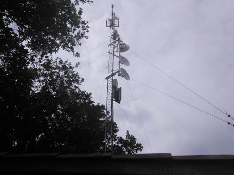
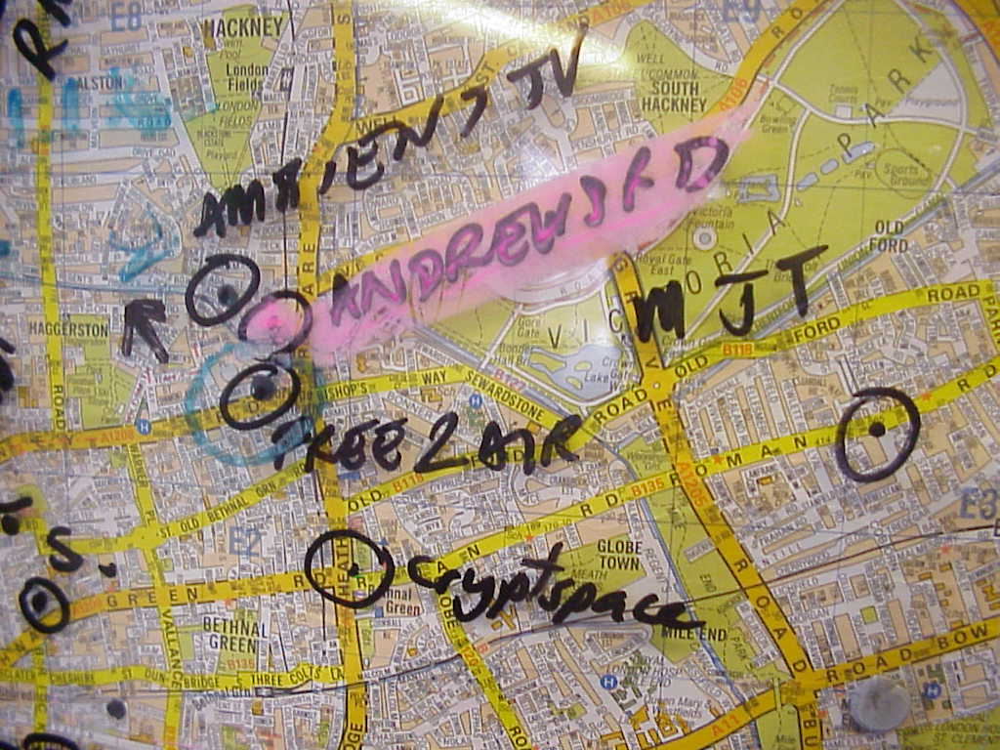
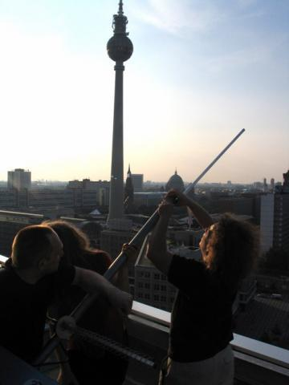
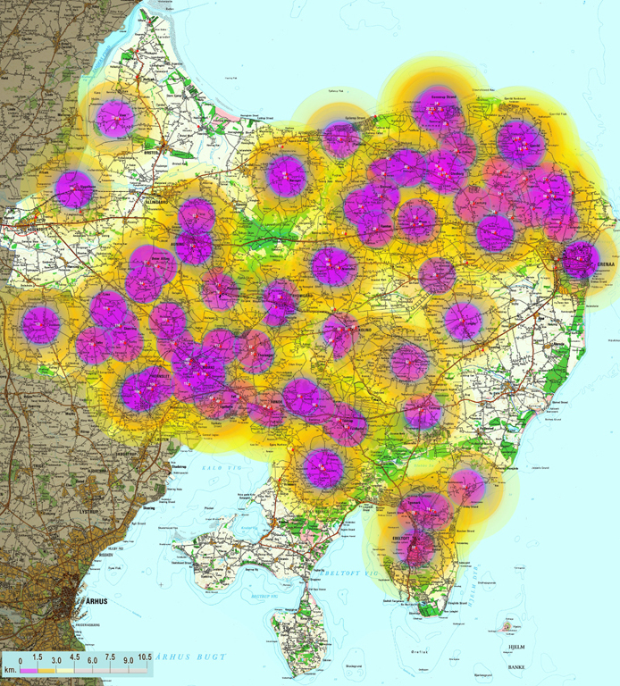
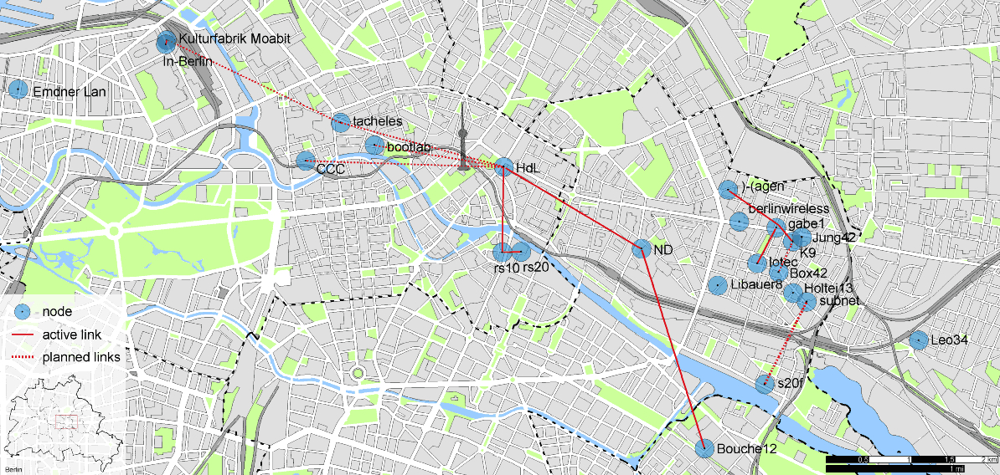
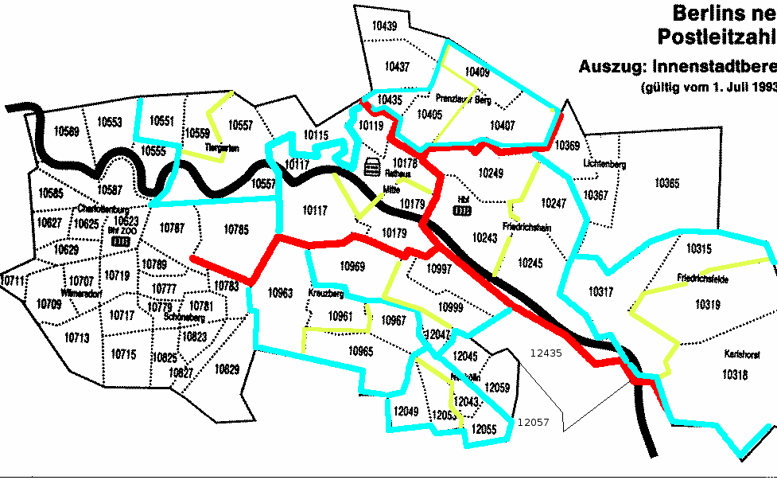
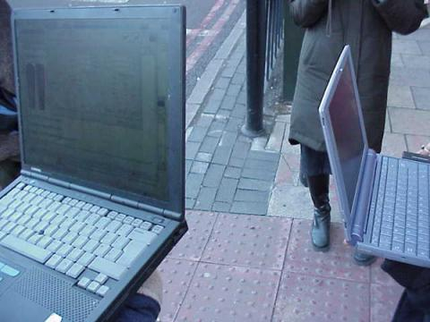
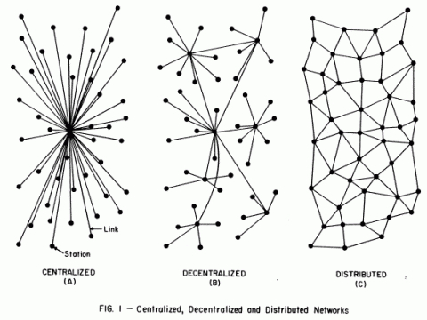
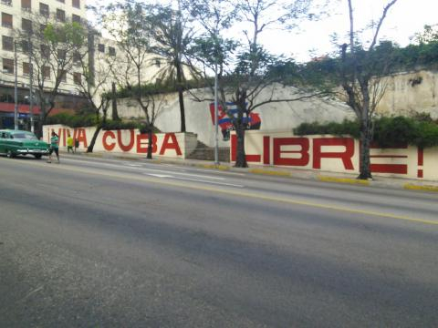
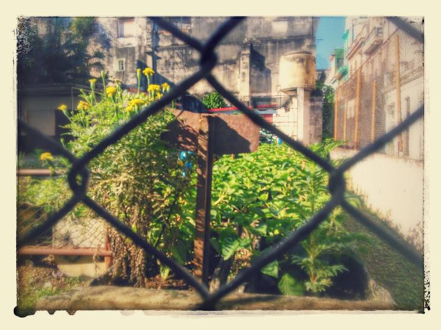

#The Rise of the Network Commons: A History of Community Infrastructure
## Armin Medosch

# Colophon

**The Rise of the Network Commons: A History of Community Infrastructure**

**Edited by:** Volker Ralf Grassmuck and Adam Burns
 

**Author:** Armin Medosch 
 
**Cover Design:** Katja van Stiphout 
 
**Production:** Ruben Stoffelen
 

Published by the Institute of Network Cultures, Amsterdam, 2025

ISBN XXXX

**Contact**  
Institute of Network Cultures 
Amsterdam University of Applied Sciences (HvA) 
Email: <info@networkcultures.org>  
Web: [www.networkcultures.org](http://www.networkcultures.org/) 

Order a copy or download this publication for free at:
www.networkcultures.org/publications

This publication is licensed under the Creative Commons Attribution NonCommerical ShareAlike 4.0 Unported (CC BY-NC-SA 4.0). To view a copy
of this license, visit www.creativecommons.org/licences/by-nc-sa/4.0./
 

 

<a href='ch003.xhtml'> **Introduction** </a>

<a href='ch004.xhtml'> **1. The Rise of the Network Commons** </a>
 
<a href='ch005.xhtml'> **2. Consume the Net: The Internationalization of an Idea** </a>
 
<a href='ch006.xhtml'> **3. Fly Freifunk Fly!** </a>
 
<a href='ch007.xhtml'> **4. The Social Technologies of the Network Commons (Freifunk 2)** </a>
 
<a href='ch008.xhtml'> **5. Free Network: We Are Only Just Beginning** </a>
 
<a href='ch009.xhtml'> **6. The Incomplete Paradigm Shift** </a>
 
<a href='ch010.xhtml'> **7. Free Networks Between Countryside and City, Between North and South** </a>
 
<a href='ch011.xhtml'> **8. The Mixed Political Economy of Guifi.net** </a>
 
<a href='ch012.xhtml'> **9. The Obsessive Utopia of Mesh Networks** </a>
 
<a href='ch013.xhtml'> **10. The Mixed Political Economy of Guifi.net** </a>
 
<a href='ch014.xhtml'> **11. Conclusions** </a>
 
<a href='ch015.xhtml'> **12. Network Commons Case Studies and Correspondence** </a>

<a href='ch016.xhtml'> **Bibliography** </a>

<a href='ch017.xhtml'> **Persons** </a>

---

#Introduction

The book in your hands is a message in a bottle that washed ashore ten
years after it was sent. Armin Medosch began documenting self-managed
local networking initiatives with his book *Freie Netze*[^01introduction_1] published
in the German language in 2004. He developed *The Rise of the Network
Commons* in draft chapters presented on his cooperative website, *The
Next Layer,*[^01introduction_2] from 2013 until 2015, before his death in February
2017.

Nearly two years later, Volker Grassmuck, who with Elektra Aichele was
working on freeing unused TV spectrum for WLAN, came across the
manuscript. He reached out to Ina Zwerger, Adam Burns and a few other
friends with the idea to collectively complete Armin’s book project. We
considered the main body of text finished, only in need of proofreading.
He had planned an addendum with case studies of wireless networks in
several countries, of which he only published Ignacio Nieto’s report
about two cases from Chile and his own open letter to Fidel and Raul
Castro after a visit to Cuba. Our idea to invite people from networks
around the world to contribute additional case studies turned out to be
too ambitious. The book project went through ups and downs until it was
defibrillated back to life at the PicoPeering Meeting 2024 in
Berlin.[^01introduction_3]

Adam Burns and Volker Grassmuck took on the editing role and were
supported by many of the people who this book is about, including
Elektra Aichele, Panayotis Antoniadis, Gregers Baur-Petersen, Andreas
Bräu, Sebastian Büttrich, Teresa Dillon, André Gaul. Aaron Kaplan, Geert
Lovink, Monic Meisel, Mauricio Román Miranda, Jürgen Neumann, Ignacio
Nieto Larrain, Julian Priest, Enrique Rivera, Tim Schütz, Felix Stalder,
Thomas Thaler, Ulf Treger, Sven (C-ven) Wagner and Simon Worthington.
His partner Ina Zwerger, as heir to the copyright of Armin’s original
work, kindly agreed to and supported this publication project from the
start.

At the Institute of Network Cultures, who agreed to publish this work,
the editors are thankful to Geert Lovink, Sepp Eckenhaussen, Ruben
Stoffelen, Tommaso Campagna, and Katja Stiphout.

The phrase *Network Commons* was conceived right after Armin’s previous
book had been published in long conversations with his London neighbor
and colleague Adam Burns together with Consume cofounder Julian priest.
It continued to evolve in Armin’s thinking. He wanted to have an
English-language companion and update to his 2004 book. In his own
words:

*The Rise of the Network
Commons* is the working title of a new book which I am currently
writing. It returns to the topos of the wireless commons on which I
worked during the early 2000s. In this new version, combining original
research from my German book *Freie Netze* (2004) and new research
conducted in the context of the EU funded project Confine
(2012-2015)[^01introduction_4], the exciting world of wireless community network
projects such as Guifi.net and Freifunk, Berlin, gets interspersed with
philosophical reflections on the relationship between technology, art,
politics, and history.[^01introduction_5]

![Fig. 0. BerLon Meeting, Berlin, 2002. Armin Medosch is in first row at
the right in jeans and red shirt.[^01introduction_6]
](imgs/m0.jpg)

 

The model of wireless community networks at the heart of this book,
Consume.net, was conceived in London during the last days of the 20^th^
century. Armin emphasizes that the two founding protagonists driving
Consume were no techies but artists, web designers, internet pioneers
and most importantly, endowed social networkers. The Consume model
attracted a wide range of people with different backgrounds and skills,
including: hacker-programmers, artist-engineers, operating systems
developers, networking wizards, social entrepreneurs, technology
activists, as well as artists and curators like Armin, whom you will
meet on the following pages.

In the following years, Consume participants teamed up with other
international groups to experiment with and share cutting-edge mesh
networking technology. As each network node joins the mesh network, it
senses its own network environment and interconnects to grow the local
network in an organic way. Participants can share local resources with
each other and communicate directly without leaving their own community
infrastructure, only using the wider commercial internet when
communicating with the outside world. A sense of network freedom spread
fast. First we take the neighborhood, then we take the world. Armin sees
the spirit as catching on:

Our mesh network dispositif does not (yet) add up to all society, but it
is something that is widely shared among techies building wireless
community networks. It is a discursive behavior, but also a set of
beliefs and a set of material assemblages. \[…\] Decentralization was at
the core of the idea, politically as well as technologically.[^01introduction_7]

Geographically, the self-provisioning Consume spirit caught on
throughout the UK and Europe. The internationalization of the Network
Commons manifested itself in the BerLon meeting in Berlin in 2002.
Figure 0 shows the British, German, Danish, Austrian members of that
historic unconference where the German Freifunk was founded. ‘The
exciting world of wireless community nework projects’ spreads from the
urban to the rural, from the global north to global south. It spreads as
an educational, emancipatory movement: by learning and exchanging
knowledge and skills with our neighbors.

Building and maintaining telecommunication networks is seen as a
technical task but affects fundamental human rights and social issues.
Thus, everybody should have at least some idea about how it works, as
one otherwise cannot meaningfully participate in Network Society.

This is the twofold thesis that Armin develops in this book: Involving
ordinary people in building a network commons has a profound
emancipatory effects on them. At the same time, doing so contributes to
the democratization of technology: it is not developed behind closed
walls into a product to be consumed. By having community networkers
participate in shaping future technologies, those technologies become
less elitist and less controlled by narrow commercial or security
interest:

The original peer-to-peer spirit of the Net gets enhanced and made fit
for the future in a network commons that is there to protect our
democratic freedoms and rights.

Today at the beginning of Trump’s second reign over the USA, the need
for resilient socio-technical systems for defending democratic rights
and freedoms is more evident than ever. As a history of community
infrastructure, *The Rise of the Network Commons* is therefore a highly
topical narrative for strengthening the resilience of our *last mile*
digital infrastructures and re-enforcing regional digital
self-sovereignty through direct community participation and knowledge
sharing.

And indeed, we find that the spirit in Armin’s text resonates in many
areas today – the spirit of peer-to-peer, of decentral and federated
networks – both technologically and politically. We see it in the rise
of the Fediverse, whose applications such as Mastodon and Peertube offer
alternatives to globally centralized social media giants, and in
projects for federated European cloud and media infrastructures.

It is our hope that this posthumous publication will inform and inspire
successive generations of activists to continue to build a more
decentralized, networked, human-centric, and commons-oriented world.

Adam Burns & Volker Grassmuck, Berlin, March 2025

**Armin Medosch** (1962 – 2017) was an Austrian media artist,
journalist, curator, theorist, critic, and a pioneer of internet culture
in Europe.[^01introduction_8] As art activist, he co-initiated the transformation of
the ship MS Stubnitz,[^01introduction_9] a former GDR deep-sea fishing vessel, into a
floating art space. He is well recognized as a journalist and as the
co-editor of Telepolis.[^01introduction_10] As an academic he earned a Master of Arts
in Interactive Digital Media at the University of Sussex and a PhD at
Goldsmiths, University of London and continued to his last days to
publish[^01introduction_11], teach and research.[^01introduction_12] See also the obituaries collected
by Monoskop.[^01introduction_13]

**Adam Burns** (1966) is a technologist & Australian internet pioneer.
He was the technical manager for Australia’s first national ISP
assisting activists to communicate across south east Asia and Pacific
Islands. He founded the first open community wireless network in Europe.
He designed the software behind the Pocket FM broadcast system deployed
in crisis areas & IDP camps in the Middle East and Africa. Published,
interviewed, filmed and quoted in numerous publications and
documentaries (including Steal This Film 2[^01introduction_14]), he advocates for open
source, as well as equitable digital access and participation.

**Volker Grassmuck** (1961) is a media sociologist, free-lance author,
and activist, has studied and conducted research on Free Software,
copyright law and practice, Public Service Media, and the knowledge
commons at Free University Berlin, Tokyo University, Humboldt University
Berlin, University of São Paulo and Leuphana University of Lüneburg.
Most recently he was Senior Researcher in the H2020 project European
Media Platforms (EuMePlat) at the Leibniz Institute for Media Research |
Hans Bredow Institute Hamburg (2021 to 2024). He was project lead of the
conference series Wizards-of-OS.org and of the copyright information
portal iRights.info, co-founded mikro-berlin.org, privatkopie.net and
CompartilhamentoLegal.org, is member of Digitale Gesellschaft e.V.,
c-base.org and C3S.cc. He blogs at vgrass.de.

[^01introduction_1]: Armin Medosch, *Freie Netze. Geschichte, Politik und Kultur
    offener WLAN-Netze*, Heise Verlag, Hannover 2004,
    https://ftp.heise.de/tp/buch\_11.pdf.

[^01introduction_2]: Archived at https://webarchiv.servus.at/thenextlayer.org/.

[^01introduction_3]: PicoPeering 2024 held above c-base in Berlin on 17 and 18 May
    2024. See sig0namectl at Picopeering 2024 Unconference, 18 May 2024,
    https://sig0namectl.networkcommons.org/posts/20240518-picopeering-2024-presentation/.

[^01introduction_4]: *Confine Project*
    (2012-2015), archived October 2015,
    https://web.archive.org/web/20151003180403/https://www.confine-project.eu/.
    See also its successor Horizon 2020 project, *netCommons*
    (2016-2018, https://netcommons.eu/), a key output of which was the
    book Melanie Dulong de Rosnay, Félix Tréguer, Panayotis Antoniadis,
    Ileana Apostol, Virginie Aubrée, et al. (Dir.). *Telecommunications
    Reclaimed: A Hands-On Guide to Networking Communities*. ISOC, 2019,
    https://shs.hal.science/halshs-02414439/file/telecommunications-reclaimed-webversion-page-1.pdf.

[^01introduction_5]: Armin Medosch, The Rise of the Network Commons, Chapter 1 (draft),
    *The Next Layer blog*, 8 August 2014,
    https://webarchiv.servus.at/thenextlayer.org/node/1231.html.

[^01introduction_6]: Others include: Julian Priest (back row 2^nd^ left), Juergen
    Neumann (back row 3^rd^ left), Thomas Krag (back row 3^rd^ right),
    Saul Albert (3^rd^ row left, sitting) Adam Burns (3^rd^ row 2^nd^
    from left), Gio D’Angelo (3^rd^ row 3^rd^ left), Alexei Blinov
    (3^rd^ row 5^th^ left), Simon Worthington (front row 2^nd^ from
    left), Shu Lea Cheang (3^rd^ row center, with laptop).

[^01introduction_7]: This and the following quotes are from the present book.

[^01introduction_8]: Monoskop, Armin Medosch (1962-2017), 28 February 2017,
    https://monoskop.org/images/c/c3/Armin\_Medosch\_1962-2017.pdf.

[^01introduction_9]: Started in 1992, the original project went bankrupt in 1994, yet
    the ship lives on as art space: https://www.stubnitz.com/.

[^01introduction_10]: The original one, co-founded in 1996 by Armin Medosch und Florian
    Rötzer as first online-only magazine of the Heise Group, which after
    Rötzer’s retirement at the end of 2020, is now headed by Harald
    Neuber, who at the end of 2024 decided to take all pre-2021 articles
    offline, i.e. large parts of the early digital cultural heritage
    (Ludger van der Heyden, “Qualitätsoffensive.” Der Heise Scheiß.
    Zensur des Archivs, KI-Journalismus und Mainstream: Kritiker
    beklagen Geschichtsfälschung bei Onlinemagazin Telepolis, Junge
    Welt, 13 December 2024,
    https://www.jungewelt.de/artikel/489833.qualit%C3%A4tsoffensive-der-heise-schei%C3%9F.html).

[^01introduction_11]: E.g. *New Tendencies: Art at the Threshold of the Information
    Revolution (1961–1978)*, MIT University Press, 2016.

[^01introduction_12]: At Ravensbourne College in London, at Goldsmiths, and at
    Singidunum University in Belgrade.

[^01introduction_13]: Monoskop, Armin Medosch (1962-2017), 28 February 2017,
    https://monoskop.org/images/c/c3/Armin\_Medosch\_1962-2017.pdf.

[^01introduction_14]: The League of Noble Peers, Steal This Film 2, 2007,
    https://archive.org/details/StealThisFilmII.

#1. The Rise of the Network Commons

The Rise of the Network Commons returns to the topos of the wireless
commons on which I worked during the early 2000s. In this new version,
combining original research from my German book *Freie Netze*[^02chapter1_1] (2004)
and new research conducted in the context of the EU funded project
*Confine*[^02chapter1_2] (2012-2015), the exciting world of wireless community
network projects such as Guifi.net and Freifunk, Berlin, gets
interspersed with philosophical reflections on the relationship between
technology, art, politics, and history.

 

## 1.1 The World of Guifi.net and the Dispositif of Network Freedom

 

On my recent visit to Barcelona in the context of the Confine project,
Guifi.net founder Ramon Roca took me to Gurb, the village he comes from.
There, in 2003 Guifi.net was started when Ramon realized that he would
never get good bandwidth at a fair price in this remote area in sight of
the foothills of the Pyrenees. Ramon, who is an IT professional but
keeps his working life and activities with Guifi.net separated, found
that he could get broadband by using WLAN to connect to a public
building in the outskirts of a nearby small town, Vic. Since then,
Guifi.net has grown to become the largest WLAN community network in
Europe, with currently more than 25,000 nodes. It is not entirely
correct anymore to call it a wireless community network since a growing
number of nodes are created by fibre-optic cable. Since Ramon and his
cooperators have found out how relatively easy it is to work with fibre,
he is on a new mission to get fibre to the curb to as many houses as
possible.

Visiting Gurb and talking to Ramon for nearly a full day has revitalized
my fascination for wireless (and wired) community networks. I have
written a book on wireless community networks in 2003, in German, under
the title *Freie Netze* (Free Networks).[^02chapter1_3] The choice of title back
then had deliberately emphasized the analogy between Free Networks and
Free Software. The title had been inspired by two very different
influences. On one hand there had been Volker Grassmuck’s early book
Freie Software.[^02chapter1_4] Volker’s magisterial work provided deep insight into
the history and politics of Free Software and stood out for me as an
example how a book on wireless community networks should be written. The
other inspiration had been provided by a sweeping lecture in Vienna in
June 2003 by Eben Moglen, lawyer of the Free Software foundation and
legal brain behind the licensing model of Free Software, the GNU General
Public License (GPL[^02chapter1_5]). Moglen’s thunderous and captivating speech had
presented the combination of Free Software, Free Hardware and Free
Networks like a kind of holy trinity of the everything-free-and-open
movement. Moglen’s conclusion was that while Free Software was already
an accomplished fact and free hardware was the hardest bit, free
networks were a viable possibility, yet there was still a long way to go
to attain critical mass.

My book had come maybe a few years too early. When it appeared, some of
the most important wireless community networks of today, such as
Freifunk, Berlin, Funkfeuer, Austria, or Guif.net, were either non
existent or existed in embryonic form only. The model of wireless
community networks on which my book had been based had been created by
Consume.net in the UK. Consume.net was the outcome of an improvised
workshop in December 1999 in Clink Street, near London’s creative net
art hub Backspace. I will describe the history of Consume in more detail
below, but one key aspect of that initiative was that it was launched by
non-techies. James Stevens, founder of Backspace, and Julian Priest,
artist-designer-entrepreneur, provided the impetus for DIY wireless
networking by sketching plans for a *Model 1* of WLAN-based community
networking on a napkin during a tempestuous train journey in late summer
1999. Their *Model 1* – a name chosen for its association with Henry
Ford’s first mass-produced car, the Ford Model 1 or Tin Lizzy – was a
techno-social network utopia.

The relatively young discipline of science studies teaches us that the
technical and the social cannot or should not be considered as
categorically separated. ‘Technologies are socially produced’ is one
of the key phrases in the discourse of science studies. They do not
exist outside the human world but are the product of specific societies
which exist under specific conditions and circumstances. Technologies
are hybrids between nature and society, as science studies author Bruno
Latour puts it. Moreover, a specific school of science studies, the
Social Construction of Technological Systems (SCTS) has studied the
co-evolution of large technological systems and social structures. SCTS
pioneer Thomas P. Hughes, who studied the building of the first
nationwide electrical grid, has found that there are strong
co-dependencies between technological and social systems. While there is
undeniably a strong influence on the shaping of technologies exerted by
business interests, Hughes’ work emphasizes co-dependencies between
technologies and the people who build and maintain them, the
technologists or techies – a term I will use from now on because it
allows to refer to both academic computer scientists and researchers and
autodidactic hackers, whereby I hope my use of the term is not seen as
derisive in any way.

Engineers and skilled workers involved in large technological projects
bring certain predispositions to projects. As projects evolve, the
communities of techies develop certain habits and ways of working. The
technological and social system build a unity which determines the ways
how those technologies evolve in the future. What we can learn from
science studies is that neither is science objective (in the strict
sense of the word), nor is technology neutral. To believe the opposite
would either constitute scientific objectivism – a rather outdated form
of scientific positivism – or technological determinism, which is the
belief that technology alone is the main factor shaping social
developments.

James Stevens and Julian Priest, founders of Consume, are neither
scientific positivists nor technological determinists. They conceived
Model 1 as a techno-social system from the very start. Their ideas
combined aspects of social and technological self-organization. In
tech-speak, the network they aimed at instigating was supposed to become
a Wide Area Network (WAN). But while such large infrastructural projects
are usually either built by the state or by large corporations, James
and Julian thought that this could be achieved by bottom-up forms of
organic growth.

Individual node owners would set up wireless network nodes on rooftops,
balconies and window sills. Each node would be owned and maintained by
its owner, who would also define the rules of engagement with other
nodes. The network would grow as a result of the combination of social
and urban topologies. The properties of the technology – well strictly
speaking there is no such thing as property of technology as I just
explained but lets reduce complexity for a moment – impose certain
restrictions. WLAN (Wireless Local Area Networking), later called Wi-Fi
by the trademark of the Wi-Fi Alliance, operates in a part of the
electromagnetic spectrum that does not pass through obstacles such as
walls. Therefore, from one node to the next there needs to be an
uninterrupted line-of-sight. Node-owners need a way of identifying each
other in order to create a link. According to the properties of
internetworking protocols each of those links is a two-way connection,
which means that data can travel as easily in one direction as in the
other. Furthermore, node owners would agree to allow data to pass
through their nodes. There would not only be point-to-point connections
from one node to the other, but larger networks, where data can be sent
and received via several nodes. Such a wide area community network would
also have gateways to the internet in order to allow exchange of
information between the local wireless community network and the wider
networked world.

Those desired characteristics of Model 1 were not actually invented by
Julian and James. Those properties already existed, deep inside the
technologies we use to connect, but working for most parts unnoticed by
those who use them. The key term has already been introduced above,
without further explanation, it is the *protocols* that govern the flow
of information in networked communication structures. Protocols are
conventions worked out between techies to decide how the flow of data in
communication networks should best be organized. The basic protocols on
which the Net is running, such as the Internet Protocol (IP) and the
Transport Control Protocol (TCP) have been defined decades ago by
engineers and computer scientists working on the precursors of the Net,
Arpanet and NSF-net. Some people would go as far as saying that the
internet is neither the actual physical structure of cables and
satellites used to connect, nor the content that travels via such
structures but it is embodied in the suite of protocols, commonly
referred to as TCP/IP (those two are usually mentioned but there are
many more). The protocols are the essence of the Net because they give
it its key characteristics. I am not sure if this is not a very refined
form of technological determinism, but I would like to leave this
question open for a moment.

The reason for this hesitation is that the protocols are not identical
with the technology that uses them. The protocols are conventions that
can be described in textual form. The way how this is done is through so
called Requests for Comments (RFCs). Since the dawn of the Net, RFCs
have been defined in a way that runs counter to common understandings of
how technologies are created. RFCs are approved by techies who
congregate under the umbrella of the Internet Engineering Task Force
(IETF). The arcane decision making mechanisms of the IETF have since the
very start been governed by maxims such as ‘rough consensus and running
code’. People who develop new internet technologies present them to
their peers who then react by making noises such as humming or
whistling. Criteria for approval are not theoretical consistency but
whether they actually do something or not. The robustness and the
freedom of the Net is guaranteed, despite the lack of central
coordination, by the self-organized decision making power of those
techies who meet at the IETF. While a lot of those people may have jobs
with large corporations, when they meet at IETF conferences they still
decide as technicians who adhere to their own codes of human
responsibility.

It is amazing because, despite the commercialization of the Net, this
has not fundamentally changed. Corporations and governments may seek to
wrest more and more control over the net, and while they are actually
quite successful in doing so in some areas, the social protocols of
decision making enshrined in the mores of the techno-social communities
have so far been able to withstand all such assaults. On the layer of
the protocols the Net was and is still *free*.

Thus, when James and Julian wrote out the formula of growth for Model 1,
they referred to a freedom to connect that is inherent to the way in
which the internet was originally conceived and still functions now, on
the layer of the protocols. The knowledge and awareness of that fact had
become buried by new layers built on top of older layers in the course
of technological improvement but also the commercialization of the Net
in the 1990s. Consume.net was started at the cusp of what was then
called the New Economy, a stock exchange boom fueled by the rise of
information and communication technologies in general and PCs and the
internet in particular. The 1990s had been a very exciting decade which
saw the rise from obscurity of the Net from a communication technology
used by scientists and a small number of civil society organizations,
artists and freaks in the late 1980s, early 1990s, to a widely used
medium driving and being driven by a gigantic economic machinery. In the
process, a lot of the properties that had been dear to the early
inhabitants of the Net, the digital natives, had become either sidelined
or overshadowed by commercially driven interest and the secret workings
of the deep state.

Model 1 was thus both a new techno-social invention but also a recurse
to the original Internet Arcadia. Against the tide of rising
commercialization and the inequalities and distortions that came with
it, wireless community networks were supposed to bring back a golden age
of networked communication, of equality and freedom. Technical and
social properties were conflated into a model of self-organization. The
possibility for that was provided by a small and often overlooked
feature of the technology. 802.11b was the technical name of the
wireless network protocol as used at about 1999. It allowed two
different operating modes, one where each wireless network node knew its
neighbors and could receive and send data based on fixed routing tables,
and another one, the ad-hoc mode, where nodes would spontaneously
connect with each other. The ad-hoc mode was supported by routing
protocols that are best suited for the wireless medium. In a fixed
network with cables, it is of advantage to work with fixed routing
protocols. When data arrives, the network node decides where to send it,
based on its knowledge of the topology of the network. But in wireless
networks that topology constantly changes. Nodes can break down due to
atmospheric or environmental influences. The quality of connection can
change dramatically because of disturbances in the electromagnetic
medium. Or a truck parks in front of your house and the line-of-sight is
suddenly gone.

For this reason, Consume.net started to get interested in a technology
called mesh networking. In the year 2000 mesh network protocols were
still very much in their infancy. There was a working group called
Mobile Ad-hoc Networking (Manet), supported by the US military. In
Germany, a small company was building something called MeshCube.[^02chapter1_6] It
was a working technology but it was not really open source and only the
developer knew how to run it. When Consume.net started to work with mesh
network technology, this seemed to be a utopian technology. While
neither James nor Julian were techies, they had the support of some very
skilled hackers, but neither of them was capable of significantly
developing mesh network protocols. Mesh networking was a dream,
something that was already on the horizon but not yet there.

This was a pattern established in 2000 and still very much in place in
the year 2014: when the problems of mesh networking would be solved,
wireless community networks would flourish and become unstoppable.
Social qualities, such as self-organization without centralized forms of
control, were mapped onto technological properties, such as the ability
of machines to automatically recognize each other and connect to build a
larger cloud of networked nodes. The idea of network freedom – the
ability to connect without having to apply to a central point of
governance and without having to go through a company such as a
telecommunications operator (telco) – was supposed to further
communication freedom and thus the rights and ability of people to
express themselves and communicate freely without top-down hierarchical
control. The convergence of those ideas I call the dispositif of mesh
networks and network freedom.

I am appropriating the term *dispositif* from Michel Foucault who used
it to ‘refer to the various institutional, physical, as well as
administrative mechanisms and knowledge structures which enhance and
maintain the exercise of power within the social body.’[^02chapter1_7]

Our mesh network dispositif does not (yet) add up to all society, but it
is something that is widely shared among techies building wireless
community networks. It is a discursive behavior, but also a set of
beliefs and a set of material assemblages. *Assemblage* is another term
that I appropriate freely from a French philosopher, Gilles Deleuze.
While the dispositif does not exist outside time, it is somehow hovering
above the concrete historical moment. In this way, the dispositif of
mesh networks has influenced wireless community networks since the year
2000. The assemblage, while also consisting of material and non-material
components, is concretely manifest in the historical moment. The mesh
network dispositif promises to bring about an era of unrestricted and
seamless communication, free from technological and social constraints.
This dispositif historically legitimates itself by the way the internet
was originally conceived. At the same time it contains the promise of a
future when the Net will be again what it once had been.

When I came to Barcelona in July 2014, I was thrilled to see that as
part of the EU funded research project Confine a project was under way
to develop the Quick Mesh Project (QMP). QMP is a so called free
firmware, a GNU/Linux based operating system for network devices. Many
people now have wireless routers at home. When you buy internet access
from a provider, you often also get a box that allows to wirelessly
connect to the Net. QMP would replace the operating system of such a
device with a much improved version, one that speaks the language of
mesh network protocols. To give a simple example, if in a street of
apartment blocks everybody who owns a wireless router replaces the
firmware with QMP and puts the router on the window sill, all those
machines would automatically connect and build a network without using
any cables or other hardware from commercial providers. It would make it
easy and simple to connect without having to go deep into system
settings. This has now changed from being a faraway utopian goal to
something that is literally around the corner.

It may or may not succeed. One problem with that is that it resembles
what Saskia Sassen described as an engineer’s utopia. Techies, whether
they are academically trained computer scientists, telecommunications
engineers or self-taught hackers, tend to believe in the unlimited
potential of technology. They see the potential of a technology. There
is nothing that speaks against it, on the contrary. It needs such people
who are capable of dreaming a different future based on creative bending
and twisting of technologies. The problem, however, is that far-sighted
techies tend towards a linear extrapolation of technologies into the
future without considering other factors, such as politics, the economy,
the fundamental differences between people in class-based societies and
so on and so forth. In this way, the highly productive mesh network
dispositif gets turned into the dreamworld of the internet cornucopia.
The technology gets imbued with characteristics that are actually
outside of it and depend on factors beyond the influence of creative
technologists. It becomes a messianic technology in the way the great
philosopher of culture and technology Walter Benjamin theorized it in
the 1930s.

## 1.2 Dawn of an Idea

 

Good ideas often pop up at the same time at various points on the Earth,
they just seem to be in the air. And so it came that around the year
2000 at different points on the globe wireless free community networks
were started: Consume.net in London, New York Wireless, Seattle
Wireless, and Personal Telco, in Portland Oregon, were among the first
wireless community networks based on Wireless LAN, or WLAN. Nobody
really can say which one came first. I have been lucky to experience the
development of Consume and free2air.org in London from a close
encounter. Therefore, in this chapter I will tell the story of those
networks.

But before I go into the details of this story, it is worth remembering
a bit how things were back then. Today, when the debate shifts to a
topic such as so called digital natives, many young people seem
incapable of comprehending that there are middle-aged people like me who
have spent a large part of their adult life on-line. I had my first
computer in 1985, whereby I should say *we*, because it was a shared
computer between my then girlfriend and myself. In 1989 it was followed
by two new computers. She got an Amiga 2000, and I got a pre-Windows PC.
So I spent a good time learning key commands for the DOS version of
Word, while my partner could do wonderful graphical stuff on her Amiga.
We could even digitize video, change every single image and turn it into
a loop that could be played out and recorded to tape. While I was
envious of the slick graphical interface of the Amiga, my PC soon
learned a new skill, communication with other computers. That was when
the whole on-line fun started.

Actually, we had to overcome a few obstacles first. In Europe, computer
modems at the time – around the late 1980s to the early 1990s – had to
be licensed by the national postal, telegraph and telephone service
(PTT). This made the stuff prohibitively expensive for many. But we
found a workaround. We traveled to West-Berlin and there, in a store
called A-Z Electronics, we could buy a 2400 baud modem on the cheap.
This modem could be legally sold because it had one cable missing – a
loophole in German law according to which it was legal to sell
unlicensed equipment if it was not in a state to be used. After we
smuggled it back to Vienna, we soldered in the cable and connected the
modem to the phone line. Franz Xaver, a friend and artist-engineer, had
to help to solve issues with the arcane Austrian telephone system.
Another friend brought a pack of diskettes and we installed Telix, a
programme for communicating with bulletin board systems (BBS).

The BBS world was like a testing ground for virtual communities where
certain types of behavior could form. This could be elements of a
netiquette, but also an understanding of what it means to be on-line in
the first place. Stories about early on-line communities by authors such
as Sandy Stone[^02chapter1_8] and Howard Rheingold[^02chapter1_9] describe how these
communities, some of which go back to the early 1970s, foster social (or
anti-social ;-) behaviour.

First artistic experiments with *Art and Telecommunication*[^02chapter1_10] began
in the late 1970s. The Canadian artist Robert Adrian X, who by then was
living in Vienna, started an artist’s conference board called Artex on a
proprietary network in 1980. Fellow artist Roy Ascott described in vivid
terms how it felt to be on-line and engage in real-time synchronous
communication.

Over the past three years I have been interacting through my terminal
with artists in Australia, Europe, and North America, once or twice a
week through I.P. Sharp’s ARTBOX. I have not come down from that high
yet and frankly I don’t expect to. Logging in to the network, sharing
the exchange of ideas, propositions, visions and sheer gossip is
exhilarating. In fact it becomes totally compelling and addictive.[^02chapter1_11]

Similar feelings have been shared by almost everyone who experienced an
always-on network connection. But let us return to the BBS world, which
could be quite wild at times. Artists-hackers such as Toek from radio
art and performance group DFM circumvented the fact that those systems
did not really have graphical interfaces by creating a log-on page with
flashing and blinking ASCII animations. Communications in those systems
were uncensored – apart from the curiosity of the maintainer of the
system – and sometimes one could encounter, without looking for it,
cracked software or literature such as the *Hackerfibel* by the Chaos
Computer Club, or the Anarchist Hackers Cookbook, or The Temporary
Autonomous Zone by Hakim Bey; one could also find software for
war-dialing and similar things bordering on what was legally
permissible. This BBS content led to promote the myth that the internet
itself is a haven for radical illegal content with dark corners of
countless publicly available DIY bomb-building manuals.

This is a pretty persistent myth by the way, but has maybe more to do
with the criminalization of hacking by the US secret services who seemed
to be intent on demonizing an activity that many of those involved
understood primarily as curiosity, research, interest, gaining new
knowledge. When the internet was opened up for public usage, it seemed
to get populated very quickly by all kinds of creative spirits. In 1995,
when I had, through work, my first always on *broadband* internet, the
web seemed to consist primarily of artists, anarchists, trade unionists,
multinational and non governmental organizations, campaigners for the
environment, workers’ rights and indigenous groups, as well as the
occasional commercial web page of a forward looking company and the
standard setting physics department homepage which has been immortalized
by artist Olia Lialina with this work *Some Universe*[^02chapter1_12]. Olia Lialina
has also collected *Under Construction* signs such as this one, another
charming aspect of the early web:

 

While the on-line world was colorful and intellectually stimulating,
internet access was not that cheap at all at the time. We looked with
envy at the US, where local calls were almost free. In Europe you had
not only to pay the cost of a provider, but also the cost of the call
for every minute you spent on-line. As the 1990s progressed, the modems
got faster and maybe telephone provider rates a bit cheaper, but the
situation remained fundamentally the same, except in those rare
instances, where people came up with inventive solutions.

## 1.3 Cheap Broadband for the Masses: Vienna Backbone Service

In Vienna, Austria, the media artist Oskar Obereder started an internet
service provider almost by accident. With some art school friends,
Obereder had launched *A Thousand Master Works*, a project where artists
produced multiples which were sold via a poster. Soon, the poster proved
an inefficient method of keeping the offerings up to date. Obereder
created a data base and together with some other artists, hackers, and
the editors of music magazine Skug brought the server on-line, as a web
based ordering system. The same technology also supported Skug’s data
base of independent music. This machine had to be online 24/7, so
Obereder and Skug had to get a leased line. In order to share the cost,
they distributed internet access throughout the loft-spaces in a former
furniture factory where lots of other artists and creative people
worked. Everyone who connected to this cable-bound ad-hoc net got the
buzz of an always-on internet and Obereder inadvertently became a
provider.

Working together with a small ISP, AT.net, Obereder and colleagues found
out about a technology that was coming from California, brand new, and
allowed normal copper telephone lines to be used for broadband internet
connections. This was called DSL, and when they first contacted the
manufacturer they told them to get lost, because they only sold to
telecom providers. Finally, the Austrians got hold of a few modems and
started laying the groundwork for what would become Vienna Backbone
Service (VBS). This network was offered by three small ISPs as a
cooperative effort, but it was also *provided* by many of its first
customers who were hosting network exchange services in their cupboards.

Because of the *creative milieu*[^02chapter1_13] in which Obereder existed, he knew
many artists and techies or combinations of those, who had high
bandwidth needs and some technical skills. As he by now had founded a
company, called Silverserver – later shortened to Sil – they had found
out that there was a special type of telephone line that you could rent
quite cheaply from the incumbent and over which you could run DSL.
Moreover, the cost was dependent on the distance from the next exchange.
Silverserver started finding friends, who were also customers, who lived
next to an exchange. In this way, they found a foothold in many Viennese
districts, from where they could spread out organically, offering
always-on broadband, initially at a tenth of the price of the incumbent.

In 1998 the workshop and conference *Art Servers Unlimited* brought
together about 40 artists, hackers, and activists of all kinds at
London’s Backspace and the ICA. Obereder was presenting the model of VBS
and James Stevens caught an earful of it. What he mainly got out of it
was that you could grow a rather large network in a decentralized way,
by a cooperative method that involved people taking over responsibility
for a node.

## 1.4 Consume – the Culture of Free Networks

 

James Stevens and Julian Priest found another inspiration for their
*Model 1* (see chapter 1.1) through the way in which in a particular
neighborhood and social environment WLAN was used to share a leased line
internet connection. At the turn of the millennium, James Stevens and
Julian Priest had ‘worked for a decade almost in multimedia, making CD
ROMs and websites, running around… then we decided to give it a try and
concentrate on doing more altruistic work.’[^02chapter1_14]

Both had their offices in a special corner of Southwark, the London
borough just south of the Thames, in Clink Street, in a small warehouse,
directly on the riverside, called Winchester Wharf. Today, oh irony, the
ground floor is occupied by a Starbucks. Adjacent to it there were other
warehouses, converted into offices and studios for various creative
outfits, from record labels to web and multimedia companies. In
Winchester Wharf, the web company Obsolete and the internet cafe
Backspace enjoyed a few years of happy coexistence. Obsolete had become
successful quickly by making web-pages for Ninja Tune and other record
labels located in the same building. After record companies followed
some blue chip companies such as Levi’s who were intent on having a
cool, young image. But James Stevens had already opted out at that time.

So he founded Backspace,[^02chapter1_15] a place at the ground floor, with one
window almost on water-level when the tide was high. Fittingly, the
homepage of Backspace showed (and still does show) a graphical animation
of the river Thames with the web-sites hosted by Backspace floating like
half submerged buoys in the river. Descriptions of Backspace as an
internet cafe or gallery just show the ineptitude of common language to
describe what it was. It was a hub where people with all kinds of ideas
– whether they were related to the internet or not – came together to
talk, organize, share. Backspace was a crucible of London’s net art and
digerati, where events such as the legendary *Anti with E*[^02chapter1_16]
conferences and lectures took place. Backspace also became quickly known
for its regular live-streaming sessions, at first mainly radio, later
also videos, with Captain Gio D’Angelo often in command.[^02chapter1_17]

That was only made possible, because Backspace shared a leased line with
Obsolete, who were just upstairs. The other small outfits in the area,
on the same street but not in the same building, also wanted a share in
the bandwidth bonanza. At first some sort of grey-area solution was
considered, like finding a way of connecting buildings via Ethernet, but
that turned out to be impossible, unless one dug up the street, legally,
as a provider company or one broke the law. At some point, someone must
have stumbled over Wi-Fi or AirPort, as the version promoted by Apple
was called. A lot of people in Clink Street were designers and thus
Apple users. Apple at the time was the first major consumer computer
company which supported Wi-Fi through their so-called *Airport* access
point together with early integration of Wi-Fi interfaces into their
consumer computer products.[^02chapter1_18]

The creative cluster of artists, designers, musicians, and entrepreneurs
experienced the benefits of broadband and also the laws of network
distribution. As Stevens and Priest noted, the maximum bandwidth
available is only relevant at peak times, when everybody was on-line,
checking into the system, or after work, when people played games or
watched videos. Otherwise, the 512K connection, which today would not be
considered broadband anymore, was giving everyone enough space to live,
listen to music, build web-pages or even play on-line games. But the
bandwidth paradise on the Southern shore of the Thames was not to last.

Winchester Wharf was sold as part of a general regeneration drive of the
Southern river bank, at a time when Tate Modern was opened and the whole
area underwent a wider transformation. ‘Between us, we both had an axe
to grind when Backspace was closed, we sat together and talked about it
and thought it was a good moment to put into practice some of the ideas
that we have hatched and some of the things that we have experimented
with’, remembered James in 2003. In late 1999, they organized a first
workshop to start building Consume, in the offices of I/O/D, one of a
web of companies and art groups in the area. For James Stevens, it was
from the beginning a *social thing*. ‘The idea that came out was much
more straight forward than it looks now, but it was interlinking
locations where people work and live using this wireless stuff. We did
it already across the street, so that sort of scale where we had a
grasp.’ (James Stevens, interview with the author, 2003).

 

I received an invitation to this workshop and remember that I was
electrified (although it turned out that I could not participate in that
first meeting). I knew that James Stevens was on to something. As he
later put it in his own words, ‘it was on the cusp of a wave of
awareness that was sweeping around, also economically we were in a funny
state, in a kind of decline of the swell after all of that gluttony of
that Dotcom shit.’ Within the space of a few years the Net had been
completely transformed from a colorful space dominated by various
leftist and creative types to a place apparently ruled and defined by
multinational corporations.

The early WWW had generated a lot of enthusiasm about free speech and
possibilities of political self-organization. It was seen as an
electronic Agora, a place where democracy could be reinvented through
participatory processes, electronically mediated. Yet in the eyes of the
media, all attention was devoted to internet startups such as Netscape
and Amazon who made billions with their IPOs. Ideas about freedom of
speech and creative expression, held dear at places such as Backspace,
were completely omitted in public discourse. But in late 1999 the stock
market boom had started to flounder and in April 2000 the Nasdaq
collapsed. Suddenly, the pendulum swung back and ideas about freedom of
speech and political self-organization came back. The call for the first
Consume workshop was met with *a phenomenal response* according to
Stevens. The question they asked themselves was: the technology had
shown to work in a relatively confined area. Could it be made to work
over a mile or two? Could different areas be connected into a Wide Area
Community Network? Stevens:

There was a momentum there, in that way, because it grasped people’s
attention and got them to come out, literally, just physically to turn
up, gather at a meeting, and really, the second meeting that we had, we
built nodes. It was really just like as direct as that: physically turn
up and do it; those who could handle the Unix side of it, which is not
everybody, obviously.[^02chapter1_19]

A subsequent workshop was held sometime in the first half of 2000. What
they were out to do, ‘was to provide ownership of network segments to
self-provide those services and in addition to that do all sorts of
node-to-node kind of benefits’, explained Stevens. But the dynamic IP
packet routing required (or meshing) was soon confirmed as a core issue
remaining to be solved. The nodes deployed in such a network had to
mesh, and this had to be automatic.

This was a grave problem in 2000, since the internet by then had been
thoroughly commodified and chunks of it handed over to companies, who
could define it as their *country* or Autonomous System, controlling the
entry points of their network. This is called Border Gateway Routing
Protocol and on such a technical level there is nothing to be said
against it. However, it introduces a more distributed hierarchical
structure, which helped accommodate rapid connectivity growth of
internet networks. A downside of this growth appeared soon after with
increasing scarcity for assignment of remaining globally routable IP
network numbers. Due to the cascaded nature of networks, with many
layers, users in internal networks are often linked via a protocol
called NAT (Network Address Translation). That means, that the router
controls the global connection to the world, while any node behind it is
visible to the world through this gateway alone. In other words, there
is no publicly visible route to one’s machine. If a lot of people who
share their network connectivity via wireless have such a provider, the
routing in the network becomes a problem. There are workarounds for that
problem, but this is just one aspect of a protracted sequence of issues
regarding wireless routing.[^02chapter1_20]

At that point, in the year 2000, mesh networking technology was really
in its infancy. Through the launch of Consume, a lot of gifted people
started to get interested in mesh networking and similar ideas. It is
fair to say that community networks took mesh technology out of the
military closet and turned it into a working technology (a story which
continues today with great intensity and to which I will return later in
this book).

The way Consume grew, initially, owed much more to the special *genius*
of James Stevens than to any technology. *Genius*, a term usually
reserved for artists or sometimes also scientists, in this context
refers to a social skill. James Stevens has a special way of *growing*
projects, of initiating them, bringing them into existence but then
letting them go their own way. Rather than becoming the leader and
figurehead, he tries to initiate a self-perpetuating idea. Maybe this
has also something to do with his past in the underground music and
squatter scene in the 1980s. Politically, those social scenes were, if
not explicitly anarchist, connected with a deep-seated social and
artistic liberalism that I found to be much more entrenched in England
than in any other country of which I know.

For Stevens and Priest it was a long term goal to ‘find an opportunity,
within the legislation of radio spectrum, to use these domestic computer
devices to interlink in a way that it was deemed possible to bypass the
local loop’, argued Stevens. For him, what became a priority was
advocacy, ‘promotion of systems that create a mesh over the topography.
\[…\] You just have to propagate the idea or possibility or potential
across the landscape.’ And that is what happened in the years 2000 to
2002. While Julian Priest had to take a step back for a little while for
private reasons and because of moving to Denmark, James Stevens and a
small but fast growing group of volunteers was building Consume, a
self-propagating net. A Consume mailing list and a website were
launched. But the main mechanism for propagating the idea were
workshops. There were a number of workshops in spring and summer of
2002, one at the studio of Manu Luksch and Ilze Black, another one at
Limehouse Town Hall, which I remember vividly.

The workshops offered something for everyone. First and foremost, they
gave people in a particular area the opportunity to meet and discuss the
possibilities of creating a local wireless community network. This
involved the social side of getting to know other people in the area.
This may not sound like much, but in London talking to neighbors is seen
as something quite radical. The only apparently banal thing of *talking
to neighbors* went together with exploring the city-scape for suitable
locations for antennas and repeaters.

Those who were inclined to do so were building antennas, an activity
that showed to be quite attractive for a diverse range of people. It is
also something that turns the rather abstract idea of the network into
something that can be literally grasped. Antenna building also involves
learning about basic physics and the electromagnetic spectrum, which is
something very useful in a world pervaded by electronic devices.

Other workshop participants turned to the software side of things. At
the time, old computers were used as wireless routers. They were taken
apart, reassembled, equipped with network cards, turned into GNU/Linux
machines and then configured by usage of some bespoke experimental
routing software. The issues that posed themselves with regard to
routing and networking were publicly and hotly debated which, in my
case, triggered a steep learning curve. This was a time when I started
to gain knowledge of IP numbers, address spaces, NATing, and port
forwarding, and, last not least, routing protocols.

 

As Stevens and a core group of supporters traveled up and down the
country, workshopping, talking, advocating, Consume quickly developed a
national dimension. Networks and nodes popped up all over the country.
The vibrancy of Consume was based on the support it found by a wide
range of people across the UK. Stevens advocated a model of
decentralized person to person communication, realized via self-managed
nodes. Decentralization was at the core of the idea, politically as well
as technologically. The network was not centrally owned and managed but
came together as a result of the activities of many independent and
self-motivated actors. James Stevens at the time argued:

Creating any sort of infrastructural layer on the landscape, in an
environment or the community, that’s something that has always been left
to the councils or commercial entities, but this is something that can
be pulled out from the ground at any level almost really. A school can
just decide to put up an access point: utilize, redistribute, in order
to legitimately pass the network that it has got from its council
network and say its available throughout the school without any
wires.[^02chapter1_21]

Stevens wanted to demonstrate that large, infrastructural projects could
be realized in a bottom-up manner, through processes of
self-organization and through the mobilization of social capital (rather
than financial capital). This was only possible because Consume
attracted some very gifted people, such as the Russian artist-engineer
Alexei Blinov, founder of Raylab, later Hive Networks;
hacker-programmer-techies such as Jasper, who programmed the Consume
Node data base, and BSD core developer Bruce Simpson; and network admin
wizards such as Ten Yen and Ian Morrison. Other people who participated,
such as Saul Albert and Simon Worthington, co-founder of Mute Magazine,
could be described as non-commercial social entrepreneurs; their
strength was also advocacy, creating ideas of their own and pulling in
people and resources; the same can be said of artists and curators such
as Manu Luksch, Ilze Black and myself who, for a while, also belonged to
the core of the London free network scene.[^02chapter1_22] Another core participant
was Adam Burns, who can claim to have had the same idea, more or less,
by himself, and had set up the first wireless free network node in
Europe, free2air.org.

## 1.5 You are Free 2 Air Your Opinion

 

While Consume had been an early project, as a really existing free
network in London it had been preceded by free2air.org. Free2air.org was
the virtual flag flown by Adam Burns, of Australian descent. In his
daytime job he managed firewalls of financial groups, in his spare time
he had set up an omni-directional antenna on a building on Hackney Road,
just above the Bus stop and a Halal Chicken shop. From there, everybody
could pick up a signal who was within range.

To my knowledge I am not aware of any other facility in Europe offering
totally open network access like this. I do not want to know the name,
the address, the credit card number, the color of the eyes or hair of
anyone who connects through to this network. That’s unimportant to me,
and I don’t feel that this is a necessary requirement.[^02chapter1_23]

At the time of the interview, in autumn 2002, Adam Burns claimed that
free2air had been active for 18 months. Thus, from late 1999 or early
2000, free2air.org, hosted on a machine called Ground Zero, offered free
wireless internet access to everyone passing through. Adam Burns had
been involved with early ISPs in Australia in the early 1990s, providing
internet access more out of ethical conviction than business sense. This
background has inspired his keen sense of networking as a social
project.

free2air is a contentious name, but one that I have chosen to use.
Basically it has a dual meaning: once you establish such a network the
cost of information travel is free. It’s not a totally free service to
establish, you need to buy hardware, you need computer expertise and so
on. But the whole idea of ongoing costs are minimal. Secondly, what I
liked about it is the plans for a distributed open public access
network. It gets rid of the idea of a central ISP, in other words,
globally around the world, when we are talking about the internet rather
than censorship or pedophiles hanging out, or bomb makers, there is a
lot of concentration on what really goes on in networks. When you have
got a lot of people passing information directly to each other its very
hard to track down what information has and has not passed and how it
got aired. So there is a double meaning to free2air, it also means you
are free to air your expressions without concern or problems in getting
that message through.[^02chapter1_24]

## 1.6 East End Net

 

Adam Burns became a central person in the London wireless scene around
Consume and what came to be known as East End Net. The idea was launched
to connect Limehouse Town Hall with the area around the office of Mute
magazine at lower Brick Lane, and somehow to connect also Bethnal Green
and central Hackney. That bit was also the place where I lived at the
time. While the large version of East End Net never materialized, we had
our local version of it, with a connection from free2air.org to the
*compound*, a large workspace building for small industries at the
bottom of Broadway Market in E8.

 

With AmbientTV.net’s help, the connection was spread by wireless and
wirebound throughout the building. For several years a community of
changing size, from between 20 to 40 or 60 people, inhabited a chunk of
the net. Due to the social composition of this area, a number of art
projects using the free WLAN took place. I will turn to those projects
at a later stage.

While East End Net was never built in the way it was supposed to, the
discussions and the focus that it generated was highly productive in a
number of areas. Several lines of flight are taking off from this point,
which all will have to be followed separately – so I will just hint at
some of those ideas in overview form. The hand drawn original map of
East End Net was the starting point for a lot of ideas about mapping of
wireless networks, but also ideas about communal map making as such. It
was the time when the Open Street Map project began, as it was
recognized that also something as complex as a map could be built in a
decentralized way by unpaid volunteers.

Consume’s NodeDB, as already mentioned, was a quite early and successful
attempt at building a website that facilitates registering a free
network node through a wiki-like functionality. The idea was that the
database would not only contain technical information about nodes, but
also additional information about services offered. In this way, the
NOdeDB would become the focus of community development and of
micro-ecologies of small business, art, culture, activism.

The communal building of a wireless mesh network over a large part of a
metropolitan area also raised issues about ownership and responsibility.
While, as we shall see, in Germany the discussion from the very start
was dominated by anxiety about legal repercussions of sharing an
internet connection, in London the discussion was about the notion of
the commons. It was through Julian Priest that I became introduced to
the work of Elinor Ostrom who successfully contested the hegemony of the
thesis of the Tragedy of the Commons – work for which she later received
the Nobel price in economics. We started to discuss the implications of
what it means to treat the network as a commons and sought to find ways
of affirming this status of the network commons.

For me, personally, two fundamental insights emerged from my involvement
at the time. Through participating in workshops and talking to techies,
I started to understand a bit more what happened behind the surface of
the screen when one clicks on a webpage or sends an email. As I gained
insight into how networks function technically, I experienced this as a
form of empowerment. In my view, everyone should understand at least a
little bit how networks work. Why? Because networking is not just about
moving around bits and bytes, it is about communication, freedom of
speech, about democratic participation, the freedom to learn things. One
big problem that we have in societies such as ours is that the division
of labor imposed on us creates categorical separations between things
that should be seen and understood as belonging together. Building and
maintaining telecommunication networks is seen as a technical task but
affects fundamental human rights and social issues. Thus, everybody
should have at least some idea about how it works, as one otherwise
cannot meaningfully participate in Network Society.

Thus, as a grand thesis I would like to introduce here, I propose that
the involvement of ordinary people in building a network commons has a
profound emancipatory effect. In particular, as the process allows
people to learn more about the structure and the functioning of the
internet, they gain a better understanding of what they can potentially
achieve in societies and, no less important, how to protect themselves
from the harmful effects of information abuse by corporations and
government. As people learn how networks work they can become teachers
of the free network spirit. They will understand that they can become
part of the network (and not only be users of a service provided by a
corporation or the state) and can bring to it their own specializations
and ideas. Through that, the idea of the network also gets enriched.

Thus, the second part of the thesis is that free networks contribute to
the democratization of technology. Conventionally, technology is
considered to be developed behind the closed walls of research labs.
There, gods in white (or jeans and black polo-neck sweater) develop the
technologies of the futures, which the thankful people then consume as a
commodity. The way in which wireless community networks function, that
is, the development of cutting edge technology, is opened up to wider
mechanisms of participation. This second part of the thesis is almost
confirmed already through the existence of projects such as the EU
project Confine. Through the involvement of community networkers in
shaping future technologies, those technologies become less elitist,
less controlled by narrow commercial or security interest. The original
peer-to-peer spirit of the Net gets enhanced and made fit for the future
in a network commons that is there to protect our democratic freedoms
and rights.[^02chapter1_25]

[^02chapter1_1]: Armin Medosch, Freie Netze. Geschichte, Politik und Kultur offener
    WLAN-Netze, Heise Verlag, Hannover 2004,
    https://ftp.heise.de/tp/buch\_11.pdf.

[^02chapter1_2]: Confine Project (2012-2015), archived October 2015,
    https://web.archive.org/web/20151003180403/https://www.confine-project.eu/.

[^02chapter1_3]: Armin Medosch, Freie Netze. Geschichte, Politik und Kultur offener
    WLAN-Netze, Heise Verlag, Hannover 2004,
    https://ftp.heise.de/tp/buch\_11.pdf.

[^02chapter1_4]: Volker Grassmuck, Freie Software. Zwischen Privat- und
    Gemeineigentum, Bundeszentrale für politische Bildung, 2. Auflage
    2004, https://freie-software.bpb.de/Grassmuck.pdf.

[^02chapter1_5]: GNU General Public License (GPL),
    https://www.gnu.org/licenses/licenses.html.

[^02chapter1_6]: OpenWrt: 4G Systems MTX-1 MeshCube / AccessCube,
    https://openwrt.org/toh/4g.systems/access.cube.

[^02chapter1_7]: Wikipedia: http://en.wikipedia.org/wiki/Dispositif. The same
    Wikipedia page further defines the dispositif as ‘the interaction of
    discursive behavior (i. e. speech and thoughts based upon a shared
    knowledge pool), non-discursive behavior (i. e. acts based upon
    knowledge), and manifestations of knowledge by means of acts or
    behaviors \[...\]. Dispositifs can thus be imagined as a kind of
    Gesamtkunstwerk, the complexly interwoven and integrated dispositifs
    add up in their entirety to a dispositif of all society.’ (quoted
    from Siegfried Jäger: Theoretische und methodische Aspekte einer
    Kritischen Diskurs- und Dispositivanalyse
    http://www.diss-duisburg.de/Internetbibliothek/Artikel/Aspekte\_einer\_Kritischen\_Diskursanalyse.htm).

[^02chapter1_8]: Allucquère Rosanne Stone, The War of Desire and Technology at the
    Close of the Mechanical Age. MIT Press, 1996.

[^02chapter1_9]: Howard Rheingold, The Virtual Community: Homesteading on the
    Electronic Frontier. MIT Press, 1993.

[^02chapter1_10]: Heidi Grundmann, Art + Telecommunication. Vancouver, B.C.:
    Western Front Publication, 1984.

[^02chapter1_11]: Roy Ascot 1984, quoted in Grundmann 1984, p. 28.

[^02chapter1_12]: Olia Lialina, *Some Universe*,
    [http://art.teleportacia.org/exhibition/stellastar/](https://web.archive.org/web/20150520012157/http://art.teleportacia.org/exhibition/stellastar/).

[^02chapter1_13]: I have written more extensively about this in Medosch, Armin.
    *Kreative Milieus*. In *Vergessene Zukunft: Radikale Netzkulturen in
    Europa*, 1. Aufl., pp. 19–26. Bielefeld: Transcript, 2012.

[^02chapter1_14]: James Stevens, interview with the author, June 2003, private
    notes.

[^02chapter1_15]: Backspace, http://bak.spc.org/.

[^02chapter1_16]: *Anti with E* conferences and lectures,
    http://www.irational.org/cybercafe/backspace/.

[^02chapter1_17]: See article by Josephine Berry, Captain's Mate D'Angelo In
    Interview with intergalactic hack Josephine Berry aboard Starship
    Backspace, 07 August1998, archived July 2003,
    https://web.archive.org/web/20030704110709/http://www.medialounge.net/lounge/workspace/crashhtml/cc/23.htm.

[^02chapter1_18]: See History of Wi-Fi: Wolter Lemstra, Vic Hayes and John
    Groenewegen, The Innovation Journey of Wi-Fi: The Road to Global
    Success. Cambridge University Press, 2010.

[^02chapter1_19]: James Stevens, interview with the author, June 2003, private
    notes.

[^02chapter1_20]: Corinna *Elektra* Aichele, a free networker from Berlin, has
    summed up those problems and possible solutions much better than I
    ever could in her book *Mesh – Drahtlose Ad-hoc Netze*, Open Source
    Verlag, 2007,
    https://download-master.berlin.freifunk.net/ebooks/mesh\_kapitel4\_leseprobe.pdf.

[^02chapter1_21]: James Stevens, interview with the author, June 2003, private
    notes.

[^02chapter1_22]: Here, the original text said: “(I will dedicate a special chapter
    to art and wireless community networks later in this book)”, which
    might have been a note of the author to himself that ended up
    unrealized.

[^02chapter1_23]: Adam Burns, Interview with Armin Medosch, Autumn 2002.

[^02chapter1_24]: Adam Burns, Interview with Armin Medosch, Autumn 2002.

[^02chapter1_25]: Related links:

    Guifi: https://guifi.net/

    Freifunk: https://freifunk.net/

    Confine Project (2012-2015), archived October 2015,
    https://web.archive.org/web/20151003180403/https://www.confine-project.eu/.

    Art Servers Unlimited: https://monoskop.org/Art\_Servers\_Unlimited.

#2. Consume the Net: The Internationalization of an Idea

 

This chapter starts out with a summary of the achievements of
Consume.net, London, and then traces the development of this idea, how
it was spread, picked up, transformed by communities in Germany, Denmark
and Austria. The internationalization of the free network project also
saw significant innovations and contributions, developing a richer and
more sustainable version of the network commons through groups such as
Freifunk.

In London, Consume had developed a model for wireless community
networks. According to this idea, a wireless community network could be
built by linking individual nodes which would together create a mesh
network. Each node would be owned and maintained locally, in a
decentralized manner, by either a person, family, group or small
organization. They would configure their nodes in such a way that they
would link up with other nodes and carry data indiscriminately from
where it came and where it goes. Some of those nodes would also have an
internet connection and share it with everybody else on the wireless
network. Technically, this would be achieved by using ad-hoc mesh
network routing protocols, but those were not yet a very mature
technology. Socially, the growth of the network would be organized
through workshops, supported by tools such as mailinglists, wikis and a
node database, a website where node owners could enter their node
together with some additional information, which was then shown on a
map. Within the space of two years, this proposition had become a
remarkable success.

Consume nodes and networks popped up all over the UK. Consume had made
it into mainstream media such as the newspaper The Guardian.[^03chapter2_1] The
project also successfully tied into the discourse on furthering access
to broadband in Britain. The New Labour government of Tony Blair was,
rhetorically at least, promising to roll out broadband to all as quickly
as possible. This was encountering problems, especially in the
countryside. The incumbent, British Telecom, claimed that in smaller
villages it needed evidence that there was enough demand before it made
the local telecom exchange ADSL-ready. ADSL is a technology that allows
using standard copper telephone wire to achieve higher transmission
rates. The Access to Broadband Campaign ABC occasionally joined forces
with Consume. The government could not dismiss this as anarchist hackers
from the big city. These are *good* business people from rural areas who
needed internet to run their businesses and BT was not helping them.
Consume initiator James Stevens and supporters traveled up and down the
country, doing workshops, advocating, talking to the media and local
initiatives.

## 2.1 BerLon

In 2002 the opportunity arose to bring Consume to Berlin. Although
living in London, I had been working as co-editor in chief for the
online magazine Telepolis for many years, so I knew the German scene
quite well. After quitting Telepolis in spring 2002, I traveled to
Berlin to renew my contacts. The curator of the conference Urban Drift,
Francesca Ferguson, asked me to organize a panel on DIY wireless and the
city. This gave me the opportunity to bring James Stevens and Simon
Worthington to Berlin, as well as nomadic net artist Shu Lea Cheang.

The idea emerged, to combine our appearance at Urban Drift with a
workshop that should bring together wireless free network enthusiasts
from London and Berlin. Taking inspiration from Robert Adrian X’s early
art and telecommunication projects, we called this workshop BerLon,
uniting the names Berlin and London. Robert Adrian X had connected Wien
(Vienna, Austria) and Vancouver, Canada through four projects between
1979 and 1983, calling them WienCouver.[^03chapter2_2]

Our organizational partner in Berlin was Bootlab, a shared workspace in
Berlin Mitte, where a lot of people had a desk who were interested in
unconventional ideas using new technologies. Some Bootlab’ers were
running small commercial businesses but most of them constituted the
critical backbone of Berlin’s network culture scene. Bootlab was a
greenhouse for new ideas, a little bit like Backspace had been in the
late 1990s in London. Our hosts at Bootlab were Diana McCarthy, who did
the bulk of organizational work, and Pit Schultz, who had, together with
Dutch network philosopher Geert Lovink, invented the notion of
net-critique and initiated the influential mailinglist nettime.

A little bit of additional money for travel support from Heinrich Böll
Foundation, the research and culture foundation of the German Green
Party, enabled us to fly over some more networkers from London, such as
electronics wizard Alexei Blinov and free2air.org pioneer Adam Burns.
And as is often the case with such projects, it developed a dynamics of
its own. Julian Priest came from Denmark, where he lived at the time,
and brought along Thomas Krag and Sebastian Büttrich from Wire.less.dk.
Last not least, there were people from Berlin who had already
experimented with wireless networking technology, among them Jürgen
Neumann, Corinna *Elektra* Aichele and Sven Wagner, aka cven (c-base
Sven).

The rest is history, so to speak. I would be hard pressed to recall in
detail what happened. Luckily, the Austrian radio journalist Thomas
Thaler was there. His report for Matrix, the network culture magazine of
Austrian public radio ORF Ö1 gives the impression that it was a bit
chaotic, really. There was no agenda, no time-table, no speakers list.
Sometimes somebody grabbed the microphone and said a few words. As
Thaler wrote, ‘London was clearly in the leading role’ in what will have
to be accounted for under *informal exchange*. Most things happened in
working groups.

One group was discussing the networking situation in Berlin. There had
already been initiatives to create community networks in Berlin, one
called Prenzelnet, another one Wlanfhain (Wlan Friedrichshain). As an
after effect of re-unification of Germany, there were areas in the
eastern side of Berlin that had OPLAN, an optical fibre network, which
made it impossible to use ADSL. What also needs to be accounted for is
the special housing structure of Berlin.

As an after effect of Berlin having been an enclave of Western *freedom*
first, then having a wild East right in its center of occupied houses
and culture centers in Berlin Mitte and neighboring areas, a relatively
large number of people live in collective housing projects. These are
not small individual houses but large apartment blocks, collectively
owned. Freifunk initiator Jürgen Neumann lives in such a housing project
which was affected by the OPLAN problem, so that 35 people shared an
expensive ISDN connection. After learning about WLAN, he built a
wireless bridge to an ISP for his housing association and spread it
around the block. Other people who were already experimenting with
wireless networks before BerLon were cven and Elektra.

Another working group dealt with the question of how to define the
wireless networking equivalent to the licensing model of Free Software,
the GNU General Public License (GPL). From Berlin, Florian Cramer, an
expert on Free Software topics, joined this discussion. This issue about
a licensing model for Free Networks caused us quite some headache at
BerLon, and we did not really finalize a solution there, but managed to
circle in on the subject enough to finish the draft Pico Peering
Agreement at the next meeting in Copenhagen.

At BerLon, Krag and Büttrich also reported about their engagements in
Africa. There, well-meaning initiatives trying to work with Free and
Open Source technology often meet socially difficult and geographically
rugged environments.

I cannot claim to know in detail what happened in the other working
group, the one on networking in Berlin, but the result is there for
everyone to see. This was the moment of the inception of Freifunk, the
German version of wireless community networking. Freifunk (which, in a
word-by-word translation means simply *free radio transmission*) is
today one of the most active wireless community networking initiatives
in the world. Ironically, while today Consume is defunct, Freifunk
became a fantastic success story. With German *Vorsprung durch Technik*,
Freifunk volunteers managed to contribute significantly to the praxis of
wireless community networks. In particular, the Freifunk Distribution
and the adoption and improvement of mesh networking technology
contributed significantly to inter-networking technology. Freifunk’s
existence, vibrant and fast growing in the year 2014, is testimony also
to the social viability of the Consume idea.

However, I am not claiming that Freifunk simply carried out what Consume
had conceived. This would be a much too passive transmission model.
Freifunk, just like Guifi, contributed significant innovations of its
own. I am also not claiming that Freifunk jumped out of the BerLon
meeting like the genie out of the bottle. A number of significant steps
were necessary. However, it is also undeniably the case that BerLon
provided the contact zone between Berlin and London. This set into
motion a process which would eventually lead to a large and successful
community network movement.

Jürgen Neumann and a few other people from Berlin decided to hold a
weekly meeting, WaveLöten (wave soldering), every Wednesday at c-base
starting at 23 October 2002, which was very soon after BerLon. WaveLöten
was an important ignition for Freifunk in Berlin. As Neumann said, the
lucky situation was that there was a group of people who understood the
technical and social complexity of this and each started to contribute
to the shared project of the network commons – Bruno Randolf, Elektra,
cven (c-base Sven), Sven Ola Tücke, and others on the technical side,
Monic Meisel, Jürgen Neumann, Ingo Rau, and Iris Rabener on the
organizational and communicative side.

What are the reasons that Freifunk could thrive in Berlin and Germany,
while Consume lost its dynamic in the UK? The answer is not simple, so I
am just pointing at this question here. Which will pop up throughout
this book. What makes a wireless community network sustainable? Why do
some communities thrive and grow while others fall asleep?

## 2.2 Copenhagen Interpolation and the Pico Peering Agreement

BerLon was followed, on March 1st and 2nd 2003, by the Copenhagen
Interpolation. On this occasion the Pico Peering Agreement was brought
to a satisfactory level. I am happy, because I contributed to writing
it, and as this story has developed since, it has found some
implementation. The Denmark meeting was also quite small. There were
people from Locustworld, the Wire.Danes, Malcolm Matson, and Jürgen
Neumann, Ingo Rau, and Iris Rabener from Berlin. They decided in
Copenhagen to hold the first Freifunk Summer Convention in Berlin in
September 2003.

At BerLon we had discussed the social dimensions of free networking.
What were the *social protocols* of free networking? The answer was to
be given by the Pico Peering Agreement, a kind of Bill of Rights for
wireless community networking.

It had all begun with discussions on how to improve the NodeDB. James
Stevens expressed his desire that a node owner could choose a freely
configurable license – to create a bespoke legal agreement on the fly
for his network on the basis of a kind of licensing kit. The node owner
should be able to choose from a set of templates to make it known to the
public what their node offered at which conditions. This work should be
done with the help of lawyers so that node owners could protect
themselves. This seemed a good idea but was way to complicated for what
our group was able to fathom at the time. We needed something much
simpler, something that expressed the Free Network idea in a nutshell.

The success of Free Software is often attributed to the *legal hack*,
the GPL. This is a software license which explicitly allows to run,
copy, use, and modify the software, as long as the modified version is
again put under the GPL. This *viral model* is understood to have
underpinned the success of Free Software. Today, I am not so sure
anymore if this is really the main reason why Free Software succeeded.

Maybe there were many other reasons, such as that there was a need for
it, that people supported it with voluntary labor, or that the
development model behind Free Software, the co-operative method, simply
resulted in better software than the closed model of proprietary
software with its top-down hierarchical command system. Anyway, we
thought that Free Networks needed an equivalent to the GPL in order to
grow. But how to define such an equivalent?

With software, there is one definitive advantage: once the first copy
exists, the cost of making additional copies and disseminating them
through the Net is very low. Free Networks are an entirely different
affair: they need hardware which costs money. This hardware is not just
used indoors but also outdoors and is exposed to weather and other
environmental influences. Free Networks can not really be free as in
gratis. They need constant maintenance and they incur not inconsiderable
cost.

The crib to get there was the sailing boat analogy. If there are too
many sailing boats at a marina, so that not all of them can berth at the
pier, boats are berthed next to each other. If you want to get to a boat
that is further away from the pier, you necessarily have to step over
other boats. It has become customary that it is allowed to walk over
other boats in front of the mast. You do not pass at the back, where the
more private areas of the boat are – with the entrance to the cabins and
the steering wheel – but in front of the mast. In networking terms that
would be the public, non-guarded area of a local network, also known as
the demilitarized zone (DMZ).

We agreed that it was conditional for participation in a free network
that every node owner should accept to pass on data destined for other
nodes without filtering or discriminating. We can claim that we defined
what today is called network neutrality as centerpiece of the Copenhagen
Interpolation of the Pico Peering Agreement.[^03chapter2_3]

While it is important, and I am happy to have contributed to it, I see
things slightly differently today. I think the real key to Free Networks
is the understanding of the network as commons. The freedom in a network
cannot be guaranteed by any license but only by the shared understanding
of the network commons. The license, however, is an important additional
device.

[^03chapter2_1]: Jack Schofield, ‘Wi-Fi can bring broadband for all’, The Guardian,
    20 June 2002,
    http://www.theguardian.com/technology/2002/jun/20/news.onlinesupplement.

[^03chapter2_2]: WienCouver, http://kunstradio.at/HISTORY/TCOM/WC/wc-index.html.

[^03chapter2_3]: Pico Peering Agreement, http://www.picopeer.net/.

#3. Fly Freifunk Fly!

 

The Copenhagen Interpolation had induced confidence into the very small
number of participants, including a delegation of three from Berlin. In
Berlin, the domain freifunk.net was registered in January 2003. The name
was coined by Monic Meisel and Ingo Rau over a glass of red wine. Their
initial impulse, according to Monic Meisel, was to create a website to
spread the idea and make the diverse communities that already existed
visible to each other. They wanted a domain name that should be easily
understood, a catchy phrase that transported the idea.

Freifunk is a good name. It carries the idea of freedom and the German
word *Funk* has more emotional pull than *radio*. *Funk* is funky. The
German word *Funke* means spark. The reason is that early radios
actually created sparks to make electromagnetic waves. *Funken* thus
means both, to create sparks and make a wireless transmission. Meisel,
who at the time worked for a German web agency, also created the famous
Freifunk Logo and the visual identity of the website.

 

It seems that Freifunk took off because of a combination of reasons. It
quickly found support among activists all over Germany, not just in
Berlin. It had people, who had a good understanding of technology and
made the right decisions. And Freifunk did very good PR from the start.
Jürgen Neumann quickly emerged as a spokesperson for the fledgling
movement. However, he could always rely on other people around him to
communicate the idea through a range of different means. Freifunk from
the start was more like a network of people than Consume has ever been.
When James Stevens decided to stop promoting Consume, it ceased to exist
as a nationwide UK network of networks.

In spring and summer 2003, the Freifunk germ was sprouting in Berlin. I
was writing my German book[^04chapter3_1] and started to put draft chapters into
the Freifunk Wiki.[^04chapter3_2] Freifunk initially grew quickly in Berlin, in
particular in areas that had the OPAL problem and thus could not get
broadband via ADSL.

In June 2003 the Open Culture conference, curated by Felix Stalder in
Vienna, brought together a number of wireless community network
enthusiasts. There, Eben Moglen, the lawyer who had helped write the
GPL, gave a rousing speech. His notes consisted of a small piece of
paper on which he had written:

‘free software – free networks – free hardware.’

 

The holy trinity of freedom of speech and participatory democracy in the
early 21st century. His speech was based on the dotCommunist
Manifesto[^04chapter3_3] which he had published earlier that year. Moglen
skillfully paraphrased the communist manifesto by Marx and Engels,
writing ‘A Specter is haunting multinational capitalism – the specter of
free information. All the powers of *globalism* have entered into an
unholy alliance to exorcize this specter: Microsoft and Disney, the
World Trade Organization, the United States Congress, and the European
Commission.’ Moglen argued that advocates of freedom in the new digital
society were inevitably denounced as anarchists and communists, while
actually they should be considered role models for a new social model,
based on ubiquitous networks and cheap computing power. His political
manifesto posited the digital creative workers against those who merely
accumulate and hoard the products of their creative labor.

While sharply polemical and as such maybe sometimes a bit black and
white in its argumentation, Moglen’s dotCommunist Manifesto is correct
insofar as it outlays a social conflict which characterizes our time and
is still unresolved. The new cooperative culture of the Net would in
principle enable a utopian social project, where people can come
together to communicate and create cultural artifacts and new knowledge
freely. This world of producers he juxtaposes with another world which
is still steeped in the thinking of the past, which clings on to the
notion of the production of commodities and which seeks to turn into
commodities things that simply are not. This is the world of
governments, of corporations and lobbyists who make laws in their own
interest which curtail the freedom and creative potential of the Net.

There is no reason why a network should be treated as a commodity. The
notion of access to the internet is, as the free network community
argues, a false one. The internet is not a thing to which one gets sold
access by a corporation. As a network of networks, everybody who
connects to it can become part of it. Every receiver of information can
also become a producer and sender of information. This is realized on
the technical infrastructural layer of the Net, but it has not yet
transpired to mainstream society.

## 3.1 Freifunk Summer Convention 2003

In September 2003, the first Freifunk Summer Convention FC03 happened in
Berlin at c-base. This self-organized memorable event, from September 12
to 14, brought together a range of people and skills which gave some key
impulses to the movement to build the network commons. Among the
participants were activists who funded their own travel from Djurslands
to join the gathering. This is a district in the north east of Denmark,
a rural area with economic and demographic problems. Djurslands.net[^04chapter3_4]
demonstrated for the first time that you could have a durable large
scale outdoor net with a large number of nodes. The guys from
Djurslands.net brought a fresh craftsman approach to free networking,
with solidly welded *cantennas* (antenna made from empty food can). At
the Freifunk convention, it was decided to have the next community
network meeting in Djursland in 2004, which turned out to become a major
international meeting of community networkers in Europe.

 

According to conflicting reports at FC03 Bruno Randolf showed the
MeshCube, a technology he developed for a company in Hamburg. However,
according to a recent entry on the timeline it was only after FC03 that
the development of the MeshCube began in serious. At the time, Julian
Priest wrote in the Informal Wiki[^04chapter3_5]:

Bruno Randolf ran mesh routing workshop. After a good discussion
covering the main mesh protocols and solutions, AODV (an early dynamic
routing protocol), mobile mesh, scrouter, and meshap, around 10 – 15
linux laptops were pressed into service as mesh nodes using the mobile
mesh toolset. Tomas Krag crammed a couple of wireless cards into his
laptop (which only just had space to fit) and ran the border router and
others stretched the network around the buildings. Many discussions
about how to assign IP addresses in the mesh followed, maybe IPv6,
mobile IP or Zeroconf could be ways forward here. Bruno demoed the jaw
dropping 4G mesh cube. 4 cm cube sporting up to 4 radios, smc type
antenna connectors, a 400 Mhz mips 32Mb flash 64M ram, with power over
ethernet and usb, currently running Debian. A space to watch for sure.

The MeshCube made use of industrial small chips optimized for running an
embedded GNU/Linux distribution. Initially it was configured with the
early AODV dynamic routing protocol and later included early versions of
the OLSR protocol, developed by Andreas Tønnesen as a master thesis
project at the university graduate center in Oslo. However, it seems at
FC03, a further dynamic network stack developed by MITRE called ‘Mobile
Mesh’[^04chapter3_6] was discussed and tested. (See this entry on Mobile Mesh[^04chapter3_7],
by Elektra, on the early Freifunk Wiki.)

Thus it is confirmed that on a mild day in September 2003 in Berlin, a
couple of dozen of geeks could be seen walking around the streets with
laptops making, to the ordinary passers-by, incomprehensible remarks
about pings and packets. This was the beginning of a long and fruitful
engagement of free network communities with mesh routing protocols (see
also this report from 2003[^04chapter3_8]).

Shortly after FC03, the Förderverein Freie Netzwerke was founded, a
not-for-profit organization whose aim was the furthering of wireless
community networks. The convention had also mobilized a television crew,
who made a short film (in German).[^04chapter3_9]

It shows a number of free network advocates including this author at a
slightly more youthful age.

As the video makes evident, Freifunk from the start advertised itself as
a social project which is about communication and community. Freifunk
created an efficient set of tools to be picked up as a kind of community
franchise model, as Jürgen Neumann calls it. There is the Freifunk
Website with a strong visual identity and the domain name, which also
works as an ESSID of the actual networks. Everybody can pick up a
Freifunk sub-domain and start a project in a different locality.
Freifunk initially grew out of Berlin’s creative new media scene, so
that from the very start interesting videos and other new media content
was produced.

Another decision that should proof beneficial was that early on Freifunk
started to build a Berlin Backbone, long-distance connections between
high-rise buildings with reliable radio links. Freifunk was really good
at choosing buildings – and getting access to them – with suitable roofs
where weather-proof installations could be made. This idea of the Berlin
Backbone was a good one from the start, it gave the community something
to experiment with. In an interview with radio journalist Thomas Thaler,
Sven Wagner advocated the Berlin Backbone as a network linking Berlin’s
big alternative culture centers such as ‘Tacheles, CCCB, Bootlab,
Lehrter Kulturfabrik, and c-base and a few other projects’.[^04chapter3_10]

I believe that for those early long distance connections MeshCubes were
used. Those links however, did not mesh, as they were set up on fixed
routes. But from those points then bandwidth was redistributed. Thus,
from early on a Berlin Backbone grew, such as shown in this image which
appears to be from July 2003. (Meanwhile, Berlin Backbone receives
financial support from the regional government – more about that in a
future installment of this story).

 

In London, if you look at an early map of East End Net, the dots are
there but they are not connected. Between Cremer street and Free2air.org
and Limehouse there was never a connection. This has partly to do with
the urban topology of London, partly with the social structure. Everyone
is much more commercially minded, even the church.

In May 2002, there was a Consume workshop in Limehouse Town Hall, where
networkers discovered the spire of the adjacent church as an ideal
antenna mounting point for a long distance connection. The Vicar,
however, had already sold access to the spire of his church to a mobile
telephone company.

 

It seems significant that today’s Berlin Backbone uses quite a few
churches. Another aspect of the social side is that in Berlin it is
easier to find people who have time to engage in voluntary labor. The
combination of lower costs of living and the remainder of a welfare
state make it easier for socially motivated techies to devote unpaid
labor time to such projects. In London, that capitalist behemoth,
everybody is under permanent pressure to make money, unless one is very
privileged or young enough to live in insecure squats. Such comparisons,
however, should not make us conduct false comparisons. At around
2003-04, Consume was still very innovative and dynamical, while Freifunk
was also developing rapidly.

If we follow this list of links from the Wayback Machine,[^04chapter3_11] then we
can see that in autumn 2003 there were already quite many initiatives.
The timeline which has recently begun as a cooperative work, shows
similar results.[^04chapter3_12]

In spring 2003 also the early beginnings of Funkfeuer in Austria were
made. Funkfeuer, which means radio beacon, was initially built by the
artist Franz Xaver for Silverserver. When the provider decided that this
was commercially not viable, the network was taken over by a group of
volunteers, among whom was Aaron Kaplan. He had already, together with
Austrian digital civil rights initiative Quintessenz, made an open WLAN
hotspot in Vienna’s Museum District (Museumsquartier). Funkfeuer has
since successfully branched out to Graz and a number of rural locations.

In above mentioned interview, Elektra also made a strong statement in
support of meshing technology, expressing confidence that the Free
Software community would solve this. The confidence should proof to have
been justified. In autumn 2003 Elektra spoke about joining together a
GNU/Linux distribution such as Knoppix with everything a wireless
community node should be capable of, especially meshing. The protocol
under deliberation was still mobile mesh, but this would change soon.

[^04chapter3_1]: Armin Medosch, Freie Netze. Geschichte, Politik und Kultur offener
    WLAN-Netze, Heise Verlag, Hannover 2004,
    https://ftp.heise.de/tp/buch\_11.pdf.

[^04chapter3_2]: Manuscript of Armin Medosch, Freie Netze in the Freifunk Wiki,
    archived March 2004,
    https://web.archive.org/web/20040301060127/http://www.freifunk.net/wiki/FreieNetze.

[^04chapter3_3]: Eben Moglen, *dotCommunist Manifesto*, January 2003,
    https://moglen.law.columbia.edu/publications/dcm.html.

[^04chapter3_4]: Djurslands.net, archived January 2014,
    https://web.archive.org/web/20140102104641/djurslands.net/.

[^04chapter3_5]: Freifunk Report on the Freifunk Summer Convention, Informal Wiki,
    Last edited on 19 September 2003, archived December 2003,
    https://web.archive.org/web/20031207152025/http://informal.org.uk/wiki/index.php/FreifunkReview.

[^04chapter3_6]: MITRE Corporation, Providing Solutions For Mobile Adhoc
    Networking, last update 8 October 2003, archived February 2004,
    https://web.archive.org/web/20040202044948/http://www.mitre.org/work/tech\_transfer/mobilemesh/index.html.

[^04chapter3_7]: Elektra, Mobile Mesh, Freifunk Wiki, archived March 2004,
    https://web.archive.org/web/20040313124958/http://freifunk.net/wiki/MeshingUndMeshAPs.

[^04chapter3_8]: Martin Röll, live from freifunk.net summer convention, Das
    E-Business Weblog, 13 September 2003, archived October 2006,
    https://web.archive.org/web/20061003173018/http://www.roell.net/weblog/archiv/2003/09/13/live\_from\_freifunknet\_summer\_convention.shtml.

[^04chapter3_9]: *On Polylux*, a TV show (1997–2008) by Tita von Hardenberg
    broadcast on RBB that unfortunately we could not locate in any
    archive.

[^04chapter3_10]: Thomas Thaler, ORF Matrix 19 November 2003, transcript, archived
    December 2003,
    https://web.archive.org/web/20031205010408/http://freifunk.net/artikel/magazin/0000\_BBB\_Thomas\_Thaler.

[^04chapter3_11]: Frontpage Freifunk Wiki, archived July 2003,
    https://web.archive.org/web/20030723203256/http://freifunk.net/wiki/FrontPage.

[^04chapter3_12]: Timeline Freifunk in a Freifunk EtherPad,
    http://pad.freifunk.net/p/ff-timeline.

#4. The Social Technologies of the Network Commons (Freifunk 2)

 

The social technologies of the wireless community network are
technologies specifically developed to support social goals, such as
community networking. Typically, new technologies are developed by large
firms or the state. The achievements of wireless community networks
demonstrate that there is an alternative: community based innovations.
This chapter presents the genealogy of some of the key technologies
needed for wireless community networking and discusses their social
content.

A happy accident in June 2003 opened the gates to wireless cornucopia.
Developers on the Linux Kernel mailing list started making comments
about a product of the company Linksys. In March 2003, Cisco Systems had
bought Linksys for US\$500 million. The firmware of the wireless access
point WRT54G included both the Linux kernel and other code released
under the GNU General Public License (GPL). The company had published
the firmware as binary, but not the source code, which was against the
terms of the GPL. As the developer who revealed the GPL violations quite
happily added, this meant that a whole family of chips by one wireless
provider, Broadcom 802.11b/g, supported Linux. ‘Complaints appeared on
discussion boards such as LKML and Slashdot claiming that Linksys was
violating the GPL by not providing source code for certain code used in
its WRT54G wireless access point.’[^05chapter4_1]

The Free Software Foundation stepped in, leading the campaign for
enforcement of the GPL. Cisco was brought to comply by publishing the
source code. This enabled a revolution, albeit one that most people have
never heard of before: the revolution of firmware flashing.

Based on the source code for the Linksys product, a new initiative
called OpenWRT came into existence and began making an increasingly
stable GNU/Linux distribution specifically for small wireless devices.

The WRT54G became the most popular router for community networks, and
this is where OpenWRT has its name from. Meanwhile, OpenWRT works on
many embedded devices such as WLAN routers but also wireless hard-drives
and basically everything that networks.[^05chapter4_2]

Firmware replacement had been the battle-cry of East London
artist-engineers such as Alexei Blinov and Adam Burns in 2003-4. It was
possible, in principle, even before OpenWRT, but it was very hard. At
the time, early ideas for Hive networks were being flouted around. This
project, which went through many instantiations, initially was quite
Utopian.

It was a boldfaced claim that you could make multi-hop networks using
mesh network protocols that use every available snippet of network
connectivity, be it Bluetooth, Wireless, LAN or you have it;
furthermore, those devices should also be self-announcing, if they carry
any services. Taking inspiration from the Zeroconf protocol, the meshing
devices would tell if they offer services such as streams, voice chat,
podcasts, skype, jabber, and others.

With OpenWRT, this utopia came that bit closer, but as this interview
with Sven Ola-Tücke[^05chapter4_3] also attests to, it needed great skill and
tenacity, even with OpenWRT. You needed to create a directory on a Linux
machine for compiling the firmware. To compile one Linux kernel on a
machine for another machine is very difficult, especially if the other
machine is so different. *Cross-compilation toolchain* it was called by
my London friends Alexei and Adam. Once you had built a customized Linux
image for your device, you needed to transfer it to the device and
*flash* it, replace its existing firmware with the new one.

If anything went wrong, you had not flashed it but *bricked* it. The
device’s electronics were as dead as a brick. As Alexei Blinov pointed
out, that is quite unfair against bricks because they can actually be
still useful. A dead WRT54G is really only electronic toxic trash. Once
you have successfully replaced the firmware, you still need to configure
it, all via ssh and shell. Last not least, you had to make the OLSR work
with the firewall. If then everything worked well, you could indeed mesh
using cheap, nearly ubiquitous devices in autumn 2004. The liberation of
hardware to build the network commons through OpenWRT was undoubtedly a
great step, hence now software experimentation could begin.

Another important step was the release of OLSR 0.48. In this
announcement by Elektra,[^05chapter4_4] the advances of this protocol are
explained. The Open Link State Routing protocol was developed initially
as a master thesis by Andreas Tønnesen at UniK – University Graduate
Centre. In the context of Wizards of OS he was invited to give a
presentation at c-base. The conference series Wizards of Operating
Systems was initiated by Volker Grassmuck and ran from 1999 to 2006. In
2004 we made a panel on free networks[^05chapter4_5] and a workshop.[^05chapter4_6] The latter
was organized by the community, that is largely by Elektra and Sven
Wagner. At the main conference Dewayne Hendricks talked about a 2
Gigabit network for California, constantly referring to the
*holodeck*.[^05chapter4_7]

The workshop was dedicated to mesh networking and was to have lasting
repercussions. The Freifunk community started using OLSR, which gave
decisive impulses for its further development. As Elektra writes, as
soon as communities started using mesh networks, the technology started
to flourish. The community networks have the decisive advantage of
having real test conditions. This underpins also project Confine which
has developed a community testbed. Many problems of routing stem from
the wireless medium, which is unpredictable.

At WOS3 a number of MeshCubes from 4G systems were used to create the
network at the conference venue. It was running OLSR and the quality of
service was horrible, according to an online posting.[^05chapter4_8] But within the
space of a few months the metrics used were significantly improved. OLSR
started to use routes according to the actual quality of transmission,
the so called ETX metrics (Expected Transmission Count).

This was the start of a long story of community development of mesh
networking. Who wants to get more into the technology should read *Mesh
– Drahtlose Ad-hoc Netze* by Corinna *Elektra* Aichele.[^05chapter4_9] According to
her, the release of OLSR 0.48 in December 2004 was a major step in mesh
routing. We could say that mesh routing is the paradigmatic technology,
the one which is most expressive of this dispositif, because it brings
together technological and social goals and advantages. It expresses the
ideal that everyone could connect to everyone in a decentralized way.

I will return to the topic of mesh routing but stick to the timeline.
Some of the *technologies* which communities have developed are rather
more like techniques, social technologies in a more direct sense, ways
of doing things. At around 2004-5, Cornelius Keller put the website
OLSR-Experiment online.[^05chapter4_10] This was a website which according to a
logic following Berlin’s postcodes, handed out IP addresses for people
who wanted their wireless router to be part of Freifunk. The visual
logic of this method you can follow here:

 

As another snapshot shows, in a series of core meetings, the Berlin
community decided how to use the IP addresses for a Class B Net.[^05chapter4_11]

Last not least, in autumn 2004 Sven-Ola Tücke had started developing
Freifunk Firmware. Initially it was developed for the Berlin Backbone,
but then became the foundation for the whole Freifunk community. The
Freifunk Firmware (FFW) brought together OpenWRT and all software
components you needed to run a Freifunk node, in an easy to use,
web-based installation process.

This is how it works more or less still today. You can buy a device from
a recommended list of compatible devices. Then you go to the Freifunk
webpage and request an IP address. Then you get the automatically
compiled correct installation package for your device. You install the
firmware via the web-interface, enter the IP address and here you go.

In 2005, OpenWRT released the so called White Russian version, which was
the first stable release. The Freifunk Firmware still relies on a
follow-up version of that.

There is no doubt that the Freifunk firmware contributed massively to
the take off of Freifunk in Germany and Funkfeuer in Austria, who made a
customized version, based on the same foundations. As Jürgen Neumann
said in an interview, when he saw Sven-Ola’s Freifunk Firmware for the
first time, he knew that Freifunk was becoming a reality.

The coming together of this assemblage of artifacts – the liberation of
hardware to build the network commons, mesh routing and the Freifunk
Firmware – stimulated a rapid growth of free networks. Other regional
flavors of firmwares were made for Funkfeuer, Guifi, Wireless London. In
the mid-2000s, Freifunk communities mushroomed, many also in former GDR
territory. The availability of small and cheap hardware for Open Source
experimentalism was a great breakthrough. Potentially, you could network
everything with everything, make alternative ad-hoc infrastructures.

Those breakthroughs in peer based innovation fell into a climate that
was thick with promises. The early 2000s were full of techno-political
hopes. The tone had been set by Wizards of OS in 1999, which was the
first significant attempt (to my knowledge) to think through Free and
Open Source Software also as a political project.

*Political* means in this case, it has a social significance beyond that
usually granted to software. The success of GNU/Linux and the things
that could be done with it arrived in the art scene – but also the
intellectuals of social sciences, etc. – to ask questions about what
that freedom or openness was and if and how you could harness that for
other things than software.

Looking back at this period, a number of things happened in close
proximity: Creative Commons was making a breakthrough with having one
million of its licenses used in 2003. Wikipedia was started in 2001 and
was gaining critical mass. Many GNU/Linux distributions appeared for
creative tasks, such as Dyne.org, Puredyne, Knoppix. The protocol
Netsukuku[^05chapter4_12] was developed, a really explicitly political technology,
a peer based routing protocol. It has changed a lot since its first
release in 2005 and now seems to take on a very interesting
direction.[^05chapter4_13]

In 2003 together with FACT, commissioned by Michael Connor, we made a
brochure and DVD, with Kingdom of Piracy.[^05chapter4_14] It was like a toolbox for
free culture, in software, intellectually, in art.

 

The early 2000s were an era of rapid growth of the digital commons. The
network commons in practice enabled a range of other creative practices.
At the time, do-it-yourself map making and the larger framework of
locative media was an exciting new topic, debated at the Cartographic
Congress in London 2003 and two workshops organized by RIXC in Latvia.
WLAN technology opened the possibility of so called war-driving, of
driving or cycling or walking through an area with a laptop or similar
device, scanning for networks. Depending on the ethical stance taken by
those doing the scanning, no intrusion happens, but the information
gathered can be used for location based tasks.

 

One thing that can be done is simply measuring the signal strength of
WLAN networks. You can also use the IP addresses for WLAN triangulation
– establishing your own location in relation to geolocative database
information. This enabled art driven, non-commercial projects to
experiment with locative media art, at a time when commercial
applications were still lagging behind. The network commons and locative
media art seemed like a perfect marriage, but it was a short spring.
While OpenStreetmap may have made rapid gains in 2003, Google Street
Maps was also released at around the time. Mapping became part of this
sprawling data monopoly. Many of the ideas that were hatched around the
early to mid 2000s by independents and small groups ended up getting
recuperated by the info-oligarchy.

Around that time the moniker *Web 2.0* was introduced. A lot of the
things that were the product of community based innovations and were
created in a decentralized way, were reunited in a new centrality, the
soon to rise monster of *social media*. As Evgeny Morozov explains, the
capacity to coin those terms gives a lot of interpretative power to
Silicon Valley.[^05chapter4_15]

In my view, you could say that the early 2000s were a time when a
peer-to-peer view of the world was formulated on many layers. Michel
Bauwens and the P2P foundation’s Wiki[^05chapter4_16] may also give testimony to
that. But these were still ideas by a relatively small elite. The
majority of the world was busy with *the war on terror*. As we now know,
it was used as a pretext to build a gigantic surveillance machinery.

Web 2.0 turned out to be the slogan of commodification of
community-based innovation, while under the surface massive data
harvesting is going on. As an economic model, it was not to last.

The banking crash of 2008 reveals a systemic crisis. The informational
paradigm does not see effective demand in the rich countries, there is a
downward pressure on the cost of labor, and all those conditions have
not significantly improved since the crash. The former West is in crisis
and community-based innovation could be a way out of it.

Wireless community networks should not be considered in isolation but as
part of this larger movement for the commons as the last great liberal
utopia. Already before, but now intensified, people start getting
involved in food coops, urban gardening, time sharing economies of all
kinds. Peer based commons production makes sense when capitalist ways of
organization break down. A project to bring wireless community networks
to deprived areas in Detroit, the Digital Stewards project, has received
mainstream media attention recently.

The former motor city is still in a process of de-urbanization. Inner
city communities have appallingly low broadband connection rates, a
digital divide reminiscent of a developing country in the heart of
industrial America.[^05chapter4_17] A project to bring WLAN to a community on the
outskirts of Valparaiso, Chile, has started and gets documented on these
pages here.[^05chapter4_18]

[^05chapter4_1]: Heather J. Meeker, *Open Source and the Legend of Linksys*, Linux
    Insider, 28.06.2005, http://www.linuxinsider.com/story/43996.html.

[^05chapter4_2]: Here is a long list of devices on which it is possibly running:
    OpenWrt: Table of Hardware, http://wiki.openwrt.org/toh/start.

[^05chapter4_3]: Fab, ‘Interview mit Sven-Ola Tuecke’, Wireless-Forum, 15 March
    2006, archived October 2007,
    https://web.archive.org/web/20071029082121/http://www.wireless-forum.ch/forum/viewtopic.php?t=16140.

[^05chapter4_4]: Elektra, ‘OLSR 0.48 zum Download freigegeben’, Indymedia, 7
    December 2004, archived February 2005,
    http://de.indymedia.org/2004/12/101054.shtml.

[^05chapter4_5]: rc.fn runcommand reality check freenetworks, panel at WOS3, 10
    June 2004, http://www.wizards-of-os.org/index.php?id=926.

[^05chapter4_6]: Armin Medosch, ‘run command free networks – a reality check’,
    Workshop at WOS3, 10 June 2004,
    http://www.wizards-of-os.org/index.php?id=719.

[^05chapter4_7]: Dewayne Hendricks, ‘One Gigabit or Bust™ Initiative – A Broadband
    Vision for California’, at WOS3, 10 June 2004, Abstract:
    http://www.wizards-of-os.org/index.php?1659; Video:
    https://archive.org/details/3\_do\_t1\_13h\_2-Hendricks/3\_do\_t1\_13h\_2-Hendricks\_hi.mp4.

[^05chapter4_8]: Berlin OLSR Wireless Mesh Testbed at Wizards of OS 3,
    free2air.org, 16.06.2004,
    http://www.free2air.org/story/2004/6/16/103734/486/.

[^05chapter4_9]: Corinna Elektra Aichele, ‘Mesh – Drahtlose Ad-hoc Netze’, Open
    Source Press, München, 2007. Extract available at:
    https://download-master.berlin.freifunk.net/ebooks/mesh\_kapitel4\_leseprobe.pdf.

[^05chapter4_10]: Cornelius Keller, OLSR-Experiment, archived December 2005,
    https://web.archive.org/web/20051211030128/http://olsrexperiment.de/.

[^05chapter4_11]: Freifunk, Ergebnisprotokoll CoreMeeting 2004-10-20, Freifunk
    Wiki, archived February 2005,
    https://web.archive.org/web/20050219235855/http://www.freifunk.net/wiki/CoreMeeting20041020.

[^05chapter4_12]: Wikipedia: Netsukuku, http://en.wikipedia.org/wiki/Netsukuku.

[^05chapter4_13]: Ibid. Netsukuku development and mailing list traffic appear to
    have ceased circa 2009.

[^05chapter4_14]: Kingdom of Piracy (KOP), online workshop, 22 February 2003 – 26
    March 2003, archived March 2016,
    https://web.archive.org/web/20160303075302/http://www.fact.co.uk/projects/kingdom-of-piracy.aspx.

[^05chapter4_15]: Evgeny Morozov: ‘The Meme Hustler’, The Baffler, April 2013,
    http://www.thebaffler.com/salvos/the-meme-hustler.

[^05chapter4_16]: P2P Foundation Wiki, https://wiki.p2pfoundation.net/.

[^05chapter4_17]: Detroit Digital Stewards,
    https://detroitdigitalstewards.tumblr.com/.

[^05chapter4_18]: Ignacio Nieto, ‘Free Mesh Networks. Two Cases from Chile’, The
    Next Layer, 31 May 2015
    https://webarchiv.servus.at/thenextlayer.org/node/1325.html. See
    also section 12.1 of this book.

#5. Free Networks: We Are Only Just Beginning

 

We are only just beginning, is the message I have picked up from the two
biggest communities in Europe, from Guifi.net and from Freifunk. Since
the publication of the first chapter and this one, Guifi.net has grown
from approximately 25,000 to 26,500 nodes. Similarly, the political
implications of the free network movement have become more easily
visible today. As Jürgen Neumann and Monic Meisel report, Freifunk has
*unfortunately* benefited massively from the Snowden allegations. Since
it has become known how massive the surveillance machinery is,
self-managed networks suddenly make much more sense again. While many
things have been coming together to make Freifunk possible, one thing
was less in their favor, the German legal climate. Freifunk finds itself
at the center of a prolonged battle about *Störerhaftung*.

In Germany, from the very start I was asked by potential node owners, if
they would not get themselves into trouble by offering an unprotected
WLAN access. In Germany, there was and is a big worry about so called
Störerhaftung – liability for violations of laws by users of an open
WLAN access point. In Germany, cases of legal precedence have been
created, where owners of WLAN routers were held responsible for
violations of law by people who had logged on to their access point and
used it, for instance, for file sharing of copyright-protected music and
films. Such cases, however, have been relatively rare. The real problem
is that in Germany, there exist specialized law firms who have made it
their business model to send threatening letters to people whom they
accuse of a violation. While often there is hardly any evidence, and the
intention of those law firms is not to take those cases actually to
court, they offer people an easy way out by paying a certain sum for an
out-of-court settlement. People unaware of their legal rights and maybe
scared of entering a prolonged legal battle with an opponent they
consider superior, give in and pay. This is a real nuisance and has
created a situation of insecurity for participants in Freifunk. However,
this is not the only threat to network freedom in Germany. There are
genuine cases, where court cases have been brought by content providers
and copyright owners who think their copyright has been infringed.

Freifunk has been battling those problems for a long time and has come
up with some creative solutions. One is to build locally a community
association which can then obtain the same status as a provider. While
this solves the *Störerhaftung* problem it may create new ones such as
costly legal obligations for data warehousing. So Freifunk in
cooperation with the OpenWRT-Team released the first hundred
*Freifunk-Freedom-Fighter-Boxes* – wireless routers flashed with an
OpenWRT release configured to route all data via a virtual private
network (VPN) through an ISP in Sweden, so that German law does not
apply.

 

This action, launched in 2012 under the title *Freifunk statt Angst*
(Free radio instead of fear)[^06chapter5_1]
created plenty of publicity. In an initial action, Freifunk gave away
one hundred Freifunk Freedom Fighter Boxes. When users logged on to such
a router, they got a Splash page which informed them about the political
background.[^06chapter5_2] According to Jürgen Neumann, one of the founders of
Freifunk, the action had always meant to be a temporary publicity stunt.
However, the battle against *Störerhaftung* in Germany turned out to be
quite a protracted one. And for many people it offered a relatively safe
option.

At the same time, the Freifunk Freedom Fighter box was just one step of
a larger counter-offensive on many layers. At the time of writing, in
November 2014, there were several court cases going on concurrently. As
Monic Meisel reported on 27 November 2014, one group of lawsuits had
been stopped because the claimant had withdrawn all allegations. They
obviously accepted that the accused was a member of Freifunk and that
because of its quasi provider-like status there was no liability.[^06chapter5_3] At
the same time, the public climate also changed. In an article, Prof.
Thomas Hoeren[^06chapter5_4] reports that a number of court decisions had gone
against *Störerhaftung*. Thomas Hoeren is a leading internet law expert
in Germany and specialized in issues where technology and restrictions
on it infringe on people’s civil liberties. According to Hoeren, the
liability of node owners is not a foregone conclusion.

Störerhaftung has meanwhile become recognized as an impediment to the
development of a creative information society in Germany. The number of
open WLAN hotspots in proportion to the number of citizens in Germany is
very low. As I can confirm as a frequent traveller, in many countries
around the world, finding an open WLAN hotspot is quite easy, but not so
in rich and bandwidth saturated Germany. German media, such as *Heute*,
the news programme of public national television, have started to
recognize that *Störerhaftung* is one of the main reasons why there are
so few open WLAN hotspots in German cities, towns and villages.[^06chapter5_5] The
German coalition government has announced in its coalition agreement to
enable open WLAN hotspots in German cities. A number of cities such as
Hamburg now also want to realize this. But until *Störerhaftung* is
revoked, there will be legal insecurity. A new draft law has been
created which, it is claimed will provide legal security for node
owners. But the devil is in the detail and this law is so badly drafted
that it actually could achieve the opposite, argues Prof. Hoeren.[^06chapter5_6]

Freifunk has started a campaign in 2014, which has intensified in 2015,
asking its members to write to their MPs to not vote in favor of this
law and demand significant changes.[^06chapter5_7] Up until March 2015, more than
200 MPs received letters informing them about inefficiencies of this
draft law. In my view, these are good steps but need to be intensified.

Wireless community networks are growing up, they are getting a political
voice. In such cases the technology itself is not the center of
attention but serves as a catalyst to ferment wider political action.
The issues and hurdles posed to wireless community networking turn
activists into educators of the public. Together with other activists
working against surveillance and for open data, their activities raise
issues that make the network more transparent for citizens. We can thus
see different layers of being political.

On the most basic layer, material access is political, because there are
situations and places where the availability of free or cheap broadband
is an issue. We are reaching a point where not having internet seriously
disadvantages you – you cannot fully participate in society. Freifunk
Hamburg, for instance, in this podcast[^06chapter5_8] tells about a refugee camp on
the premises of St. Pauli church, where Freifunk Hamburg established a
free hot-spot, without mightily banging its drum about it. Freifunk is
now working with refugees in several cities, providing them with free
internet, without advertising this too loudly, because of the many
discriminations refugees face (not just in Germany).

While access to the network is one layer on which freedom can be
formulated, another layer is the actual shape of the network. In the
early 2000s, when free network movements started, broadband via ADSL and
cable often came with restrictions, such as no fixed IP numbers and an
automatic reset of the network connection once every 24 hours, as well
as imbalance between upload and download speed. The actual shape of the
network connection, its technical properties, also define how *free* a
network is. This affects deep layers of network technology, where access
points / providers have powers to filter and monitor traffic. Wireless
community networks thus have an important function in educating the
public but also politicians about the social necessity of net
neutrality.

Finally, also on the layer of applications and content, networks can be
more or less free. Here, one of the major sources of insecurity arises
through issues such as copyright, or more generally speaking,
intellectual property. In countries with a repressive regime, freedom of
speech and other issues are also at stake. In my 2004 book *Freie
Netze*[^06chapter5_9] I tried to systematize those ideas by creating a layered
model of network freedom. If demand arises, maybe I will translate and
update this model.

In the meantime, however, since I wrote that earlier book, a major
economic crisis has happened. Free network activists often appeared to
rather robot-like repeat Richard Stallman’s dictum that the *free* in
*free software* is not about free beer, but about free speech. Well,
maybe this opinion turns out, if applied to networks, to be narrow and
dogmatic. Free or at least cheap telecommunication is an important issue
of our times. Especially after the outbreak of an economic crisis, even
in the richest countries, there is a digital divide, as some groups or
strata of society tend to have no internet or also no PCs. Such issues
are often connected with intractable social problems, where issues of
class, economics, gender, ethnicity, all come together.

This goes so far that a recent study in wealthy Austria concluded that
600,000 adult Austrians (out of a population of 8.5 million) are
affected by functional illiteracy. Digital literacy is thus a major
issue which has repercussions for many other areas which affect the
basic life chances and citizen rights of people. This poses questions
for self-serving views of some free network activists who think their
networks are free because they use *free software*. When people have
problems with reading and writing, the potentially *liberating*
technology actually just creates further obstacles, as more basic
problems need to be addressed first.

On the other hand, it is exactly the potential of the internet to create
an open knowledge society that makes it still so attractive and which
could also benefit disadvantaged people. In the following chapters, I
will thus try to address those questions. On the one hand, the paradigm
change from industrial to information society has remained incomplete.
It has become stuck halfway, where older layers and mindsets prevail and
prevent the full emancipatory potential of the Net to be realized (see
next chapter The Incomplete Paradigm Shift). On the other hand, I am
certainly not the first and only person to have recognized that there
are complex relationships between free networks, free software and
society. Those problems pose themselves in especially sharp focus when
free networks are created in poor countries and rural areas.

[^06chapter5_1]: Christian Heise, ‘Aktion gegen Störerhaftung: Anonym im WLAN an
    öffentlichen Plätzen mit Freifunk’, 14 June 2012,
    https://freifunkstattangst.de/2012/06/14/aktion-gegen-storerhaftung-anonym-im-wlan-an-offentlichen-platzen-mit-freifunk/.

[^06chapter5_2]: Splash page of Freifunk WLAN Access Point,
    http://anon.freifunk.net/.

[^06chapter5_3]: Monic Meisel, ‘Update zu den Feststellungsklagen’, 23 November
    2014:
    http://freifunkstattangst.de/2014/11/23/update-zu-den-feststellungsklagen/.

[^06chapter5_4]: Prof. Dr. Thomas Hoeren, *Schluss mit der Störerhaftung*,
    Süddeutsche Zeitung, 10 May 2015
    https://www.sueddeutsche.de/digital/forum-wer-haftet-1.2473293.

[^06chapter5_5]: Alfred Krüger, ‘Funkstille in deutschen Städten’, ZDF Heute, 25
    November 2014, archived April 2015,
    https://web.archive.org/web/20150418235850/http://www.heute.de/freie-wlan-netze-funkstille-in-deutschen-staedten-rechtliches-problem-stoererhaftung-36042870.html.

[^06chapter5_6]: Prof. Dr. Thomas Hoeren, *Schluss mit der Störerhaftung*,
    Süddeutsche Zeitung, 10 May 2015,
    https://www.sueddeutsche.de/wirtschaft/forum-wer-haftet-1.2473293.

[^06chapter5_7]: Christian Heise, Gesetzesentwurf zur Neuregelung der
    Störerhaftung: Wie es jetzt weitergeht…, 13 March 2015,
    https://freifunkstattangst.de/2015/03/13/neuregelung-der-stoererhaftung-wie-es-jetzt-weitergeht/.

[^06chapter5_8]: Hamburg.freifunk.net, podcast Freisprech 12, 06 November 2014,
    https://web.archive.org/web/20150317015328/https://hamburg.freifunk.net/2014/11/freisprech-12.html.

[^06chapter5_9]: Armin Medosch, ‘Freie Netze. Geschichte, Politik und Kultur
    offener WLAN-Netze’, Heise Verlag, Hannover 2004,
    https://ftp.heise.de/tp/buch\_11.pdf.

#6. The Incomplete Paradigm Shift

 

This chapter takes a bird’s-eye view of history, locating the
developments of wireless community networks within a historical
transition from industrial to information society. Following the thesis
that this paradigm shift has become stuck, creating serious obstacles
for realizing the emancipatory potentials of the information society,
the conclusion can only be that those obstacles need to be overcome in
order to realize *Society in Ad-hoc mode* as a positive, really existing
utopia.

The historical context of the problems and issues regarding wireless
community networks is what I call an incomplete paradigm shift. The term
*paradigm* is used here in a specific and well defined sense. While the
*paradigm* has been introduced into the scientific language by Thomas
Kuhn’s seminal book *The Structure of Scientific Revolutions*,[^07chapter6_1] it
has been given new meaning by the Innovation School in economics who,
building on Kuhn’s work, coined the term *techno-economic paradigm*.[^07chapter6_2]
Christopher Freeman and colleagues at the Science Policy Research Unit
(SPRU), a semi-independent research institute connected with the
University of Sussex, developed a theory of innovation in industrial
societies. They claimed that technological progress since the beginning
of the Industrial Revolution did not occur in a linear way, but in
bursts and bouts, followed by periods of only incremental change.
Influenced by the Austrian economist Joseph Schumpeter and by the
Russian econometrist Nikolai Kondratiev, they argued that technological
innovation was linked to the business cycle. It had long been known that
economic activity in capitalist economies followed patterns of expansion
and contraction. There is a short term cycle of three years and a medium
term cycle of ten years, which Marx had already observed and commented
on, but it has been Kondratiev, studying long term price developments of
staple foods such as grains who found out that there were so called
*long cycles* of 50 years, which could be separated in two parts, an
upswing of 25 years, followed by a downswing of roughly equal length.
Those time periods are not mechanical but research since Kondratiev has
confirmed the existence of swings in economic activity of approximately
between 40 and 60 years.[^07chapter6_3]

The period of a downswing, especially in its later stages, is usually
experienced as a severe economic crisis. Schumpeter’s contribution has
been to show that such a crisis can only be resolved by clusters of
innovations. In order to resolve a crisis of a paradigm in decline, a
new paradigm has to come into place. This new paradigm will typically
consist of new *leading technologies* but also new business models and
new ways of working. It is never just the technology alone which allows
a paradigm shift to happen, but without technological change it would
also not be possible. However, in order for this technological change to
happen, mindsets of people also need to change, new laws need to be
made, a wholly new business environment needs to be created. That
explains why it takes such a long time, 25 years, a whole generation,
for a new paradigm to come into place.

The Venezuelan economist Carlota Perez, who also worked with Freeman and
SPRU, has developed a stylized model of paradigm change, which gives
this whole development some further plausibility. According to Perez,
the new paradigm develops inside the womb of the old one.[^07chapter6_4] Perez has
divided the 50 years of the *long-cycle* into four quarters, separated
by an interstice. The first quarter is when innovation gets started,
usually by forward looking people, inventors, entrepreneurs, risk taking
financiers, but also, I would add, artists, activists, and independent
technological innovators. Once they have been able to show the
feasibility of an innovation, others jump on the bandwagon and an
investment frenzy starts. This will lead to an over-investment and a
first crisis – an interim period of uncertainty. Once those insecurities
are overcome, the paradigm reaches maturity stage. In this stage, all
innovations made before are becoming fully relevant on a societal scale.
This is the roll-out phase of the paradigm, when knowledge about new
business processes and new patterns of behavior gets widely shared. Once
this is achieved, however, the benefits of the new technologies, new
business models, new ways of working, start to decrease. Since everybody
now knows how to do it, the competitive advantage is gone, and the
paradigm enters its fourth and last stage, saturation.

The key point, however, that Perez makes, is that during maturation and
especially during saturation phase aspects of a new paradigm are already
developed, albeit not yet widely recognized. While the benefits of the
existing paradigm can still be exploited, something new is already
breeding under the surface. At this stage, however, it is hard to say
what the new paradigm will really be made of.

It needs to be pointed out the theories about techno-economic paradigms
have serious weaknesses. They imply a quite mechanistic way of
historical development and as such, suggest a depoliticized view of
history. History is always defined through human struggles which have
many aspects, be they of a political, cultural or religious kind. Work
under the title *Technopolitics*, initially undertaken by Brian Holmes
and Armin Medosch, meanwhile more widely shared by a Technopolitics
working group in Vienna, has widened the scope and perspective to not
just look at techno-economic but also techno-political paradigms.
History is not only defined by economics and technology, but also by
politics, which implies raising the fundamental question how we want to
live, as individuals and as social groups or classes.

The economic innovation school appears to almost willfully exclude such
a political perspective, implicitly suggesting that capitalism itself
will continue forever, in one way or the other. But as recent years have
shown, the struggle is exactly also about that aspect of the argument,
with new social movements in the European and global South suggesting a
different type of economic model, often based on commons-types of
economic activity where cooperation plays a larger role than
competition.

It is now not so difficult to apply those theoretic concepts to recent
history. According to Freeman, Perez, and other scholars, the fourth
long-cycle had been defined by the industrial mass production of
consumer goods, in particular cars, by communications technologies such
as radio and television (which relied on a centralized *broadcast*
structure) and on cheap energy based on oil and other fossil fuels and
nuclear energy. This paradigm reached maturity during the first decades
after the Second World War, when it allowed for a long boom of economic
expansion, led by the United States. It was successfully copied by
nations who had been defeated in that war but now had become the biggest
American allies, Germany and Japan, as well as other states in Europe.
This industrial paradigm is often referred to as Fordism, after Henry
Ford, who invented the core production technology supporting it, the
assembly line.

However, it is very important to point out that this paradigm also had
an economic and political aspect. Because of the economic, political, or
simply human catastrophes of the first half of the 20th century and
because of the existence of the Soviet Union proposing itself to be an
alternative socio-political model, capital was willing to compromise and
find a way of co-existence with labor. This manifested itself in
concessions to organized labor, such as the right to form trade unions
and the agreement to collective bargaining. These institutional
arrangements guaranteed rising wages and rising living standards in the
USA, Western Europe, and Japan for 25 years. In the 1970s, however, for
a combination of reasons this model entered a crisis, and the new
techno-political paradigm, the *information society* began, at first
under the surface of what was then called *Post-Fordism*.

The 1970s were a period of crisis and transition, when the new paradigm
had been kickstarted by the mass production of microprocessors by Intel
in 1970-71 making computing small and cheap. This was at first only
recognized by an avant-garde of techies, intellectuals, financiers,
people who met, for instance, in the Homebrew Computer Club, or worked
in research labs such as Xerox Park, where the first GUI was created.
Yet by the end of that decade, the first Personal Computers (PCs) were
brought to market, and the electronic and digital world started to
capture popular imagination through video games and films such as Tron.
Now, rather than continuing with such a chronological narrative, I would
like to point out that by the early 1990s, the information society was
established, and with the opening of the internet, an investment frenzy
started, at the time known as the New Economy. It first hit the
headlines of newspapers globally, when the browser company Netscape
received two billion dollars for its initial public offering (IPO) at
the stock market.

When we now take a look at the old paradigm, Fordism, and the new
paradigm, information society or *informationalism*, we can see that in
many aspects it has turned to completely the opposite of what had been
in place before. Had the old paradigm depended on hierarchical chains of
command from top down to the bottom, the new paradigm fostered much
flatter hierarchies and cooperation. This found its most pronounced
expression in the leading sector, ICT (Information and Communications
Technology), where *commons-based peer production* became the new norm.
This term, coined by Yochai Benkler, suggests a new cooperative type of
production, pioneered in free and open source software.[^07chapter6_5] People
decide themselves on which projects they want to work and freely
associate themselves with software projects. These projects are then
often not organized in a completely egalitarian way, sometimes there are
so called benevolent dictatorships. But the core issue is that it is
free cooperation and that the results of that cooperation are entering a
digital commons, a pool of resources which can in principle be used by
all.

I could continue now with a much longer list of transitions from the old
to the new paradigm, but would rather restrict it to a few core
examples. Another important point is the type of media used. Fordism
relied on a centralized model of broadcast media, with electronic media
such as radio and television sending out their messages to people.
*Feedback* was provided mainly through viewer statistics but also focus
groups used in product marketing. The informational paradigm is
characterized by *pull*-type media, where people either communicate with
each other directly, through the internet, or use *on demand* platforms
to watch what they want, when and where they want it. This would seem in
principle to foster a much more egalitarian media culture, a *read and
write* media culture, as Lawrence Lessig, advocate of the Creative
Commons licenses for free content, has called it.[^07chapter6_6]

The problem at which I wanted to get through this rather lengthy
parenthesis is that all those great ideas and innovations have somehow
become stuck halfway. It is true that in principle free cooperation has
become much more important than hierarchical top-down structures.
However, hierarchies have not gone away, and command structures have
become established on another level. It is true that the combination of
cheap computing power, laptops, and the Net has enabled a much more
egalitarian media culture. At the same time, however, new centralized
media powers have arisen which did not even exist 20 years ago,
companies such as Google and Facebook who have acquired a centrality
compared to which Henry Ford's business empire pales.

One aspect of this paradigm change which has not been mentioned yet,
must be added quickly, which is *financialization* and *neoliberalism*.
Finalization describes a process where ever more areas of the economy
were reshaped according to principles stemming from high finance and
finding their most potent expression in computerized, networked stock
markets. This means that even companies who on the surface still
mass-produce consumer goods, now act according to a new set of
principles. While in the old paradigm, the Fordist multinational
corporation had been hierarchically organized, subsuming under one
company all kinds of activities – development, production, marketing,
catering, cleaning – in the financialized economies of now, corporations
have been broken up and shed all those parts which do not promise a
maximum of profit. Production typically happens abroad, in so called
low-wage countries, while things such as cleaning or catering or
transport and logistics are outsourced to companies exposed to breakneck
competition.

This system has arisen in tandem with the neoliberal economy. We can say
that while financialization is the *mode of production* of the
information society, neoliberalism is its political ideology. It
suggests as the best way forward a scaling down of the state and its
functions, while everything should be ruled by market mechanisms. This,
it needs to be said, is an ideology. The reality is different. In
neoliberalism, the markets are not free and the states have an important
function, but this is rarely ever said. Neoliberalism is now the ruling
ideology and as such, it does not have to care about reality. It has won
the argument, at least as far as business circles and politicians are
concerned, and as a consequence, many rights and achievements of the
labor movement have been rolled back. This has led to a much more uneven
economic development, with a rising gap between rich and poor. Even the
OECD, which itself is a kind of neoliberal think tank of the most
developed countries has recently conceded that never before has income
inequality been as pronounced as now.

As a result, the paradigm shift has remained incomplete. As Karl Marx
and Friedrich Engels had already observed in the mid 19th century,
capitalism is technologically innovative. This would create the
condition which would theoretically enable a new type of society. The
informational paradigm has this potential to enable a knowledge society,
a cultural society, where sharing, learning, and the creative
realization of the self become core aims. These beneficial aspects and
potentials of the liberal technological utopia are constantly undermined
by capitalism’s need to maintain current social relations. It has to
catch the surplus amount of freedom in order to maintain the political
status quo. Thus, you have *Störerhaftung*, data retention laws,
surveillance, Big Data, the rule of the financial markets, the command
of capital.

The bigger sweep of history shows that there is a structural analogy
between the distributed or decentralized structure of the Net and the
ideals of the revolutionary sixties. The global revolts of ‘68 were
against the docility induced by one-directional, one-dimensional
societies of mass production, where TV organized the consciousness of
the worker-consumers. The drive for decentralization has come from many
corners, but has its origins in the social movements of the 1960s. The
foundational technologies of the internet were developed in the late
1960s, by staff and students at public universities, who made the
results of their research public, thus creating the foundations of the
digital commons. Inspired administrators such as J.C.R. Licklider were
driven by visions of networked digital public libraries.[^07chapter6_7]

The information society has inherited those ethical values which have
also become embodied in the structure of digital technologies in general
and the internet in particular. From this point of view, the Net as it
exists today is a mesh network, and it is free and neutral, at least on
the level of protocols, as I have written in the first chapter. The
information society as such, however, has only been established in core
nations in the 1980s and 1990s, and not everyone loves its
decentralizing, horizontal, participatory groove. So there are those
continuing tensions and contradictions going on, between those forces
who still defend their privileges and sources of incomes, but also
patterns of thought of the old paradigm, and those who propagate bottom
up social self-organization and a free culture of sharing and
cooperation. Advocates of free culture need to be careful, however, not
to become victims of their own ideology.

As this article on Rhizome[^07chapter6_8] has pointed out, there is a connection
between mesh networking and decentralization in general, but this opens
the danger of a re-centralization. In an article in 2004, I speculated
about similar issues, regarding a *Society in Ad-hoc Mode*. We have to
be careful not to be carried away too much by those technological and
political analogies. A mesh network can also be used by the army. Well,
the first mobile ad-hoc networks were developed by the US army. The
social version of the ad-hoc mode may have liberating potentials, but we
do not need to forget that neoliberalism is the political economy of
informationalism, and that means that ever more areas are exposed to
financialization. The plutocracy of global finance prefers *ad-hoc*
structures such as the G7/8/20 conferences. They like them, rather than
more democratically legitimate structures such as the UNO. Globally
important decisions are made by ad-hoc committees rather than more
democratically legitimized multinational structures. The allocation of
the means of social production – and that is what finance is[^07chapter6_9] – is
regulated by stock markets which are increasingly networked and
automated, rather than by considerations about the well-being of people,
animals, plants and the sustainability of natural resources.
Decentralization can become a dangerous ideology when detached from
actual social content. On a political layer, it is then either a form of
libertarianism or anarchism.

The negative effects of financially driven globalization have been
countered by new global protest movements that emerged as a specific new
political culture of the Net in the 1990s. As the old class politics
were replaced by a newly constituted *working class*, which has become
rechristened as the *multitudes*, new forms of networked protest were
pioneered in the 1990s. With support of the Association for Progressive
Communications[^07chapter6_10] during the Chiapas uprising in 1994, messages from
Subcommandante Marco were smuggled out of the Lacandona jungle via the
Net and triggered a global campaign of solidarity which stopped the
Mexican army from committing genocide against the descendants of the
Maya people.

The increasing financialization during the era of the New Economy peaked
in protests against the financial centers and free trade such as June
18th and the Battle of Seattle in 1999. The multitudes got together on
the streets, organized in a decentralized way, via the Net. It is no
coincidence that June 18th and Seattle were foundational moments for
Indymedia. However, those were early high-points of a new form of
networked protest that has received various names, from the Arab Spring
to the Indignados to Occupy – movements for the right to democratic
self-organization supported by a variety of DIY network technologies.

All major protests against G7/8 meetings after Seattle had independent
media centers, IMCs, which in some cases were attacked by the police.
Ad-hoc networks for mobile devices carried by crowds could make
uncensored communications possible, even when mobile phone networks are
shut off. The ad-hoc mode, the power of self-organization has become
part of a wider epistemological shift in the information society.
Starting in the 1980s, but intensifying in the 90s, there was a flood of
terms such as *emergence*, *complexity*, *self-organization*, which were
spilling over from techno-science into common language. These are all
terms which come from a second order cybernetics, the cybernetics of
cybernetics, and form an epistemological framework for the network
society. In some cases they have become mixed with other terms from the
social sciences and philosophy, such as *spaces of flow* and *lines of
flight*. In some cases this is just old-fashioned philosophical idealism
in a new dress-up. In the worst case, this can become part of an
ideology, where neoliberalism, libertarianism (or anarchism), high-tech
and finance meet to create new ideologies of power and domination, for
which the best example is still Kevin Kelly’s book *Out of
Control*.[^07chapter6_11]

Against this backdrop, I have advocated, already years ago, a political
understanding of the term *self-organization*. One of the few coherent
concepts for self-organization was developed by the philosopher,
psychoanalyst and political activist Cornelius Castoriadis.[^07chapter6_12]

Castoriadis’ ideas center on autonomy (self-determination) as opposed to
heteronomy (outside control). In his view, self-organization is not
simply a better model for organization or management, serving instead as
a principle for ‘the permanent and explicit self-institution of society;
that is to say, a state in which the collectivity knows that its
institutions are its own creation and has become capable of regarding
them as such, of taking them up again and transforming them.’[^07chapter6_13]
Castoriadis went back to the direct democracy of the Greek city state in
order to find out how democracy should reinvent itself today. This
vision could also be achieved by using self-organizing technologies such
as mesh networks. What is dangerous, however, is any belief that
automatically links the technological with the social level of
self-organisation.

The protest movements of the late 1990s and the concepts and ideas of
free software have inspired new ideas regarding the possibility of
self-organization. In the 1990s, this has led to a lively discourse,
first, about the digital commons, then about the notion of the commons
in general. The rise of the information society enabled an avant-garde
of software developers to create the digital commons. As I have
described in much more detail in my article *Shockwaves in the New World
Order of Information and Communication*[^07chapter6_14] the success of the digital
commons has then been transposed into other areas. People such as Michel
Bauwens of the Peer-2-Peer Foundation are propagating the idea of the
commons as a new social model that could be applied in all areas. After
the financial crash of 2008, the commons movement internationally has
taken up steam. Electoral victories by protest movements in Greece and
Spain signal, that a political change has started which could lead not
just to a new techno-economic but also to a different political paradigm
in which the commons and social justice play a greater role.

While I do not insinuate that every member of the free network movements
shares leftist political ideas, I propose to consider such a larger
socio-economic environment. The self-organizing mesh network could
thrive much better in a self-organizing society. Currently we live in an
ongoing era of insecurity. The new paradigm is not yet in sight, its
shape remains to be determined. I think that, without this being a
foregone conclusion, commons of all types, technological, social,
political, could play a much greater role in the next 25 years, while at
the same time we need to be cautious regarding the ideology of the
information society which has made a language of self-organization,
emergence and complexity its own, while actually building new
hierarchies and new forms of domination and repression.

## 6.1 Comment: Brian Holmes: The Long-Awaited Shift is not the Paradigm

Armin, you are a very strict guy when it comes to concepts. From my view
that's fantastic and I think you should go a little further with it.

If we are talking *techno-political paradigms*, the informational shift
happened, and it was complete. From the 90s onward (with significant
precedents in the US a decade before) network technologies under strong
corporate and state control provided the communicational glue for a new
organizational form that was able to reorganize production on
continental and global scales. Of course, financialization represents a
speculative excess over global just-in-time organization. But finance
has also been a key enabling component of the informational production
paradigm. The capacity to raise money on capital markets and use it to
create new industrial plants, extractive operations, and distribution
chains, all in record time, has been the excruciating history of the
last three decades. Finance allowed IT to become productive. The results
have built a new Asia.

What has not yet happened is any perceptible shift in the overall mode
of development. Yet what your text is about (this chapter, and the whole
book) is precisely the emergence, in nuce, of a cooperative mode of
development in the key sector of the neoliberal production paradigm,
which is obviously information technology. That's the amazing thing.
Just as mechanical engineers in the 1910s and 20s were widely seen as
progressive, even revolutionary social agents, so software engineers,
with their open source coding, have been and still are seen as
potentially revolutionary social agents in our time.

What has been missing up to now, in my view, has been the capacity for
the cooperative mode of symbolic code creation to organize forms of
material production that can be concretely useful to everyday life,
beyond the realm of images and signs. The factory mode of production
brought many new use values into being, for all social classes.
Informational production has thus far remained under the control of the
corporations and the state. They dictated its major forms. The paradigm
shift was for them.

Yet probably in the time I have been writing this, solar panels have
gotten cheaper. Certainly their cost has plummeted over the last five
years. We know from the history of techno-politics that a change in
energy source is a major change indeed (cf. the book *Carbon
Democracy*,[^07chapter6_15] a fundamental book for all that interests us). Solar
panels become socially progressive in the context of decentralized smart
grids, and even more so when they are used to power micro-manufacturing
technologies. Under normal circumstances, these are the kinds of
techno-political transformations that capitalist oligopolies would do
everything possible to suppress (call it the *Tesla syndrome*). Today
they are still trying to do that, with the big guns of oil and nuclear
power. But climate change, runaway automation and an exponentially
increasing global population are not normal circumstances. Unprecedented
numbers of people need to survive and thrive in a way that does not
constitute a path toward collective suicide. Solar panels, windmills and
decentralized micro-manufacturing have a real chance over the next long
wave.

Every forty to fifty years, capitalism completes a paradigm shift. Great
news for the capitalists! Or to hell with them, I say. Now, as in the
20s and 30s of the last century, what we can struggle for is something
far more beneficial. A change in the mode of development itself.

[^07chapter6_1]: Thomas S. Kuhn, The Structure of Scientific Revolutions. Chicago:
    University of Chicago Press, 1962.

[^07chapter6_2]: Christopher Freeman and Luc Soete, The Economics of Industrial
    Innovation. 3rd revised. Cambridge Mass.: MIT Press, 1997.

[^07chapter6_3]: Joshua S. Goldstein, Long Cycles: Prosperity and War in the Modern
    Age. New Haven: Yale University Press, 1988.

[^07chapter6_4]: Carlota Perez, Technological Revolutions and Financial Capital:
    The Dynamics of Bubbles and Golden Ages. Cheltenham, UK;
    Northampton, MA, USA: Edward Elgar Publishing, 2002.

[^07chapter6_5]: Yochai Benkler, The Wealth of Networks : How Social Production
    Transforms Markets and Freedom. New Haven, Conn.: Yale University
    Press, 2006.

[^07chapter6_6]: Lawrence Lessig, Free Culture: How Big Media Uses Technology and
    the Law to Lock Down Culture and Control Creativity. London: Penguin
    Books, 2004.

[^07chapter6_7]: Morris Mitchell Waldrop, The Dream Machine : J. C. R. Licklider
    and the Revolution that Made Computing Personal. New York: Penguin
    Books, 2002.

[^07chapter6_8]: Adam Rothstein, Making Internet Local, Rhizome, 06 November 2014,
    https://rhizome.org/editorial/2014/nov/6/making-internet-local-mesh-network/.

[^07chapter6_9]: Saskia Sassen, Finance as Capability: Good, Bad, Dangerous, Arcade
    2014,
    https://web.archive.org/web/20150620143536/http://arcade.stanford.edu/occasion/finance-capability-good-bad-dangerous.

[^07chapter6_10]: Association for Progressive Communications, https://www.apc.org/.

[^07chapter6_11]: Kevin Kelly, Out of Control: The New Biology of Machines, Social
    Systems & the Economic World. New York: Basic Books, 1995.

[^07chapter6_12]: Cornelius Castoriadis took part in the attempted Communist coup
    in Greece in 1944. This experience turned him into an opponent of
    Stalinism and he went to France, where he joined the Trotskyites,
    soon leaving again due to their authoritarian tendencies. He then
    founded the group *Socialisme ou barbarie* and the publication of
    the same name. In his work with this group, he developed his ideas
    of self-organization, using the example of wildcat strikes, among
    others. He was one of the first radical socialists in France at the
    time to publicly criticize Stalinism, as well as publishing
    critiques of Marx’s historical determinism.

[^07chapter6_13]: Cornelius Castoriadis, The Castoriadis Reader. Oxford; Cambridge,
    Mass.: Blackwell Publishers, 1997, p. 30.

[^07chapter6_14]: In Blackwell Companion to Digital Art. Paul, Christiane, ed.,
    Hoboken, NJ: Wiley-Blackwell, 2016, pp. 353-383.

[^07chapter6_15]: Timothy Mitchell, *Carbon Democracy: Political Power in the Age
    of Oil*, Verso, 2011.

#7. Free Networks Between Countryside and City, Between North and South

 

The previous chapter has delved into some of the bigger implications of
free networks in relation to the overall historic development. It has
described the overall development as an incomplete paradigm shift,
characterized by an ongoing structural crisis of the information
society. This chapter starts with the question, what makes a network
sustainable? On the surface of things it looks like the conditions for
growth are better in rural areas, where there are no good alternatives
provided by the telecommunications industry. Examples in Spain, Germany,
as well as Greece show that there can be successful models that bring
together community initiatives with municipalities. This appears to have
worked less well in the USA where after a good start in the early 2000s
hardly any wireless community networks exist. It seems that the
relationship between rich and poor in the US is almost like the
relationship between the overdeveloped world and the poor nations of the
South. This chapter finishes with a more sustained look into selected
projects from the global South.

As the introduction to this chapter has stated, it often looks like the
main difference, regarding the demand for wireless community networks,
is whether broadband is available at reasonable cost or not. In East
Berlin and East Germany, Freifunk found a lot of support initially
because of the presence of the OPAL network, a fibre optical backbone
which prevented the implementation of ADSL. The availability of
broadband often comes down to the difference between the city and the
countryside. Therefore, Guifi.net in Spain had its origin in rural
Catalonia.

In the countryside in Catalonia, the problem was and is that it is hard
to get broadband internet at an affordable price. As the very first
chapter has pointed out, Guifi.net originated in Gurb, a small village
near the larger town Vic. Twelve years ago, there was no broadband in
Gurb, not even for a very high price. Now it is attainable through
telecommunications carriers, but the price is very high. The reason,
according to Guifi.net founder Ramon Roca, is the collusion between
business and politics. The incumbent telecommunications provider has no
incentives to change its business practices. Since the liberalization of
telecommunications laws in Spain, no significant competitor to the
incumbent has arisen. Guifi started in the countryside out of a real
need. According to my interview with Ramon Roca, initially they could
use a public library as access point:

One of the things that helped us a lot in the beginning, maybe we did
not have the internet at home, but looking at places where there were
some public institutions like libraries was a way of sharing the
internet. In our case it was a public library, it was paid through our
taxes. So we were already paying for that internet access; and they were
happy for sharing it. It was free in this case in terms of gratis, so it
was paid already by taxpayers’ money.

Ramon suggests, there are a number of ways in which community networks
and public institutions can cooperate. So this is like an open model of
cooperation between community network and the communes, the local small
political entities. This is not a one-size-fits-all scheme of *municipal
wireless*. There have been several schemes around the world, where
cities made full-mouthed announcements about bringing free WLAN to
public places, but then soon had to row back for various reasons. What
Guifi.net promotes is something else, a suggestion of cooperation
between communities and public entities. For the politicians, who want
to get re-elected, it is good to support Guifi, because they can say
they brought their citizens cheap broadband, and for Guifi support by
the municipality makes life much easier. Similar models have also been
founded in Germany, where Freifunk communities have entered successful
cooperations with local communities or firms; and in Greece, where in
the Sarantaporo area wireless community networks[^08chapter7_1] are getting built.

The enthusiasm around Sarantaporo is a reminder of how exciting all this
has been, as it was in other regions 10 years previously. There seems to
be a better chance that community WLAN prospers, when it taps into other
needs of a region or community. The fruit and vegetable farmers in
Sarantaporo hope to have a more direct access to markets, giving them
fairer prices.

In cities such as Barcelona it is different. There, you have various
providers offering different types of broadband, from ADSL to cable to
fibre optic at relatively affordable prices. The widely shared
assumption is that in such a setting there need to be other motivations
to participate in a wireless community network; for the municipality the
motivation – it seems – to support such a network is small as the
politicians can say that the market provides for all needs. But this is
not really true.

I would advise caution with regard to such assumptions. In the still
ongoing economic crisis, the price for broadband is not negligible,
especially if you are on low income. In cities there is also a digital
divide but it is part of a larger divide, of social stratifications in
class-based societies where the class structure is often veiled behind a
language that implies there is just one large middle class. This class
structure often coincides with shifting urban geographies. I think
community networks would be wise to adopt strategies which make it a
strong point that collective and not-for-profit network provision is
also cheaper and fairer; even in the city it gives an economic
advantage. The second point is that also in cities it can be beneficial
to have cooperation between community networks and political entities.

In Berlin, a benevolent development has been the financial support of
the regional government for the Berlin Backbone, built by Freifunk. This
gives Freifunk resources to work with, such as money for hardware,
access to public buildings but also added legitimacy in the public eye.
Getting access to tall public buildings such as the mayor’s hall in the
Berlin district of Neukölln and using it as a hub for the wireless
backbone, has had a very positive impact on the perception of Freifunk
by the public and in the media, according to Jürgen Neumann. Freifunk
had used some tall buildings and also churches in Berlin for many years
for its wireless backbone. Only after getting access to mayor’s halls in
Kreuzberg and Neukölln, Freifunk suddenly became celebrated as Robin
Hoods of network society, especially since they used those buildings not
only as supernodes for their backbone but also to distribute open public
wireless access. Citizens in some of the more edgy inner city areas of
Berlin, can now access the Net on their smartphones and tablets while
waiting to conclude some public errands.

It appears that both Guifi and Freifunk have successfully built models
for growth of community networks across large metropolitan areas –
because this is what is the case, their networks cover not just cities
such as Berlin and Barcelona, but whole regions such as Catalonia and
Eastern and Northern Germany. The crucial point is to tap into real
needs, which are always slightly specific and local, and find a layer
where it is possible to bring those needs and resources together. Yet,
*resources* in this context means the mobilization of people to come
together and cooperate.

This appears to have worked less well in the USA. In the most powerful
nation of the world, the USA, the regulatory climate and the general
business environment is so strongly pro-business that community networks
have a hard time to get going at all. The USA really pose a conundrum.
In 2003, 04, 05, there were community networks such as NYC Wireless,
Seattle Wireless, and Personal Telco, Portland, Oregon. Those
initiatives were quite vocal and participated in regional and
international debates. Nowadays you have to search for them like a
needle in a haystack. As this article[^08chapter7_2] shows, there are still some
wireless community networks in the USA. This is really great, but
Pittsburgh’s mesh network with its 11 nodes looks a bit meagre compared
with Guifi’s almost 28,000 at this point in time (9 April 2015), or
Freifunk’s nearly 13,000.

The story of one such project, Wireless Philadelphia, is being told in
this report by New America.[^08chapter7_3] The city of Philadelphia created a
*quango* (a quasi-autonomous non-governmental organization), Wireless
Philadelphia, with the aim of creating a city-wide wireless network.
However, this quango made the mistake of handing over the commission to
build the network to a private company, rather than consider
alternatives (such as an initiative by community activists). This
created a dependency and weakened Wireless Philadelphia’s ability to
carry out its declared goals of closing the digital divide. Now, a newly
configured Wireless Philadelphia tries to find other ways of furthering
network access. The regulatory climate is difficult, to put it mildly.
Companies use the courts to prevent cities from supporting
non-commercial networks for poorer citizens, as this is considered
*unfair competition*.

## 7.1 Free Networks in the Global South

It is a question that stares you into the face when you study wireless
community networks. Hardly any seem to exist in the USA today, despite
the work of organizations such as the Open Technology Institute which
does its best to promote and study wireless community networks. OTI,
formerly part of the New America Foundation (which has been renamed New
America[^08chapter7_4]), is behind projects such as the Digital Stewards scheme in
Detroit, where people are sent into poor areas to raise digital
literacy. After the riots in Ferguson and Baltimore in recent months,
the world has been reminded that in the USA race and class divisions go
through society which are reminiscent of the divisions between the rich
overdeveloped world and the poor global South. A scheme such as Digital
Stewards reminds of approaches in so called *development projects* with
ICT in what used to be the Third World many years ago.

The basic scheme behind such projects was that the good knight from the
North came with his horse and shining armor to bring the internet to the
suffering people of the South. For *horse and shining armor* think, of
course, jeep, laptop, and solar panels. From very early on it was
considered a good idea to use wireless networks in poor, rural areas. In
my book Freie Netze (2004) I had a chapter about a number of such
projects (pp. 152-157). Lee Felsenstein is not just a pioneer of
computer science but also a pioneer of community networks, having built
the Community Memory project in the Berkeley area between 1972 and 74,
probably the first computerized community network in the world. In the
2000s, Felsenstein was involved with the JHAI foundation which undertook
ICT projects in Laos and Cambodia. They developed a special purpose
computer with low energy consumption and resistant to the extreme
climactic conditions to link villages and assist them in important
issues such as crop selection and bringing their harvest to markets.
Meanwhile, I would assume, many more projects of this kind exist.

While I would not doubt for one millisecond the good intentions of
everyone involved, the problem with those schemes is their one-sidedness
and the specific ideas regarding *development* and *aid* they are often
connected with. Thomas Krag and Sebastian Büttrich of Wire.less.dk have
been involved with Geekcorps and went to Ghana to build wireless
networks. They went there well prepared, bringing technology such as the
solar energy supported *Autonokit*, a set of hardware and software
components that should allow building a wireless community network based
on free and open source software in Africa in the countryside. What they
had to find out is that our notions of free and open source do not
necessarily function in Africa in the same way. In areas where poverty
is endemic and education and knowledge are bottlenecks which are an
impediment to development, some of the people they had to work with,
such as local business people and ISPs were not fond of the idea of
sharing knowledge. They were afraid that if they trained people so that
they could build wireless community networks, they would walk away and
found their own companies.

 

Even where the social separations are by far not as pronounced as in
sub-Saharan Africa, obstacles arise from the nature of the social
environment. In 2010, Ignacio Nieto reports, an extremely interesting
project was launched in Santiago, Chile. After a meeting of free network
activists from Latin America in Uruguay, this group, together with
long-term Freifunk activist Elektra, came to Santiago to realize a
project that would use a wireless community network to connect to a
pirate television station. Through the wireless network, an internet
portal was created, through which everyone would be able to post video
which then would be re-broadcast on the television station. The project
very nearly succeeded, but after Elektra, who had provided a lot of the
technical expertise, left, technological development stopped. It also
seems that there were issues around the appropriation of funds.

 

In 2014, Elektra was again invited to Chile, this time by Espacio G, an
alternative gallery hacker space in Valparaiso. There, poorer areas in
the outskirts had been devastated by fire. While people live on the
hills, all public services are in the valley. So the idea was to connect
the two hillsides through a mesh network. Again, a prototype was built
with Elektra’s help. In a recent interview she called those types of
projects *helicopter drop* projects. As a well-meaning person she
participated, but was already aware that this was possibly not very
sustainable. And again, soon after Elektra’s departure the project fell
apart for a number of reasons. One reason, according to Ignacio’s
report[^08chapter7_5] was that the people in the poor neighborhoods of Valparaiso
were not motivated enough. They probably did not feel they had a real
stake in the project.

It does not necessarily have to be that way. Carlos Rey-Moreno works at
the University of Eastern Cape in South Africa. His project, which also
received support through the Open Call of the Confine EU project,
created a wireless mesh network and Voice-Over-IP (VOIP) project in a
tribal area in the Eastern Cape province, where the Mankosi people
live.[^08chapter7_6] Here, the aim has been from the beginning to involve the
community as much as possible to create a sustainable model for a
village telco. As Carlos Rey-Moreno told me in an interview, it is
important to consider the specific circumstances that came together.

Mankosi is composed of twelve villages, around which 6,000 people live
in 500 households. The average income per household, consisting of
around 10 people, is about 53 euros. In this community, there is
coverage from mobile telephone operators but they tailor their services
for wealthier urban users. South Africa is the second most unequal
country in the world when it comes to income distribution. With regard
to mobile communications, matters are made worse by middlemen who go to
town and bring the airtime, so that there is a markup for airtime, local
people are charged even more than everyone else. We are talking of about
30% of household income going into phone communication, with all the
hazards that implies for other areas, such as health, education.

The project used *mesh potatoes* from the Village Telco project as
hardware. Twelve houses were chosen as nodes, with solar panels and
antennas. The local people were involved in all aspects of the project,
such as choosing the houses and installing everything. It was not always
a smooth process, reports Carlos. The locals are used to relying on the
tribal elders for all decisions. The result is that not always
everything is very transparent. For example, some of the owners of the
houses where nodes were installed did not tell everyone else that this
new infrastructure was a shared property. After seven months absence,
Carlos returned and started a process of public meetings.

Now we have regular meetings with about ten people meeting monthly,
people from every village, so that it has become much easier to reach
decisions. This is now beginning to take root, that working together is
a better way. They start to apply that to other areas as well. Some sort
of transformative effect appears to be taking place, apart from the
network as such.

Initially, the plan had been to use the network mainly for voice calls
between the 12 villages. But then the villagers raised the demand to
also make break-out calls into the telephone net. As a result, a
cooperative was formed, which has attained the status of a local network
carrier. As a small provider, they could negotiate better conditions
with a commercial VOIP company. Carlos stresses that now the project has
become self-sustainable. Income is raised by using the solar panels for
charging mobile phones for a small fee. Break-out calls can be made at a
quarter of the normal costs. The maintenance and the operation of the
network is now in the hands of the people of Mankosi. It is true that
Western Cape University provided initial capital and that Carlos’ role
had been important to overcome initial hurdles regarding technological
and social issues. He thinks that it had been important that of the 20
months of the project’s duration, he had spent around 10 months in
Mankosi. At the same time he thinks it had been important that he took
care not to impose himself on their decision making processes and allow
them to find their own feet. But now he thinks this has created a model
that could be replicated with much less work in other, similar areas.

[^08chapter7_1]: Sarantaporo.gr, https://www.sarantaporo.gr/. See also the
    documentary by Personal Cinema, Building Communities of Commons in
    Greece (1:03:15), July 2016,
    https://www.youtube.com/watch?v=T5Uj-twO-zc.

[^08chapter7_2]: Jason Tashea, 12 communities experimenting with mesh networks,
    Technical.ly, 06 April 2015,
    https://technical.ly/diversity-equity-inclusion/12-communities-experimenting-mesh-networks/.

[^08chapter7_3]: Joshua Breitbart, The Philadelphia Story. Learning from a
    Municipal Wireless Pioneer, New America Foundation, ca. 2007,
    https://web.archive.org/web/20130317002126/http://www.newamerica.net/files/nafmigration/NAF\_PhilWireless\_report.pdf.

[^08chapter7_4]: New America, https://www.newamerica.org/.

[^08chapter7_5]: See below under Case Studies: Free Mesh Networks. Two Cases from
    Chile.

[^08chapter7_6]: Village Telco: Mankosi – South Africa,
    https://villagetelco.org/deployments/mankosi-south-africa/.

#8. The Mixed Political Economy of Guifi.net

This chapter throws a closer look at the different models used
economically by Freifunk and Guifi. In particular, it investigates in
which ways the fact that Guifi has a mixed political economy contributed
to its growth. This sub-chapter also investigates the terms in which
network freedom is defined and with which other ideas and measures it is
connected.

Guifi and Freifunk have chosen different models. In Germany, it seems
there is a high ethical stance adopted by volunteers who are building
and maintaining networks. The initial *Model 1* as proposed by Consume
(see Chapter 1) was that each node should be built and maintained by its
owner. But this turned out to be slightly utopian. Building proper,
reliable nodes goes still far beyond the capacity of the average user.
So in Germany, the networks are built by volunteers, who donate free
labor to build and maintain networks.

In Spain that happens too, but in addition to voluntary work there is
also the option of having people come to build one’s node in a paid
capacity. Only slowly I start to understand what a complex *being*
Guifi.net is. I am not implying that volunteers in Spain are less
idealistic than their German peers. But I would like to high-light that
Guifi has created a unique mixed economy where capitalist elements can
co-exist with the commons, and vice versa.

Guifi is managing an expanded web of contacts between node builders and
node owners via the Guifi website. This website is, by the way, far more
than simply a website, but more like a central hub that facilitates the
growth of Guifi. A quite elaborate social media system has been built,
which allows users to rate network builders, who are often small IT
companies, consisting of one or two people. In times of a severe
economic crisis in Spain, this enables aficionados of free software and
free networks to earn a bit of money. Maybe this gives Guifi a chance to
maintain its fast growth rates.[^09chapter8_1]

 

In Germany, it seems, paying people to build networks is anathema to
most. The shared ethical stance – which has been voluntarily adopted and
not been imposed by anyone – demands that people build free networks
through free labor. Both models have their pros and cons. The German
model works as long as enough techies are available to donate their
time. Even the Berlin Backbone is built without paid labor. The funding
from the Berlin Brandenburg Media Agency is only used for hardware and
other materials.

The Spanish model seems to work pretty well too. But it can also have
centrifugal consequences. Some of those service providers will always
want to privatize the network segment they have created. They will try
to take their customers with them and build a service provider company.
However, the Guifi foundation exists as a governance layer to prevent
this.

Both, Guifi and Freifunk have become very strong in advocacy. Neither of
which sees itself as a centralized company or a network provider.
Neither the Guifi Foundation nor the Freifunk Förderverein
(not-for-profit umbrella organization) are running those networks. Their
task is to advocate the building of free networks in two directions: on
one hand, towards the official world of institutions, city, town and
village administrations, and internally, regarding the community of
active and potential network builders. But there is also a difference,
regarding the type of advocacy.

In my view – which I do not claim to be objective and someone can come
and correct me – Guifi advocates the right of access to the internet as
a fundamental freedom and right for all people more strongly than
anybody else, while Freifunk argues slightly differently, advocating the
political implications of a free network, free from government
surveillance and commercial interests, which may distort network
freedom.

Guifi is consciously creating a network commons and uses also the term
commons in its language. Ramon Roca:

The network is managed as a commons. Whatever you have wireless and
cable-bound, whichever protocols, and all the economics – which are a
lot – have to respect that the network is in the commons. It is not in
control of a single person, single company, single point of interest.
That does not mean that there can be no business. A lot of business can
happen around that but based on the service.

He insists that whoever makes a business there by building the network,
planning, and maintaining it, ‘has to respect that the return comes from
his services. It is not coming from claiming ownership of the network
and then asking a higher price to whoever wants to use it. They have to
respect the internet as commons.’ Ramon Roca:

We are not building a private internet, we are part of the internet.
Internet is the result of the networks, so we are simply a part of that.
We have a portion of the internet that works as a commons, and other
portions maybe do not work as a commons. And the only thing we have to
do is to interconnect. So what happens inside the commons is we do not
charge anything for interconnecting.

The mixed economy allows people to build a business model for instance
by providing some kind of support after disasters. They guarantee they
will bring a node back within four hours for a certain fee. But you are
not charging for interconnecting between networks, which is called
peering. Guifi are systematically peering, for free, explains Ramon.

You don’t take economic advantage from each other. Don’t be intrusive in
terms of looking what they are doing, in terms of privacy also, which is
taken care by the licenses, and doing the business but not in
controlling the network, keeping it as a commons.

In order to do so, it would be good to be able to rely on the state as a
benevolent partner. Commons theorists maintain that there should be
alliances between democratic governments to create commons enabling
legislation. Yet regulation can be easily circumvented. Ramon Roca:

But even talking in market terms, everybody knows that the market does
not work if there is no competition. There are many ways of avoiding
competition. So that’s why in every country you have a regulatory agency
to ensure that happens. When there is an incumbent with too much
difference towards the others, there is no free competition and they
will do whatever to protect their position, such as to create
bureaucratic problems. This is a very long story. And it differs between
countries, but often the regulator can be captured by the lobby
interests because they are very powerful.

The interests of the incumbent are often more highly on the mind of
politicians than the interest of the majority of people. Nevertheless,
so far Guifi have been able to fight off any charges, whether they come
from government or business.

In order to keep the balance between commercial business and those
merely participating in the network as a commons, All users of Guifi.net
have to subscribe to *The Compact for a Free, Open & Neutral Network*
(FONN Compact). This contract has carefully looked at other examples
such as the Pico Peering Agreement and has enshrined network freedom in
a small number of principles to which everyone has to subscribe, thus
allowing a network to grow which has different property structures, but
works as a commons regardless, through its commitment to interconnect.
The three principles deserve some closer explanation. I quote:

1. It is open because it is universally open to the participation of
everybody without any kind of exclusion nor discrimination, and because
it is always described how it and its components work, enabling everyone
to improve it.

2. It is free because everybody can use it for whatever purpose and
enjoy it as foreseen in the freedoms of the *General principles*
section, independently of their degree of network participation.

3. it is neutral because the network is independent of the contents, it
does not influence them and they can freely circulate; the users can
access and produce contents independently of their financial capacity or
their social condition. The new contents produced by guifi.net are
orientated to stimulate new ones, or for the network administration
itself, or simply in exercise of the freedom of adding new contents, but
not to replace or to block others.

It is also neutral with regard to the technology. The network can be
built with whatever technology chosen by the participants with the only
limitations resulting from the technology itself.

However, any rule needs enforcement in order to function. Guifi.net has
chosen to look at Elinor Ostrom’s research on how commons can function
and avoid their *tragedy*. From the design principles for a commons,
they have chosen ‘4) Effective monitoring by monitors who are part of or
accountable to the appropriators.’ This is one of the reasons why Guifi
is applying network monitoring methods. It is another thing which
initially perplexed me. In the early days of Consume, metering would
have been seen as a first step towards charging and thus in opposition
to the spirit of network freedom. Ramon Roca disagrees:

We aim for a net neutrality, not only the commons. That’s far from being
a religion. To be neutral we should maintain agnostic in all aspects,
technology, between volunteer activity or professional activity, allow
all uses from free as in beer or commercial services on it..., be safe
from governments... not to say about politics or religions. Important
not to become fundamentalist.

It seems that Guifi does not only have no problems with metering
traffic, but on the contrary, sees it as a prerequisite for building an
effective network commons.

For sustainability of the commons and for managing the network you need
capacity planning and economics involved in investments or operating
expenses (regardless if there is money in between or not). For sure, it
requires metering for managing the network itself, diagnosing where more
capacity is required, etc.

As the mixed political economy of Guifi.net includes governments and
businesses, the metering also serves the aim of checking if people pay
their dues. The condition for businesses and administrations
participating in the commons infrastructure is that they have to
compensate, by paying back something.

The Guifi.net website is the embodiment of this social and technological
construct which is Guifi, a network commons-based on a mixed political
economy. The metering capacity also is a necessity for network planning.
And recently, Guifi cannot be called a wireless community network
anymore, since it has started to deploy more and more fibre. Ramon Roca:
‘We started in 2009; we were realizing that fibre was getting much
cheaper and also much more reliable and capable; but it’s a difficult
journey, with lots of bureaucracy, it’s a complex project, but still a
planning issue.’

Once the new way of working with fibre has been mastered, explains
Ramon, it is quite easy to roll out and can be much more cost-effective
than anything else. With fibre, Guifi can offer one Gigabit per second
symmetric bandwidth. Fibre, Ramon Roca is convinced, is the future.

All those properties together, Guifi’s mixed economy, its strength in
advocacy, the existence of effective mechanisms for conflict resolution
through supervision and its agnosticism, if one can say so, against
anything fundamentalist, make this a very open, very adaptable model
which is, in my view, the secret of Guifi’s success. And Guifi’s mixed
political economy has allowed it to grow at a rate that has made itself
visible in government statistics. Ramon Roca:

In 2004 the region, Osona with 150,000 inhabitants, was ranked 31st in
Catalonia in terms of bandwidth, and now we have ten percent above the
average, because it was the first region to reach the European average.
So now we can provide that we are the only county in Catalonia that
meets the European average, and this year we went above the average. If
you look at the statistics you see we make the difference, it’s the ten
percent. By having alternatives, we can ensure to meet the Digital
Agenda 2020 of the European Union. We are maybe a minority, but we are
still ten percent. And that ten percent will make a difference.

[^09chapter8_1]: Guifi.net: Node statistics,
    https://guifi.net/guifi/menu/stats/nodes.

#9. The Obsessive Utopia of Mesh Networks 

‘The sleeping beauty of mesh has been kissed into life by the
community’, explains Elektra in her book. The community has made it
possible to have decentralized wireless networks which connect small
local cells, automatically by intelligent software (Aichele 2007, p.
15). In this chapter, a closer look at developments around mesh networks
is taken, based on a study trip to Barcelona, supplemented by further
research. This chapter also asks the difficult question, how the
mystifications of technology might be overcome. Are better mesh routing
protocols really the answer to all problems?

In one of the previous chapters I stated that there is a significant
difference between town and countryside. In many rural areas, it is
virtually impossible go get affordable broadband internet. This problem
has actually furthered the growth of wireless community networks in the
countryside. A widely shared view is that it is much more difficult to
mobilize people for wireless community networks in urban areas where a
variety of possibilities for network access exists and where the urban
topology makes networking difficult. This, however, while broadly true,
may not always be the case. In some areas in Barcelona, wireless
community networks are growing, and they are developing and using the
latest mesh network technologies.

Routing is generally a very interesting area. Dijkstra’s algorithm is
one of the earliest path finding algorithms, written by computer
scientist Edsger W. Dijkstra in 1956 and published in 1959.\
The Dijkstra algorithm is something as basic for the current political
and cultural system as cars – or traffic lights – were for the previous
one, but nobody knows it, except for experts, computer scientists,
techies. It would not surprise me if it was included in the *Evil Media*
book,[^10chapter9_1] since this is something that has become part of the
technological unconscious. It has an agency of its own, as a repressed
force. This is definitely the case with the information infrastructure.

The process of forwarding *packets* from one node to the next on the Net
is called routing. The politics thereby deployed concern fundamental
freedoms and rights. Until now, the neutrality of these protocols has
been maintained, because they are jointly developed by the IETF and
IEEE. The commonality of the Net depends on neutrality on some layer.
And even in the turbo-capitalist world we live in this is still
safeguarded. Mesh routing protocols are improvements of *normal* routing
protocols.

Pau Escrich is one among a team
of researchers working on the Confine project and he is also a Guifi
activist:

I realized that in my district, a Barcelona neighborhood which is called
Sants, there was not any node of the Guifi.net project. So, following
the approach – think globally, act locally – I started contacting people
from the neighborhood. We built a nice group of folks interested in
building a free network, and after having some meetings we started
deploying nodes. Now, four years after this, we have around 50 nodes in
this area.

Pau and colleagues started using new technology based on mesh routing
protocols. Most of Guifi.net does not use mesh protocols, but standard
routing technology such as the Border Gateway Protocol (BGP). In such a
network, a group of routers under a single administrative policy – an
Autonomous System (AS) – is managed using BGP for interior and exterior
routing. If you compare an AS with a country, the router controls
entrance and exit to that country. The benefit is that for nodes inside
this *country* it is not necessary to know the route to each and any
other node on the net, it only needs to know the nearest gateway router.

 

The resulting network topology is one that could be described as
decentralized, according to the classification of Paul Baran’s seminal
study from the early 1960s (see image above). A decentralized topology
is a mixture between a hierarchical, star-shaped network and a
completely distributed or mesh network, without any nodes taking on a
notion of a center.

In Catalonia, Guifi.net has a decentralized topology with SuperNodes
which are connected with each other and to which are connected many
Nodes, which are only connected to the SuperNode, but not to each other.
This works reasonably well but does not fulfill the criteria of the
wireless community network dispositif which demands a more egalitarian
topology. Pau Escrich:

The SuperNode network creates what we call the Backbone, and this
Backbone network is decentralized, but the level below (the Nodes layer)
is very centralized, and it represents more than 80% of the network
devices. So this is an actual control point; the groups, individuals or
companies controlling these SuperNodes are the actual managers of the
network. This is what we are trying to skip by developing and using QMP.

QMP stands for Quick Mesh Project, a GNU/Linux distribution based on
OpenWRT and specifically made for mesh networks. QMP is based on a
predecessor project which was developed in the context of another
community network initiative. In 2007, a small group in Gracia, a
pleasant neighborhood in Barcelona, which extends from just behind
Sagrada Familia into a more leafy and hilly area, started a small mesh
network called GSF. Roger Baig, a key figure in Guifi.net, was involved
in this. Roger Baig, according to his self-description, had been
involved in free software since the 1990s and ‘installed a server in
each village around my area. Initially’, he said, ‘I was not so skilled
in networks, still learning, so OpenWRT was fresh air for me.’

The group looked for funding and managed to win a contest organized by a
foundation named PuntCat (dot-cat are Top Level Domain managers). They
received 15,000 Euros to start the project, reports Pau Escrich.

The development of QMP then started seriously after 2010, when a small
group of convinced mesh networkers dedicated themselves to building a
new distribution from scratch. Part of this group was the German Axel
Neumann who at the time also lived in Gracia. After three years they
launched the first stable release, and QMP is now used at many places
around the world.[^10chapter9_2] Axel Neumann is key developer of BMX6,[^10chapter9_3] one
among a number of the latest incarnations of B.A.T.M.A.N.,[^10chapter9_4] a mobile
ad hoc mesh network protocol.

Axel Neumann is writing software for the Confine project. He is helping
to run the testbed, Community Lab. He is also main developer of BMX6,
one of a number of B.A.T.M.A.N. forks. Axel was fascinated with complex
problems early on, problems such as how to make a map of a landscape
that constantly changes; or how to have routing tables in a network
where constantly nodes appear and disappear? Axel was getting interested
in B.A.T.M.A.N. through Freifunk. Pau Escrich:

B.A.T.M.A.N. was born in Berlin as an alternative to OLSR. Its approach
is different for a node running the routing protocol; instead of knowing
all the network topology (as OLSR does), in B.A.T.M.A.N. every node only
knows its new best step to reach any other node in the network. So if
all the network participants are doing the same, the user data will be
routed from one side to the other following always the best path. This
approach is called distance vector.

B.A.T.M.A.N. is actually an acronym and stands for *better approach to
mobile ad-hoc networking*. The initial idea came from Corinna *Elektra*
Aichele, who also started developing it, and was soon joined by Axel
Neumann in this effort. To cut a long story short, after B.A.T.M.A.N.
emerged as an alternative to OLSR – the latter the first mesh protocol
which became more widely used by the community – a rivalry developed
which inspired the *Battle of Mesh Networks*. This is a kind of contest,
where community networkers meet to test and compare different
protocols.[^10chapter9_5] Meanwhile, a number of different flavors of B.A.T.M.A.N.
exist besides BMX6.

B.A.T.M.A.N. is a distance vector protocol. OLSR is a link state routing
protocol where every node has a map of the network and can make
decisions about where to send packets first. Distance vector, Axel
explains, is more like I send somebody on a hike without giving him a
map, but telling him to look out for the signs. Distance vector is more
simple, in a certain way, but has other consequences. The signs have to
be put in place and they have to be kept up to date. This is done by
flooding the net with messages from the target node. Axel is now working
on BMX6, trying to improve the way how this flooding of messages is
done. ‘Speaking in the abstract,’ Axel explains, ‘it is like compressing
data.’ Pau Escrich:

We choose BMX6 because it fits our requirements: scalability, good
performance, capable to run on a low-resources machine and IPv6 support.
In addition Axel Neumann, its main developer, is a good friend of the
Guifi.net community and he joined the QMP team, so we are really having
a routing protocol which is very adapted to our needs.

Programmers such as Axel and Pau are deeply fascinated about the
capacities of mesh protocols like OLSR or B.A.T.M.A.N. in terms of
self-organization. In the network topology of Guifi.net as described
above, a SuperNode may control 50 or 100 nodes. While the backbone is
decentralized, the leafs are very centralized. For community network
activists, the network topology is not just a technical issue, it also
expresses a political desire. Pau Escrich:

When I was a kid, I was enthusiastic about Che Guevara, Gandhi and these
people in history who changed the world and fought for the freedom of
ordinary people. I also liked computers a lot. So I found the free
software movement as a perfect scenario to follow my ideas.

The mesh networking community is striving to build a completely
egalitarian, uncensored, free and open network. Axel Neumann believes
that the future belongs to multi-policy routing. Each node decides
autonomously but still everything works together. In Community networks,
it would be too much asking constantly for meetings to make policy
decisions. B.A.T.M.A.N. advanced, the other main B.A.T.M.A.N. fork, uses
Layer 2 of the internet. The user feels like hanging on one switch, but
Axel says he cannot be sure how far this can scale. Axel would propose
to have a cloud using B.A.T.M.A.N. Advanced and BMX for long distance
connections. Locally, the user will be able to move from cell to cell as
with a mobile phone.

Distributions with several mesh protocols are already in actual use in
Spain, Germany, Austria, Argentina, and Nicaragua, in Chile possibly
too. A major effort for a new distribution is called LibreMesh.[^10chapter9_6] It
is an attempt at globalizing the Freifunk firmware undertaken by several
community networks across continents, including Freifunk, Ninux, and
Guifi, together with people in Argentina.

The latest Freifunk distribution, Kathleen, also has B.A.T.M.A.N. and
OLSR installed. It offers a lot of improvements in the direction of
auto-configuration and ease of use and better management of IP spaces
and DNS services.[^10chapter9_7] With regard to the politics of Freifunk, I was
able to make interesting observations when a massive flamewar broke out
between someone, who apparently wanted to use the Freifunk label for his
own cause, and everybody else.

The discussion about what makes a network *free* or *open* was raging on
WLAN-News, one of the main Lists for exchange on Freifunk issues. The
story, which had rumbled already through local Freifunk lists, was that
one wannabe entrepreneur wanted to do something *like* Freifunk and with
its endorsement and under the subdomain, but with policies contradicting
some rules. It seems he wanted to make his own network and use a tall
building, paying someone to have a router there on his balcony.

The ensuing discussion was like a look into the collective psyche of the
Free radio community. The community objected to a whole range of issues,
but one of them was that the other network would not mesh. Admittedly
the *entrepreneur* did not make his own case easier with a very angry
tone, accusing Freifunk of acting like a closed shop. The whole idea
smacked of opportunism. But what I found interesting was the emotional
intensity with which mesh was argued as a political project. Only the
mesh network is really a free network.

On one hand, I do believe that things such as LibreMesh can make a
difference, since it creates the possibilities of a global, independent
infrastructure, the network commons, reclaimed by its users.

In political terms, this could either be described as libertarian, or
anarchist or grassroots, bottom-up, self-organized democracy. The desire
of mesh network developers is to give the net a technical structure
which makes it difficult to impose any top-down control structure.

In my ears, this sounds a bit like the initial idea behind the internet
in the first place. However, as the history of the Net has shown, such a
decentralized structure on the technological level does not make the Net
immune from other forms of centralization and control. Capitalism knows
many ways of bending and taming the liberatory potential of new
technologies. Google is the best example, it can exert control without
directly owning the whole of the Net, it does not need to shape the
traffic flows of the Net at control points such as routers or hubs.

In my conversations with community network activists, I tried to explain
that a decentralized network can also serve top-down organizations and
vice versa, that a centralized network could also serve the struggle of
a movement for freedom. This winter, I visited the Museum of Revolution
in Havana where you can see the radio transmitters built by technicians
for Fidel Castro and Che Guevara. There was nothing decentralized about
this technology, but it served the purposes of the revolutionary
struggle perfectly well. Whenever I try to make such an argument, it
seems I am running against walls.

‘If you have a centralized network you have a weak network; distributed
things are the basis for the freedom of technologies’, Pau insisted. The
*freedom of technologies* is constituted by the three freedoms of Eben
Moglen introduced earlier in this text: free software, free networks,
free hardware. Basically, everyone from Guifi.net whom I interviewed
repeated those three freedoms to me like a mantra.

Pau Escrich and Roger Baig are part of a group of community networkers
and researchers, who work at Universitat Politècnica de Catalunya (UPC),
Barcelona, Spain in the framework of the EU funded project Confine.[^10chapter9_8]
This project brings together community networkers, but also academic
computer scientists and telecommunications researchers, to build
Community Lab, a testbed for many new WLAN applications.

One of them is Llorenç Cerdà-Alabern who is an Associate Professor at
UPC. He also lives in the district of Sants and wanted to contribute
something practical to this project. So he put an antenna on his roof
which has now become a hub in the mesh in Sants built using QMP. Llorenç
thinks that this cooperation between networking enthusiasts and academic
researchers is beneficial because the community is much more oriented
towards practical results whereas researchers can look further into the
future.

Llorenç is using his position in the network topology to conduct some
experimental measurements and to write papers about it.[^10chapter9_9] He has also
written a topology generator, a tool that visualizes the network between
Sants and UPC.[^10chapter9_10]

The community network provides the unique opportunity to have live field
tests running, studying relatively large scale wireless networks under
real conditions. Ivan Vilata-i-Balaguer is also working in the Confine
project. His responsibility is to provide services for the
implementation of the testbed, Community Lab.[^10chapter9_11]

‘We have the community device’, explains Ivan, ‘we chose to run the
experiments on a separate device.’ The community lab testbed is actual
hardware, a device which is put next to nodes at community networks, and
on this device are running some experiments. So they had to ask a lot of
questions, explains Ivan, questions such as ‘How do we manage all this
hardware? We are talking about nodes on the community network which can
be used to run experiments.’

Most research is usually done in controlled environments, by research
groups, but there are no users. In a community network with real users,
explains Ivan Vilata-i-Balaguer,

‘the experiments must not overwhelm the community network with traffic,
must not crash it, when experiments crash, and it also should not affect
node ownership, so we cannot expect total control from the testbed
operator; we had a lot of open topics to think about and we had to find
an architecture that meets all these requirements.

The research devices can be used for different experiments, remotely
controlled from servers hosted at an organization called Pangea.
According to Ivan Vilata-i-Balaguer, in July 2014 there were 120 to 130
research nodes, of which about 90 were in perfect working condition,
‘but we are expanding the testbed and developing the software.’

The maintenance of the research devices is an issue, because most of the
nodes belong to individual node owners, so updating of the software and
keeping the nodes in working-order is precarious. As a result, now most
of the nodes which are connected to a research device ‘are operated by
people who work for CONFINE, so the communication overhead is not so
big’, explains Ivan. Confine merges community network and academia in
the same project. It enables, for example, advanced monitoring
capacities which can be used by Guifi.net to have a transparent network
and enforce the rules and principles of the network commons. It also
enables more experimental topology generators such as the one by Llorenç
Cerdà-Alabern; but this is just a fraction of what is going on.

The project is also providing data sets from those measurements for
other researchers.[^10chapter9_12] This page gives an overview of all the partners
and activities, such as Athens Wireless. Ninux in Italy, Funkfeuer and
many more.[^10chapter9_13] As part of the project, a whole range of social projects
have been added through an open call.[^10chapter9_14] One of those projects is
CONFLATE, which uses ‘the new Research Devices of Ninux.org to deploy a
simple (but practical) OpenFlow based DASH Live Video Streaming service
for real users of Ninux.org,’ informs the website. This and other
projects will be topics of future articles.

However, at the risk of being seen as a party popper, I feel the need to
also share an observation which stems from rather long-term engagement
in the field. It seems that many participants in this movement display
facets of what Joseph Weizenbaum called the obsessive-compulsive
programmer.\
In his 1976 book *Computer Power and Human Reason*,[^10chapter9_15] Weizenbaum, as
a big critic of computer science from within, wrote this famous passage
about the

bright, young men of disheveled appearance, often with sunken glowing
eyes, \[who\] can be seen sitting at computer consoles, their arms
tensed and waiting to fire their fingers, already poised to strike, at
the buttons and keys on which their attention seems to be as riveted as
a gambler’s on the rolling dice.

The real issue here is not about appearances and also not about
finger-pointing at computer enthusiasts or techies, as I prefer to call
them. We should not make techies culpable for what are actually the contradictions of this
society. In the knowledge economy, almost everyone is quite compulsive
about their work, and in the 21st century many people have become
*hackers* according to McKenzie Wark’s
definition.[^10chapter9_16] In *Fun and Software*,
a recent book edited by Olga Goriunova, one of the pioneers of Software
Studies, the authors treat this subject in a more even-handed
way.[^10chapter9_17] Wendy Hui Kyong Chun and
Andrew Lison argue that there is a dialectic at work between fun and
exploitation.[^10chapter9_18] Techies such as
Linus Torvalds write software *just for fun* but their political naivety
makes them also subject to exploitation. For some, the fascination with
technology, which itself is not the real problem, can turn into a
compulsive obsessive disorder.

The real problem seems to be not the obsession, which is actually
driving innovation, but the one-sided belief that there is a
technological fix for each and any social ill. The bigger question
rumbling throughout this book is whether community networks can alter
the course of technology and whether a different relation between
technology and society can emerge which could help to make society more
democratic. The simple answer to the first part of the question is
almost certainly a bold Yes!, of course. Community Lab certainly helps
to generate a lot of data to improve mesh protocols and develop new
methods and services. Yet the second part of the question is much more
complex and demands further explanations.

In capitalist societies a heightened division of labor develops which
drives people into increasing specialization. As a result, information
and communication technology (ICT) is for most people a black-box. They
use it, but have no idea how it works. This allows to create what
Critical Theory used to call the *mystifications of technology*.
Societies get ever more fragmented, whereby small elites command a lot
of power by using money and technology. To ordinary people then it looks
like they are controlled by technologies, mistaking social relations for
relations between things. As technology becomes *mystified* in this way,
the solution to the problem appears to be to create even better
technology.

While techies, as individuals and citizens, might actually disagree with
the political status quo and desire a free and egalitarian society, the
course of technology as such – driven by their own free labor, produced
out of their obsession with creative computing – exacerbates those
divisions between powerful elites and ordinary user-citizens. Techies
passionately belief that Free and Open Source Software (FLOSS) will help
to counter such developments. But while those technologies are
transparent to experts, for ordinary people they are as opaque as a
brick wall. Social mechanisms intrinsic to the techie community actually
make matters worse.

The idealistic techie communities who produce FLOSS tend to have a
missionary zeal about them and are very tightly knit *communities of
practice* who have created their own rules and codes, literally and
metaphorically. This world, as highly complex as it has become, of
practices and ethics, has few connections with the rest of society – it
works well within the community, where everybody carries the same rules
and values, but is completely impregnable for non-members.

Just to give an example, it is completely beyond me why the testing of
different mesh protocols has to be called *battle mesh*. People who are
otherwise really nice and sensible are using, without further
questioning it, a militarized language. This is a put-off for many
people who may otherwise be interested in joining those communities. The
problem goes even further. Mobile ad-hoc networks have initially been
developed by the US military. The new and improved mesh network
protocols are almost certainly used by the military again. Mesh
protocols can be used for creating swarms of semi- or fully automated
weapons in a battle field. These are issues that most people involved
would want to avoid. When directly asked, they give evasive answers.

The *mystifications of technology* could be reversed by a two-way
process which I tentatively call the socialization of technology. If
more people learn about how ICT works, it will become much less easy to
use and abuse those technologies by the powers that be. The
socialization of technologies would also imply that there are closer
links between the people who develop technology and those who use it.
This was the idea behind participatory design which was pioneered in
Sweden in the 1970s. Community networks in principle carry great hopes
for initiating and furthering such processes of participatory design and
socialization.

In reality, however, when I tried to find empirical evidence for those
claims, I mostly gathered evidence to the opposite. I wanted to find out
what drove people to work on those issues and how they developed the
criteria for their code. And the answer was in 90 percent of cases that
the criteria were implicit, that they were following a shared tacit
consensus according to which the coders developed the code. The question
of a *user* of a software lies at the bottom of concerns, as the
developers – or like-minded people – are the users themselves.

This self-referentiality of community network activists extends to the
three *laws* of Guifi.net. When asked about the freedom in free
networks, everybody was quick to come up with the answer that this
freedom was based on the open, free, and neutral character of the net.
The reality is that the initial utopia of self-provision of networks is
not really attainable. Most networks are built and maintained by
professionals and the users, by participating in such networks, learn
little or next to nothing about the technology. It remains a black-box
and thus mystified.

Yet for exactly that reason, *mesh* is so important in upholding the
decentralized utopia. If every node can mesh, you do not need expert
knowledge at each node. The dream of mesh, however, is a Promethean
fantasy inherent to all such technology, it is a form of the automatic
utopia. The idea is that community networks will proliferate freely once
mesh software is perfectly working and available.

In the meantime however, the actual problems and possible impediments
come from the social sphere, where lobby groups and continued
neoliberalism lead to a difficult environment for community networks. At
the time of writing, Freifunk in Germany finds itself in a renewed
battle against *Störerhaftung*, the law according to which a node owner
is responsible for anything that a user might do. This law seems to have
been created particularly to support the interests of the copyright
industry. Now, the German coalition government is drafting a new law
which, if passed, would make wireless community networks next to
impossible.[^10chapter9_19] The problem is a political one, not one of the
efficiency of battling mesh networks.
[^10chapter9_1]: Matthew Fuller and Andrew Goffey, *Evil Media*, MIT Press 2012.

[^10chapter9_2]: Quick Mesh Project (qMp), https://qmp.cat/.

[^10chapter9_3]: Bmx6 in OpenWRT, n.d., archived December 2013,
    https://web.archive.org/web/20131220025032/http://bmx6.net/projects/bmx6.

[^10chapter9_4]: Open-Mesh: B.A.T.M.A.N.,
    https://www.open-mesh.org/projects/open-mesh/wiki.

[^10chapter9_5]: The Wireless Battle Mesh is an ongoing annual convention: Wireless
    Battle Mesh, https://www.battlemesh.org/.

[^10chapter9_6]: LibreMesh, https://libremesh.org/.

[^10chapter9_7]: For a history of Freifunk firmware releases, incl. Kathleen, see
    Freifunk, Berlin: Firmware
    https://wiki.freifunk.net/Berlin:Firmware.

[^10chapter9_8]: Confine Project (2012-2015), archived October 2015,
    https://web.archive.org/web/20151003180403/https://www.confine-project.eu/.

[^10chapter9_9]: For instance: D. Vega, L. Cerda-Alabern, L. Navarro, and R.
    Meseguer. *Topology Patterns of a Community Network: Guifi.net*. In
    2012 IEEE 8th International Conference on Wireless and Mobile
    Computing, Networking and Communications (WiMob), 612–19, 2012.
    doi:10.1109/WiMOB.2012.6379139.

[^10chapter9_10]: The resulting page is definitely worth studying: Bmx6 Wireless
    Mesh, Sants-UPC, http://dsg.ac.upc.edu/qmpsu/index.php.

[^10chapter9_11]: For those more technically interested, there are some slides
    here: Ivan Vilata-i-Balaguer, Community-Lab: Exploring the Future
    Internet on Community Networks, slides of talk at FOSDEM 2014,
    archived May 2016,
    https://web.archive.org/web/20141126225209/http://wiki.confine-project.eu/\_media/pub:community-lab-intro\_fosdem-2014.pdf.

[^10chapter9_12]: Confine Wiki, Open Data Sets, archived November 2014,
    https://web.archive.org/web/20141126212934/http://wiki.confine-project.eu/experiments:datasets.

[^10chapter9_13]: Community Lab, archived December 2014,
    https://web.archive.org/web/20141217005023/http://community-lab.net/.

[^10chapter9_14]: Confine Wiki, Selected Open Call 2 experiments, archived November
    2014,
    https://web.archive.org/web/20141126212458/http://wiki.confine-project.eu/experiments:opencall2.

[^10chapter9_15]: Joseph Weizenbaum, *Computer Power and Human Reason: From
    Judgement to Calculation*. W.H. Freeman & Company, 1976.

[^10chapter9_16]: McKenzie Wark, *A Hacker Manifesto*. Harvard University Press,
    2009.

[^10chapter9_17]: Olga Goriunova, Fun and Software: Exploring Pleasure, Paradox and
    Pain in Computing. Bloomsbury Publishing USA, 2014.

[^10chapter9_18]: Wendy Hui Kyong Chun and Andrew Lison *Fun Is a Battlefield:
    Software between Enjoyment and Obsession*. In *Fun and Software:
    Exploring Pleasure, Paradox and Pain in Computing*, 175–96. London /
    New York / Paris: Bloomsbury Publishing USA, 2014.

[^10chapter9_19]: To support the Freifunk campaign against the new draft law,
    follow this link: ‘Christian Heise, Wir brauchen eure Hilfe – Helft
    mit die Störerhaftung für WLANs zu stürzen!’, 10 March 2015,
    https://freifunkstattangst.de/2015/03/10/wir-brauchen-eure-hilfe-helft-mit-die-stoererhaftung-fuer-wlans-zu-stuerzen/.

#10. Towards the Network Commons (Conclusions)

![Fig. 30. Andrews Road, London, May 2005
(from Monoskop[^11chapter10_1]).](imgs/m30.jpg)

 

Based on a recent trip to Germany, where vibrant new communities have
triggered discussions about what makes the essence of Freifunk, I am
suggesting that the future of wireless community networks lies in the
notion of the Network Commons.

In the course of this book project, I have studied wireless (and wired)
community networks trying to establish the current status of this
movement. Two main research questions have guided my inquiry. First, I
wanted to see if and how wireless community networks connect with larger
questions such as communications freedom; and second, I wanted to find
out if those networks can play a role regarding the democratization of
technology. This second question has two aspects. One regards the
development of technology itself. Wireless community networkers are not
just consumers and users of technology, they are also actively
developing it. My question was, if technologies, developed by a
community, are fundamentally different from technologies developed by
companies and what would make such a qualitative difference. The second
aspect regarding the democratization of technology concerns the role and
function the respective technology plays within a community of users. In
informational capitalism, technology in general and ICT in particular
are key social agents. They are not just neutral tools but connected
with wider social issues. Intricate knowledge of technologies, however,
is restricted to narrow strata of society. The gap between high-priests
of ICT and users, for whom it is a black box, goes across society and
political divides. My assumption is that a lack of knowledge also
furthers other inequalities, economic and political ones. If wireless
community networks thus further knowledge about network technologies,
because the development and application is embedded in a wider
community, then it could be said that they further the *socialization of
technologies*.

When starting this study, I soon became aware that any proper method
applied to the research question would require vast quantities of
empirical research which, due to the limitations of this project, I
would be unable to conduct. It would require, for instance, to gather
comprehensive empirical evidence about who participates in those
networks, what their backgrounds are and which ways of participation
exist. That would mean to engage in field work doing hundreds, not
dozens of interviews. My work has been supported by an EU grant in the
context of the CONFINE project. I was employed by Verein Funkfeuer,
Vienna, on a part-time contract of less than one working day per week
for 14 months. I thus soon decided that I could only do qualitative
research. My main methodology used was participatory observation,
conducted through interviews, research visits, websites, and
mailinglists. I conducted about 20 interviews of different lengths and
intensity.

By and large I think that my research questions have been validated.
Those were interesting questions to ask and they merit further
attention. However, the nature of my research questions does not allow
for a yes or no type answer. Any answer would necessarily be a complex
assessment of a complex matter. My main case studies were Freifunk,
Germany, and Guifi, Spain. In both projects, people are at work who
share a certain set of ethics and their goals coincide with my research
questions. They are building wireless community networks with the aim of
furthering communications freedom, free speech, access to knowledge and
information. This answers the first main research question, whereby
important qualifications are to be made.

The second question regarding the democratization of technologies yields
more mixed results. The intention of the communities involved, in
principle, is to further the democratization of technology, but there
are different views on how this is best achieved. As I have analyzed in
the previous chapter among some members of the developers’ and
activists’ community, mesh network routing protocols are idealized as a
technological fix to all problems of wireless community networks. There
is a widely shared belief that once there exists firmware that is really
easy to install which also uses mesh routing protocols, then nothing can
stop wireless community networks. This type of firmware now more or less
exists. The Quick Mesh Project and also the latest releases of the
Freifunk Firmware meet those requirements to a large degree. However,
this still leaves open the question how easy it is to install and
configure such software. And even if that part becomes solved, there are
other issues regarding installation of antennas, energy supply and so on
and so forth – technical hurdles are bound to continue to exist.
Therefore, the main question regards the nature of participation in
these projects, in particular the relationship between the core of
activists, those people who participate in the network and society at
large. I have been trying to find out, to which degree developers
consider demands arising from the community and to what kind of extent a
knowledge transfer happens between techies and users. As I was lacking
the means to answer those questions through a broad scientific study,
which would require a different project with a significantly higher
level of funding, I can only address those questions as an observer,
participant and interpreter.

## 10.1 The Dispositif of the Self-Organizing Network

On 14 May 2015, I was invited to give a talk at the OpenTech Summit in
Berlin. This was followed, on the 15th and 16th, by the Wireless
Community Weekend at c-base, also in Berlin. At the OpenTech Summit I
presented the summary of my findings. What I said, was about the
following:

In my view, ideas about wireless community networks in Europe were first
raised by initiatives such as Consume and Free2air.org in London, around
the year 2000. While there existed other initiatives as well, nobody
else made such a concerted effort, not just technologically but also
ideologically, intellectually, in furthering those ideas. As I have
described it in the first chapter, Consume produced a dispositif of the
network commons, an idea, but also material support structures and a set
of methods which enabled the building of a network commons. I am aware
that I am slightly misappropriating this term by Michel Foucault.
Foucault’s notion of the dispositif is largely concerned with how power
is distributed in society. The dispositif of the network commons is
concerned with the distribution of a type of network that is free from
hierarchical power relations as far as possible. Consume’s *Model 1* was
the idea of a network where each node is owned and maintained by its
users. There is no centralized entity, neither technologically speaking
(no supernodes which can become control points), nor organizationally.
There should not be a company or other type of organization which runs
the network. The network would be created through a process of social
self-organization. An important aspect of self-organization would be
provided by organizing workshops in regular intervals and having local
meeting points which allow people to come together and share ideas,
knowledge, skills, technologies.

The dispositif of the network commons traveled over the English channel
and found support in Germany. In Berlin, a group of people came together
and started, first, a regular meeting at c-base, called Wavelöten, and
soon Freifunk (free radio), an initiative to build network commons,
first in Berlin, later all over Germany.

Independently of Freifunk a similar initiative had started in Austria,
called Funkfeuer (radio beacon). Funkfeuer had the advantage of being
able to start on the basis of an existing installation. In the late
1990s, early 2000s, the provider Sil had been one among the most
innovative internet companies in Europe and worldwide. As I have written
in my article *Kreative Milieus* (2012[^11chapter10_2]), Sil was the result of a
creative milieu, of the coming together of artists, hackers, designers,
and an entrepreneurial spirit. The company was among the first in Europe
to offer fixed leased line broadband internet via ADSL for competitive
prices through a partnership with two other small providers called
Vienna Backbone Service (VBS). In the late 1990s VBS/Sil was looking
into ways of consolidating its success by moving into the wireless
medium. The artist-engineer Franz Xaver, while working for Sil, created
Funkfeuer, a wireless network on the rooftops of Vienna, built to
professional standards. But that proved too costly for Sil, which was,
after all, a commercial company. Sil abandoned the effort and for a
while the antenna and router installations lay silent. Then a new
initiative formed around the young computer technician Aaron Kaplan to
revitalize Funkfeuer. He had actually read an early draft of my first,
German, book on Freie Netze which gave him the idea. Initially,
Funkfeuer also operated a free WLAN hotspot in Vienna’s Museum Quarter,
in cooperation with the NGO Quintessenz. The hotspot served the purpose
of showing that an open public WLAN access point could be operated
without submitting to regulations regarding mandatory data retention. To
cut a long story short, Freifunk and Funkfeuer became resounding
successes.

Both networks initially grew rapidly. Freifunk in Berlin was propelled
by the lack of availability of affordable broadband in certain areas. In
former East Berlin, after German reunification, German Telekom installed
a fibre optic network called OPAL. The same story was replicated in
towns and regions across the former GDR, in cities such as Leipzig.
Because of the OPAL fibre network, those areas could not receive cheap
ADSL broadband access. Freifunk has had a strong argument. By joining
Freifunk, people could gain fast internet access almost free of cost. In
Leipzig, Freifunk soon had 900 nodes, in Berlin at one point more than
1000. At the same time the German and Austrian free network communities
were fervent developers of mesh network routing protocols. At first,
OLSR was adopted, then B.A.T.M.A.N. was developed out of the heart of
the community. Freifunk and Funkfeuer also developed organizational
ideas of their own which went beyond what Consume had dreamed up. It can
thus be generalized that they did not just adopt the dispositif of the
network commons, but contributed to it significantly. One key difference
was that Consume was very British in a certain sense, that it had a
strong libertarian or anarchist ideology at heart, which at some point
becomes impractical when it comes to organizational issues. Those
ultra-liberal instincts amount almost to a fear of doing anything that
may be seen as prescriptive or normative. The ideology of Consume was
that the network had to grow by itself. But the reality was that the
moment key protagonists of Consume withdrew from publicly advocating it,
it stopped developing at all and then fell apart. Since around 2006-7
Consume stopped being a publicly recognizable entity. Freifunk and
Funkfeuer, on the other hand, soon founded a *Verein* each. A Verein is
a registered non-commercial association which allows doing things
collectively without running a business. Freifunk Germany from the very
start was adamant that *Förderverein Freie Netze* was no umbrella
organization under which all other Freifunk initiatives had to be
subsumed. And most importantly, the *Verein* was not to be mixed up with
the function of a provider. Its role was merely to give the movement a
kind of backing by doing fund raising and giving it a voice also
publicly, when talking to politicians and regulators.

As I have already written in previous chapters, while Freifunk was
growing rapidly throughout the 2000s, German law – or rather *legal
practices* always had maintained a threat to the movement through so
called *Störerhaftung*. This means that if a private person offers an
open WLAN hotspot this person can be made responsible for infringements
committed by users. There had been precedents in German law where people
were made responsible for illegal filesharing over their open WLAN.
This, however, was not even the main source of the problem for Freifunk.
The real trouble is that there are law firms in Germany which make it
their business model to send threatening letters to everyone suspected
to have broken the law. They send out mass letters to people supposedly
running open WLAN routers threatening to sue them unless they settle out
of court by paying a certain sum. It is very rare that such a case
actually comes before a court because this is not really the intention
of those law firms. Their intention is to scare people so that they will
give in and pay them money.

Such practices discomforted Freifunk activists. Therefore, the
Förderverein Freie Netze created a workaround, the Freifunk Freedom
Fighter Box, a WLAN router configured in such a way that it creates a
VPN (a secured virtual private network) which routes internet traffic
via a provider in Sweden. If no data packet hits German ground, German
legislation does not apply. This created a lot of publicity but also
adversity. Elements of the German press accused Freifunk of a lack of
patriotism by going through a Swedish provider. Thus, Freifunk
diversified the method. It also found German providers who allowed
tunneling to them. When access is provided by a bona fide provider,
*Störerhaftung* does not apply because providers, like telecoms, are not
liable for violations of laws by their users.

Providers, however, have other obligations. It has been only relatively
recently, in April 2014, that the EU data retention directive has been
brought down by a decision of the European Court of Justice. Member
states are keen on reinstating a similar law which forces providers to
store communications data for later usage. This would be in total
opposition to the values held by the free networks community, I would
assume. Anyway, the issue I want to get at is that there is no ideal
solution. Following the example of Förderverein Freie Netze, many local
Freifunk initiatives also formed a registered association and attained
the status of an internet service provider which made them exempt from
liability for the actions of their users.

## 10.2 The New Ideological Divide

In my presentation at the OpenTech Summit, I argued that the belief in
mesh networking technology as the *golden bullet*, the magical solution
to all problems, was mistaken. While techies believed that technology
would provide the fix for all problems, the real problems were of a
social and political kind and not easily solvable through technology
alone. I presented this with a punchline. I said that while hackers in
the past had told newbies always to RTFM, which stands for *Read the
Fucking Manual*, I am now telling hackers my own version of RTFM, which
in my case stands for *Read The Fucking Marx* (whereby Marx does not
just literally mean Marx but all Marx inspired social theory and
critique). I honestly expected to get booed when I would say that, but
actually I was cheered on. Later I was to find out that my speech had
touch on open points of lively ideological discussions going on inside
the Freifunk community.

As I found out through discussions around the barbecue at the Wireless
Community Weekend (WCW) on the following day, Freifunk had gone through
a specific curve in its development. After growing rapidly almost
throughout the 2000s, German IT infrastructure providers had upgraded
their infrastructure, which meant removing the OPAL obstacle to
broadband via ADSL. As the obstacle for getting broadband was removed,
the incentive for joining Freifunk was lessened. At around 2009 it
started getting quiet around Freifunk. But then the Snowden affair
kickstarted a new wave of free wireless networking. As people realized,
through the revelations of whistleblower Edward Snowden, how widespread
snooping on their communications habits was, both by the state but also
by private companies, they also realized that the *free* in Freifunk had
other connotations as well rather than just cheap internet. A range of
new initiatives started, especially in former West Germany, where
Freifunk had not been that strong during its early years.

For instance, it was only in 2011 that Freifunk Rheinland[^11chapter10_3] was
founded (Freifunk in the Rhine valley). In 2013, it celebrated its 100th
node, in May 2015, it had more than 1000 nodes. Freifunk Rheinland
understands itself as a loose connection of local networks in currently
42 towns. It has servers at major internet exchanges and is also member
of RIPE (regional internet registry for Europe). In the vicinity of it,
there is also Freifunk NRW (North Rhine Westphalia). Actually, it calls
itself *Verbund freier Netzwerke*[^11chapter10_4] which insinuates that it is an
actual umbrella organization which represents all the smaller networks
belonging to it. This is a hierarchical organization which is not in the
spirit of the original idea.[^11chapter10_5]

However, to take things further, having a web-based forum is something
that is anathema to most Freifunk people of an older generation. Some
new initiatives are presenting themselves to the public in a way which
is not in the decentralized spirit of the original model at all. There
are initiatives which present themselves and act as a kind of
alternative internet service provider. This goes deep into the way how
technology is used. There is a new version of the Freifunk Firmware,
called Gluon, which allows remote software updates. Freifunk Munich
recently proudly informed its members about the successful remote
upgrade of the firmware of 300 routers. Remote software upgrades of this
kind fly in the face of the network commons dispositif. Some other
people have even opened a Freifunk shop[^11chapter10_6] where you can buy hardware
which has the Freifunk firmware pre-installed. Freifunk Firmware, by the
way, now exists in two main versions and more than 40 flavors.

The bottom line is that there is a new generation of activists who do
not share the same set of values at all. It seems that they see the
building of a Freifunk type of network as some sort of sport, proudly
announcing when they break another quantitative landmark (1000+ nodes!).
There is quite a variety of those new initiatives and one should avoid
generalizing too much. Some initiatives are actually very close to the
ideas of the original dispositif of the network commons. Others have
barely hidden commercial aspirations. And others again, whilst operating
under a non-commercial *Verein* (registered association) and subscribing
to the basic set of values, have condescending views of the people who
participate in their networks, whom they see as end-users. Some of those
differences may be based on a generation gap. Whilst it is always
dangerous to classify a whole generation under this or that label, just
because they have been born at around the same time, what seems obvious
is that younger people have grown up within the neoliberal information
society. They are net-savvy and naturally use the techniques of Net 2.0,
but they have also been shaped by consumer society and a certain
competitive attitude prevalent in the neoliberal age. This sort of
edginess makes itself felt in forum postings which are outright hostile
to Förderverein Freie Netze.

The association created in Berlin in 2003, which has done so much for
the network commons, gets denounced as an obstacle to growth. Its set of
values – which can be summed up in the slogan Decentralize! – is even
considered *dogmatic* or *fundamentalist*. They call Freifunk Berlin the
*legacy* organization, as if this was an obsolete version of Freifunk,
insinuating that the new model is better adapted to the contemporary
landscape and has more efficient ways of growing networks.

Jürgen Neumann and Monic Meisel of Förderverein Freie Netze try to
counter those tendencies in a measured way. In those cases where the
Freifunk logo and name are clearly abused for commercial ventures, they
are working with lawyers to fight against that. The ideological
differences they try to work through by raising a discussion about the
original values.

## 10.3 Memorandum of Understanding

At the Wireless Community Weekend (WCW) 2015 a *Memorandum of
Understanding*[^11chapter10_7] was released which summarized the original ideas of
Freifunk and called for an open debate. At the same time a national
*Advisory Council* was formed which should serve as supervising instance
in disputes about domain names and related issues. If that will help is
not clear. In the week after WCW the general mood seems positive, as the
new initiatives were received positively by the community. The
Memorandum of Understanding and the Advisory Council are part of a
larger change in strategy. Förderverein Freie Netze does not necessarily
advocate the foundation of a Verein (registered association) for each
local initiative. They now say any group of people can make a Freifunk
initiative, recognizing that the structure of those *Vereine*, so well
known in Germany, tends to attract the wrong kind of people who are
experts in that type of community organizing. A negative example is
provided, unfortunately, by Funkfeuer Vienna. This has become a tightly
run organization, very inward looking and barely communicating with the
outside world. It seems significant also that Funkfeuer is stagnating,
the number of nodes has roughly been the same for years, and the website
has hardly any new content. While Freifunk and Guifi.net communicate
with the world through thousands of channels, Funkfeuer oozes the spirit
of self-contained nirvana of nerd. The prevalent attitude is similar to
those of HAM radio amateurs, a tightly knit group of males who like to
experiment with latest technology. Benefits to society may arise in
times of natural disasters, but apart from that it is not evident if or
in which ways this once so vibrant initiative participates in wider
social issues.

Freifunk, on the other hand, as Elektra remarked with a laugh, has
arrived in the mainstream of German society, with all pros and cons. In
the region of Franconia, in the south, Freifunk has been adopted by the
local branch of the CSU, the Christian Conservative party. Local and
regional newspapers are full of articles about Freifunk, not always
positive. It seems that Germany is a more politicized society, where
issues such as surveillance, privacy, network freedom, and communication
freedom are of concern for a growing number of people.

All those things were debated hotly at the WCW. The spectrum of opinions
stretches from those who think that routers with pre-installed firmware,
serviced and maintained from remote by experts, are the way forward.
Others think that this is a consumerist ideology which has nothing in
common with the original idea. They insist that the transfer of
knowledge between core activists and users is an important facet, that
there should be no Freifunk shops, no pre-installed software. If that
implies that growth is much more slow or even stalls, than that is the
price. They are convinced that upholding the original idea is much more
important than quantitative success, expressed in numbers of routers
flashed. But is there such a thing as the original idea? Has not the
idea of what a free network is already changed? Has not the very success
of Freifunk and Guifi shown that the idea of Consume was a tick too
Utopian, that it needed a less fundamentalist, slightly less
decentralized approach? On the other hand, a centralized structure such
as Funkfeuer, based on a *Verein* (registered association) and a closed
community of males with an affinity for technology, can create a network
which functions as a commons for its participants but appears as a
closed network to the outside world. While being a closed community,
Funkfeuer can still make important contributions to the development of
experimental network technology.

[^11chapter10_2]: Armin Medosch, ‘Kreative Milieus’. In *Vergessene Zukunft:
    Radikale Netzkulturen in Europa*, 1. Aufl., pp. 19–26. Bielefeld:
    Transcript, 2012.

[^11chapter10_3]: Freifunk Rheinland, https://www.freifunk-rheinland.net/.

[^11chapter10_4]: Verbund freier Netzwerke Nordrhein-Westfalen (VFN-NRW), Über den
    Verein, achived October 2015,
    https://web.archive.org/web/20151011083542/https://vfn-nrw.de/uber-den-verein/.

[^11chapter10_5]: This is claimed in this Forum post which created 254 responses so
    far: Freifunk Forum, FreifunkNRW weiterhin irreführend, March/April
    2015,
    https://forum.freifunk.net/t/freifunknrw-weiterhin-irrefuhrend/3448.

[^11chapter10_6]: Freifunk Shop, Herzlich Willkommen im Freifunk-Shop!, archived
    November 2015,
    https://web.archive.org/web/20151114002919/http://freifunk-shop.net/.

[^11chapter10_7]: ‘Memorandum of Understanding’, *Freifunk Blog,* 15 May 2015,
    https://blog.freifunk.net/2015/05/15/memorandum-understanding/.

#11. Conclusions

After considering all evidence, it seems a proven fact that community
networks make unique and important contributions to communications
freedom and the democratization of technology. Major European networks
such as Guifi and Freifunk are growing at exponential rates which
creates all kinds of stress and problems, but this is in turn just a
sign of their vibrancy. Community networks have also demonstrated that
they can make invaluable contributions in poor and thinly populated
areas. Those success stories, however, are precarious, always threatened
by the general tendencies of the neoliberal information society. The
course of development of the information society, which has been
characterized by an incomplete paradigm shift, is itself not yet a
foregone conclusion. The combination of computer networks and
computational devices has potentials for emancipation and empowerment,
but also repression, exploitation, and disenfranchisement. Within that
scenario, the relation between society and technology is a key issue.
Wireless community networks have the potential of closing the digital
divide and furthering knowledge about ICT in society, creating more
sensibility about how people can make better use of those technologies.
But this social aspect is not universally shared by all activists. Even
in the world of free networks, where free and open source software is
used, elitist attitudes sometimes prevail, which only reinforce other
social divisions of wealth, class, education, gender. Therefore, the
dispositif needs to be fundamentally revised. It needs to be spelled out
what a free network is.

In my view, and this is my real conclusion out of my engagement over
more than ten years, it is more productive to ditch the notions of Free
networks and wireless community networks and speak of the Network
Commons. The Network Commons is not a solution that already exists, but
something which yet needs to be defined. The attempts at defining the
free in free networks in the past centered on the so called Pico Peering
Agreement. But this was very minimalistic, overly determined by English
anarchic-libertarianism. What is now needed is a definition of the
Network Commons in a strong and normative sense, something that can be
read as a kind of constitution and even be turned into a legally binding
and accepted license, such as the Creative Commons license package. The
idea of the network commons stood at the beginning of this book and also
at its end. It is not a ready-made solution but an open horizon to be
explored.

#12. Network Commons Case Studies and Correspondence

 

This chapter contains contributions by a range of authors on separate
topics and case studies.

## 12.1 Ignacio Nieto: Free Mesh Networks. Two Cases from Chile

 

This article starts with a short introduction to free networks, followed
by a summary about free networks in Latin America. The article then
tells in more detail the story of two attempts at making free networks
in Chile, in both cases linking the idea of free networks with specific
artistic and socially engaged goals, reports Ignacio Nieto, who has been
involved in both projects.

Free networks have made possible new alternatives that allow to think
about autonomy from the commercial ISP system and be able to share
information between peers and on an equal basis. Free servers have
allowed creating services on the Net which are not determined by
commercial interest and which are not governed by the desire to control
information. However, they have also led to the overcrowding of the
spectrum for IEEE 802.11 technology.

In 2001, *NYCwireless* has been created as a nonprofit organization that
promoted and enabled the growth of free, wireless, public access to the
internet in the city of New York and surroundings. Several free networks
have emerged with similar objectives, both in Latin America and in the
world. Standing out is Guifi.net, for its rapid growth, a project which
began to take shape in 2004 near Barcelona. On November 17, 2006, the
National Youth Council of Catalonia gave to guifi.net the award for most
innovative partnership project, as a pioneering project which enabled
new forms of participation, beyond offering free internet. Guifi.net
provides resources to the community and interconnects the rural world,
while bringing closer young people to new information and communication
technologies. In the year 2008, a private foundation for a Commons
Telecommunications Network, Open, Free, and Neutral, Guifi.net, was
legally established as a platform for cooperative R & D and as a forum
for institutions, organizations, and companies interested in
participating in a global project for the development of infrastructure
and network services.

The development and growth of these communities resulted in the
development of free software, focused on replacing the routers’ factory
firmware to allow greater control and the ability to incorporate new
features. In early 2004, based on a Linux kernel, the first release of
OpenWRT appeared. Currently it has a repository system that installs
around two thousand applications, and there are versions for a lot of
different architectures, compatible with various routers and inexpensive
computers. This facilitated the emergence of several derivative projects
which have contributed to the development of the state of the art.

One case was Netsukuku, a firmware developed by the Italian hacklab
Freaknet, makers in 1998 of the first hack meeting. Its proposal arises
with the idea of creating a pure network that would use chaos theory in
the sense that it is created and maintained autonomously, adapting to
mutations in the network connections. Binding of management algorithms
of a pure network with fractal algorithms and mathematical theories of
chaos is one of the features that give Netsukuku the power to create a
diffused and distributed, non-centralized, anonymous, anarchic,
uncontrollable, and finally, autonomous network. The goal is that
anyone, anywhere, anytime can immediately connect to the network without
having to go through bureaucratic controls or having to sign contracts.
The IP address which identifies a computer will be chosen randomly and
unambiguously (the eventual IP *collisions* will be resolved by a hash
table), so the IP number will not be associable to a precise physical
location (its server), and those routes, formed by a huge number of
nodes tend to have a high complexity and density as they do not allow
the tracing of a particular node, due to the complexity and randomness
allocator IP. In May 2010, Andrea Lo Pumo, as part of the Netsukuku
project, published his dissertation *Scalable Mesh Networks and the
Address Space Balancing problem*.[^13chapter12_1]

There are several algorithms for mesh routing, among them OLSR,
B.A.T.M.A.N., and PA-SHWMP. Currently open source developers struggle to
find the best routing protocol. That is why they meet once a year for a
Wireless Battle Mesh.[^13chapter12_2]

In Latin America, the creation of collective-oriented implementations of
free networks began to settle early, in far more precarious
circumstances than in the so-called first world countries. One of the
first known cases is Buenos Aires Libre, also known as *BAL*.
Originally, the group was called WirelessZonaSur and was then known as
FreeBaires. Although there is little clarity about its foundation, it
was apparently circa 2001 that it started developing as *Buenos Aires
Libre* (BAL), with the objective of implementing a data network, free
and community-based, for the City of Buenos Aires and its surroundings,
connected with services like Wikipedia in Spanish, including
community-based services. Jointly with the installation of nodes, BAL
conducts outreach and training, where the building of antennas with
household items is taught. They have participated in events like
*Wikimania* (2009) and the free culture festival *Fabrica de Fallas*
(Failures Factory), organized by Radio La Tribu since 2008, and have
contributed to the emergence of other free networks such as FerNet,
Rosario, MontevideoLibre or LugroMes, who have excelled in developing
the firmware Nightwing and have recently cooperated in developing a
version that can meet the specific needs of BogotaMesh, a free network
that has a precursor in Andres Burbano, the first free network project
in Bogota in 2007.

In 2010, BAL organized the first Jornadas Regionales de Redes Libres
(JRRL, Regional Conference of Free Networks) in which free networks from
Argentina, Uruguay, Brazil, Chile, Colombia and Paraguay meet. During
the second JRRL in Tacuarembo, Uruguay, work on the preparation of the
manifesto of Latin American free networks began, which was finished and
presented publicly in the third JRRL, conducted within the framework of
the 12th International Free Software Forum (FISL) in Porto Alegre,
Brazil. This event also included the participation of Elektra, developer
of B.A.T.M.A.N. (Better Approach To Mobile Ad-hoc Networking), among
with Rodrigo Troian from RedeMesh (Brazil) and Hollman Enciso from
Bogotá-Mesh. Together, they traveled to Santiago, Chile, to deploy an
open network using the mesh routing protocol B.A.T.M.A.N.-adv, in a
community called La Victoria (The Victory), the first occupied area in
Latin America. We established our base station at Channel 3, a pirate
television UHF frequency station that began their transmissions during
the late nineties. The station’s editorial line is left-leaning,
connecting with the 70’s in Latin America. This particularity mixed with
the idea of centralized signal transmission was why we chose it. We
proposed a project for FONDART, the National Funds for the Arts of
Chile, and we won it. We installed five nodes in different houses in the
La Victoria area.

The project that was funded, focused on the transmission of digital
video in an internet portal. Any person in reach of the radio signal of
these free network nodes could access the web portal and see and hear
the videos transmitted from Channel 3. Elektra, from B.A.T.M.A.N.
protocol, funded by FONDART, was invited to work technically to install
the network.

A mesh network was working in the winter of 2010 in La Victoria. We
could *see* all nodes and also the web portal, but we could not transmit
video from Channel 3. Elektra left it in that state, and afterwards the
person in charge conducted bad management, taking the money of the
project for his own purpose. So the group that was working on the mesh
network broke up and the mesh network was abandoned.

A second free network project was run when the curator of Encuentro de
Cultura Digital (digital culture gathering) met Elektra in Berlin. The
curator spoke with me and we decided to invite Elektra again, funded by
the New Media Department of the a Chilean Ministry of Culture, Arts and
Heritage.

We established our base in Espacio G,[^13chapter12_3] an alternative gallery hacker
space in the city of Valparaiso. One of the curatorial ideas was to work
with the people who had lost everything to the fires during the summer
of 2014 in Valparaiso. So a prototype was developed and installed in two
community centers and two houses in ButterFly Hill. Technically
speaking, the network was based on an infrastructure which combines
antennas, software, and a social network that can be freely used. In the
sense of the context, the installation of this network up on a hill
broke typical communication flows. Topologically, people who live in the
hills, usually have to go down to communicate in a verbal or non verbal
way. All the services of the city (school, stores, baths etc.) are in
the plain, far away from the places we installed the network. This
produced a new form of communication that impacted directly on the way
the city was organized, generating new forms of activity that have
nothing to do with other urbanized public or private spaces.

**Conclusion**

Technically speaking, these technologies are difficult to install,
manage, support, and train. Chile is not a rich country, and especially
the community members who work in these projects, have no free time to
work on this network.

In the first case, technically speaking it was impossible to transmit
digital video to the community. The mesh network was too weak, besides
we got economic problems that broke the group and we never prepared a
final document to give back to the FONDART evaluators.

In the second case, Mariposa Hills are far away from Espacio G and we
did not have any financial support to go on with the project. Also,
people at Valparaiso were not motivated enough to go on with the
project. The distance is too great and the community of hackers in
Valparaiso is a very close-knit community. As for myself, I live in
Santiago, so it was quite expensive for me go there and work for free.

## 12.2 Letter to Fidel and Raul Castro

 

Dear Fidel and Raul,

Recently, I had the opportunity to visit Cuba as a tourist. I would like
to use this opportunity to send you a letter. I really do not want to be
seen lecturing two great leaders such as you, by offering my unasked
advice, but my suggestions are simple and constructive as you will see,
so please take the time to read this letter.

First of all, my heartfelt congratulations on the release of the three
heroes from the Cuban Five. This is indeed a victory and a recognition
of Cuba’s independence and right to self-determination.

I happened to be in Cuba when that announcement was made. That day, we
traveled from a tourist hotel in Varadero to Playa Larga/Caleton, at the
Bay of Pigs, also known as Playa Gíron. In Varadero, staff were
gathering in front of a large flatscreen television showing Telesur TV –
the Cuban CNN. We could understand what was going on by reading the
scrolling subtitles.

This was truly a historic date. We were traveling as tourists, as I
said, and I have not done any substantial reading on Cuba, I will openly
admit. Neither as a journalist nor cultural theorist I am a Cuba
specialist. And I was not going to comment on those big historical dates
either. I just wanted to provide some way of expressing my gratitude of
having spent three weeks in a wonderful country with wonderful people.
We enjoyed our holiday tremendously and surely will be coming back.

 

But between all the bliss of Sun, Sea, Salsa (the music and the food) we
found one thing lacking. This was the internet, particular in its
wireless form, through WLAN. The internet, if it was offered, was always
locked into a room, which can be unpleasant in a hot country. It was
also expensive and slow, if it worked at all. Being expensive is maybe
the least important point, but since this is more a matter of principle,
allow me to make a proposition.

The internet is not to be treated just as any other commodity. It is,
like with Marxism itself, something that does not become less by getting
used. Through its usage, it becomes more valuable, because it allows
people to exchange information directly and engage in unfiltered,
two-directional people-to-people communication. It also gives people an
opportunity to access wide areas of knowledge and to learn about
contemporary affairs as well as study history.

The internet gives those with less power a chance in many different
ways. They can communicate directly from remote places with people all
over the world and get their message through, just like the Zapatistas
did in Chiapas in the 1990s, sending messages directly from the
Lacandonian jungle to the world.

 

The internet is not a commodity like any other commodity. I would like
to thus add a recommendation. In order to further the internet in Cuba
and give Cuban people a fair chance in the globalized world, the
techniques of free wireless (and wired) community networks could be
applied. Those projects are taking the principles of *agricultura
urbana* to new technologies.

Worldwide, currently there exist several movements for the creation of
free networks – wireless community networks as a self-provided internet.
One such group is Guifi.net[^13chapter12_4] who originate from Catalonia, Spain, and
are now operating all over Spain and beyond. Here, people use ways of
pooling their skills and some small funds for materials, to build a
wireless internet in the sky. With such methods, large scale networks
can be constructed, shown by many examples such as Guifi, Freifunk in
Germany, Ninux in Rome and Italy, Athens Wireless. There are now
examples also much further south, such as Valparaiso Mesh.

These networks operate like cooperatives, pooling their resources to
have cheap wireless broadband. In some cases it has been shown to be
more interesting to lay fibre optical cable, also as part of a community
network which is shared as a *commons*. This idea of the pooling of
resources in the network commons has emerged directly from the
capitalist core. It is one of those *events* in history which confirm
the idea of Marx and Engels, that the capitalistic revolution of the
means of production creates the condition for the social revolution. The
network commons creates conditions for capitalism to surpass itself. So
in its dialectical movement, capitalism creates the conditions that
allow the network commons to emerge, but then it also fights it.

On one hand, the network commons in particular, and the wider free and
open source software movement in general, represents the surplus of the
utopian values of liberal capitalism, on the other hand it points at a
stage surpassing it. This possibility of surpassing is fought by the
conservative forces within capitalist societies. So they try to hinder
it, by using all kinds of laws and measures, like copyright and
surveillance, from fully developing, and thereby stifle and undermine
the potential which the free exchange between people may have.

But I am convinced that the community-based method of network deployment
is the best for Cuba, in particular with regard to cost, resilience and
people’s participation. Those community networks, because they are built
and maintained by their users, tend to be quite resilient during natural
disasters. They are also resilient in case capitalist infrastructure
breaks down, due to the crisis-prone mode of development of capitalism.
They allow people to organize their own telecommunications and therefore
make digital networks more transparent to their users.

If there is any idea that Cuba might adopt such a community-based model,
I am sure, the activists from cooperative wireless networks everywhere
will be happy to give advice. I personally can not offer any practical
support, as I am a writer who chronicles those developments. By letting
you know these things I am not following any commercial interest. If
necessary, I can help to get in contact with the right people from the
free wireless movement.

Last not least, I would like to express my personal admiration for your
achievements and express my heartfelt support for the future development
of *project Cuba*

yours sincerely,

Armin Medosch, February 2015.

[^13chapter12_1]: Andrea Lo Pumo, Scalable Mesh Networks and The Address Space
    Balancing Problem, dissertation submitted to the University of
    Cambridge, 31 May 2010,
    https://archive.org/details/scalable\_mesh\_networks\_and\_the\_address\_space\_balancing\_problem-andrea\_lo\_pumo.

[^13chapter12_2]: Wireless Battle Mesh, https://www.battlemesh.org/.

[^13chapter12_3]: Espacio G, archived May 2015,
    https://web.archive.org/web/20150505210255/http://www.espacio-g.cl/.

[^13chapter12_4]: Guifi.net, https://guifi.net/.

#Bibliography

Aichele, Corinna *Elektra*. *Mesh – Drahtlose Ad-hoc Netze*, München:
Open Source Press, 2007. Extract available at:
https://download-master.berlin.freifunk.net/ebooks/mesh\_kapitel4\_leseprobe.pdf.

Aichele, Corinna *Elektra.* ‘Mobile Mesh’, Freifunk Wiki, archived March
2004,
https://web.archive.org/web/20040313124958/http://freifunk.net/wiki/MeshingUndMeshAPs.

Aichele, Corinna *Elektra.* ‘OLSR 0.48 zum Download freigegeben,
Indymedia, 7 December 2004, archived February 2005,
http://de.indymedia.org/2004/12/101054.shtml.

*Anti with E* conferences and lectures,
http://www.irational.org/cybercafe/backspace/.

Art Servers Unlimited: https://monoskop.org/Art\_Servers\_Unlimited.

Association for Progressive Communications, https://www.apc.org/.

Backspace, http://bak.spc.org/.

Benkler, Yochai. *The Wealth of Networks : How Social Production
Transforms Markets and Freedom*. New Haven, Conn.: Yale University
Press, 2006.

Berry, Josephine. ‘Captain's Mate D'Angelo In Interview with
intergalactic hack Josephine Berry aboard Starship Backspace’, 07 August
1998, archived July 2003,
https://web.archive.org/web/20030704110709/http://www.medialounge.net/lounge/workspace/crashhtml/cc/23.htm.

Bmx6 in OpenWRT, n.d., archived December 2013,
https://web.archive.org/web/20131220025032/http://bmx6.net/projects/bmx6.

Bmx6 Wireless Mesh, Sants-UPC, http://dsg.ac.upc.edu/qmpsu/index.php.

Breitbart, Joshua. ‘The Philadelphia Story. Learning from a Municipal
Wireless Pioneer’, New America Foundation, ca. 2007,
https://web.archive.org/web/20130317002126/http://www.newamerica.net/files/nafmigration/NAF\_PhilWireless\_report.pdf.

Burns, Adam. ‘Interview with Armin Medosch’, Autumn 2002.

Burns, Adam. ‘Berlin OLSR Wireless Mesh Testbed at Wizards of OS 3’,
free2air.org, 16.06.2004,
http://www.free2air.org/story/2004/6/16/103734/486/.

Castoriadis, Cornelius. *The* *Castoriadis Reader*. Oxford; Cambridge,
Mass.: Blackwell Publishers, 1997.

Chun, Wendy Hui Kyong and Andrew Lison. ‘Fun Is a Battlefield: Software
between Enjoyment and Obsession’. In Olga Goriunova (ed.) *Fun and
Software: Exploring Pleasure, Paradox and Pain in Computing*, London /
New York / Paris: Bloomsbury Publishing USA, 2014, pp. 175–96.

Community Lab, archived December 2014,
https://web.archive.org/web/20141217005023/http://community-lab.net/.

Confine Project (2012-2015), archived October 2015,
https://web.archive.org/web/20151003180403/https://www.confine-project.eu/.

Confine Wiki. ‘Open Data Sets’, archived November 2014,
https://web.archive.org/web/20141126212934/http://wiki.confine-project.eu/experiments:datasets.

Confine Wiki. ‘Selected Open Call 2 experiments’, archived November
2014,
https://web.archive.org/web/20141126212458/http://wiki.confine-project.eu/experiments:opencall2.

Detroit Digital Stewards, https://detroitdigitalstewards.tumblr.com/.

Djurslands.net, archived in January 2014,
https://web.archive.org/web/20140102104641/djurslands.net/.

Espacio G, archived May 2015,
https://web.archive.org/web/20150505210255/http://www.espacio-g.cl/.

Fab. ‘Interview mit Sven-Ola Tuecke’, Wireless-Forum, 15 March 2006,
archived October 2007,
https://web.archive.org/web/20071029082121/http://www.wireless-forum.ch/forum/viewtopic.php?t=16140.

Freeman, Christopher, and Luc Soete. *The Economics of Industrial
Innovation*, 3rd revised. Cambridge Mass.: MIT Press, 1997.

Freifunk Blog. ‘Memorandum of Understanding’, 15 May 2015,
https://blog.freifunk.net/2015/05/15/memorandum-understanding/.

Freifunk Forum. ‘FreifunkNRW weiterhin irreführend’, March/April 2015,
https://forum.freifunk.net/t/freifunknrw-weiterhin-irrefuhrend/3448.

Freifunk. ‘Hamburg.freifunk.net’, podcast Freisprech 12, 06 November
2014,
https://web.archive.org/web/20150317015328/https://hamburg.freifunk.net/2014/11/freisprech-12.html

Freifunk. ‘Report on the Freifunk Summer Convention’, Informal Wiki,
Last edited on 19 September 2003, archived in December 2003,
https://web.archive.org/web/20031207152025/http://informal.org.uk/wiki/index.php/FreifunkReview.

Freifunk Rheinland, https://www.freifunk-rheinland.net/.

Freifunk Shop. ‘Herzlich Willkommen im Freifunk-Shop!’, archived
November 2015,
https://web.archive.org/web/20151114002919/http://freifunk-shop.net/.

Freifunk Wiki. ‘Frontpage’, archived July 2003,
https://web.archive.org/web/20030723203256/http://freifunk.net/wiki/FrontPage.

Freifunk, Berlin: Firmware https://wiki.freifunk.net/Berlin:Firmware.

Freifunk. ‘Ergebnisprotokoll CoreMeeting 2004-10-20’, Freifunk Wiki,
archived February 2005,
https://web.archive.org/web/20050219235855/http://www.freifunk.net/wiki/CoreMeeting20041020.

Freifunk. ‘Splash page of Freifunk WLAN Access Point’,
http://anon.freifunk.net/.

Freifunk. ‘Timeline Freifunk’, in a Freifunk EtherPad, still live today,
http://pad.freifunk.net/p/ff-timeline.

Freifunk: https://freifunk.net/

Fuller, Matthew and Andrew Goffey. *Evil Media*, Cambridge, Mass.: MIT
Press, 2012.

GNU General Public License (GPL),
https://www.gnu.org/licenses/licenses.html

Goldstein, Joshua S. *Long Cycles: Prosperity and War in the Modern
Age,* New Haven: Yale University Press, 1988.

Goriunova, Olga. *Fun and Software: Exploring Pleasure, Paradox and Pain
in Computing*, New York: Bloomsbury Publishing USA, 2014.

Grassmuck, Volker. *Freie Software. Zwischen Privat- und
Gemeineigentum*, 2^nd^ edition, Bonn: Bundeszentrale für politische
Bildung, 2004, https://freie-software.bpb.de/Grassmuck.pdf

Grundmann, Heidi. *Art + Telecommunication*, Vancouver, B.C.: Western
Front Publication, 1984.

Guifi: https://guifi.net/

Guifi.net: Node statistics, https://guifi.net/guifi/menu/stats/nodes.

Heise, Christian. ‘Aktion gegen Störerhaftung: Anonym im WLAN an
öffentlichen Plätzen mit Freifunk’, 14 June 2012,
https://freifunkstattangst.de/2012/06/14/aktion-gegen-storerhaftung-anonym-im-wlan-an-offentlichen-platzen-mit-freifunk/.

Heise, Christian: ‘Gesetzesentwurf zur Neuregelung der Störerhaftung:
Wie es jetzt weitergeht…’, 13 March 2015,
https://freifunkstattangst.de/2015/03/13/neuregelung-der-stoererhaftung-wie-es-jetzt-weitergeht/.

Heise, Christian. ‘Wir brauchen eure Hilfe – Helft mit die Störerhaftung
für WLANs zu stürzen!’, 10 March 2015,
https://freifunkstattangst.de/2015/03/10/wir-brauchen-eure-hilfe-helft-mit-die-stoererhaftung-fuer-wlans-zu-stuerzen/.

Hendricks, Dewayne. ‘One Gigabit or Bust™ Initiative – A Broadband
Vision for California’, at WOS3, 10 June 2004, Abstract:
http://www.wizards-of-os.org/index.php?1659; Video:
https://archive.org/details/3\_do\_t1\_13h\_2-Hendricks/3\_do\_t1\_13h\_2-Hendricks\_hi.mp4.

Hoeren, Prof. Dr. Thomas. ‘Schluss mit der Störerhaftung’, Süddeutsche
Zeitung, 10 May 2015
https://www.sueddeutsche.de/digital/forum-wer-haftet-1.2473293.

Jäger, Siegfried. ‘Theoretische und methodische Aspekte einer Kritischen
Diskurs- und Dispositivanalyse’, preprint, in Reiner Keller, Andreas
Hirseland, Werner Schneider, Willy Viehöver (eds) *Handbuch
Sozialwissenschaftliche Diskursanalyse*, Opladen: Leske + Budrich, 2000,
http://www.diss-duisburg.de/Internetbibliothek/Artikel/Aspekte\_einer\_Kritischen\_Diskursanalyse.htm.

Keller, Cornelius. ‘OLSR-Experiment’, archived December 2005,
https://web.archive.org/web/20051211030128/http://olsrexperiment.de/.

Kelly, Kevin. *Out of Control: The New Biology of Machines, Social
Systems & the Economic World*, New York: Basic Books, 1995.

Kingdom of Piracy (KOP), online workshop, 22 February 2003 – 26 March
2003, archived March 2016,
https://web.archive.org/web/20160303075302/http://www.fact.co.uk/projects/kingdom-of-piracy.aspx.

Krüger, Alfred. ‘Funkstille in deutschen Städten’, ZDF Heute, 25
November 2014, archived April 2015,
https://web.archive.org/web/20150418235850/http://www.heute.de/freie-wlan-netze-funkstille-in-deutschen-staedten-rechtliches-problem-stoererhaftung-36042870.html.

Kuhn, Thomas S. *The Structure of Scientific Revolutions*, Chicago:
University of Chicago Press, 1962.

Lemstra, Wolter; Vic Hayes and John Groenewegen. *The Innovation Journey
of Wi-Fi: The Road to Global Success*. Cambridge, UK: Cambridge
University Press, 2010.

Lessig, Lawrence. *Free Culture: How Big Media Uses Technology and the
Law to Lock Down Culture and Control Creativity*, London: Penguin Books,
2004.

Lialina, Olia. ‘Some Universe’,
http://art.teleportacia.org/exhibition/stellastar/.

LibreMesh, https://libremesh.org/.

Lo Pumo, Andrea. *Scalable Mesh Networks and The Address Space Balancing
Problem*, dissertation submitted to the University of Cambridge, 31 May
2010,
https://archive.org/details/scalable\_mesh\_networks\_and\_the\_address\_space\_balancing\_problem-andrea\_lo\_pumo.

Medosch, Armin. *Freie Netze. Geschichte, Politik und Kultur offener
WLAN-Netze*, Hannover: Heise Verlag, 2004,
https://ftp.heise.de/tp/buch\_11.pdf.

Medosch, Armin. ‘Manuscript of Freie Netze in the Freifunk Wiki’,
archived March 2004,
https://web.archive.org/web/20040301060127/http://www.freifunk.net/wiki/FreieNetze.

Medosch, Armin. ‘rc.fn runcommand reality check freenetworks’, panel at
WOS3, 10 June 2004, http://www.wizards-of-os.org/index.php?id=926.

Medosch, Armin, run command free networks – a reality check, workshop at
WOS3, 10 June 2004, http://www.wizards-of-os.org/index.php?id=719.

Medosch, Armin. ‘Kreative Milieus’, In Clemens Apprich and Felix Stalder
(eds). *Vergessene Zukunft: Radikale Netzkulturen in Europa*, 1^st^
edition, Bielefeld: Transcript, 2012, pp. 19–26.

Meeker, Heather J. ‘Open Source and the Legend of Linksys’, Linux
Insider, 28 June 2005, http://www.linuxinsider.com/story/43996.html.

Meisel, Monic. ‘Update zu den Feststellungsklagen’, 23 November 2014:
http://freifunkstattangst.de/2014/11/23/update-zu-den-feststellungsklagen/.

Mitchell, Timothy. *Carbon Democracy: Political Power in the Age of
Oil*, London: Verso, 2011.

MITRE Corporation, Providing Solutions For Mobile Adhoc Networking, last
update 8 October 2003, archived February 2004,
https://web.archive.org/web/20040202044948/http://www.mitre.org/work/tech\_transfer/mobilemesh/index.html.

Moglen, Eben. ‘dotCommunist Manifesto’, January 2003,
https://moglen.law.columbia.edu/publications/dcm.html.

Morozov, Evgeny. ‘The Meme Hustler’, The Baffler, April 2013,
http://www.thebaffler.com/salvos/the-meme-hustler.

New America, https://www.newamerica.org/.

Nieto, Ignacio. ‘Free Mesh Networks. Two Cases from Chile’, The Next
Layer, 31 May 2015
https://webarchiv.servus.at/thenextlayer.org/node/1325.html

Open-Mesh: B.A.T.M.A.N.,
https://www.open-mesh.org/projects/open-mesh/wiki.

OpenWrt: 4G Systems MTX-1 MeshCube / AccessCube,
https://openwrt.org/toh/4g.systems/access.cube

OpenWrt: Table of Hardware, http://wiki.openwrt.org/toh/start.

P2P Foundation Wiki, https://wiki.p2pfoundation.net/.

Paul, Christiane (ed). *Blackwell Companion to Digital Art*, Hoboken,
NJ: Wiley-Blackwell, 2016.

Perez, Carlota. *Technological Revolutions and Financial Capital: The
Dynamics of Bubbles and Golden Ages*, Cheltenham, UK; Northampton, MA,
USA: Edward Elgar Publishing, 2002.

Personal Cinema. ‘Building Communities of Commons in Greece’ (1:03:15),
July 2016, https://www.youtube.com/watch?v=T5Uj-twO-zc.

Pico Peering Agreement, http://www.picopeer.net/.

Quick Mesh Project (qMp), https://qmp.cat/.

Rheingold, Howard. *The Virtual Community: Homesteading on the
Electronic Frontier*, Cambridge, Mass.: MIT Press, 1993.

Röll, Martin. ‘live from freifunk.net summer convention’, Das E-Business
Weblog, 13 September 2003, archived in October 2006,
https://web.archive.org/web/20061003173018/http://www.roell.net/weblog/archiv/2003/09/13/live\_from\_freifunknet\_summer\_convention.shtml.

Rothstein, Adam. ‘Making Internet Local’, Rhizome, 06 November 2014,
https://rhizome.org/editorial/2014/nov/6/making-internet-local-mesh-network/.

Sarantaporo.gr, https://www.sarantaporo.gr/.

Sassen, Saskia. ‘Finance as Capability: Good, Bad, Dangerous’, Arcade
2014,
https://web.archive.org/web/20150620143536/http://arcade.stanford.edu/occasion/finance-capability-good-bad-dangerous.

Schofield, Jack. ‘Wi-Fi can bring broadband for all’, The Guardian, 20
June 2002,
http://www.theguardian.com/technology/2002/jun/20/news.onlinesupplement.

Stevens, James. ‘Interview with the author’, June 2003, private notes.

Stone, Allucquère Rosanne. *The War of Desire and Technology at the
Close of the Mechanical Age*, Cambridge, Mass.: MIT Press, 1996.

Tashea, Jason. ‘12 communities experimenting with mesh networks’,
Technical.ly, 06 April 2015,
https://technical.ly/diversity-equity-inclusion/12-communities-experimenting-mesh-networks/.

Thaler, Thomas. ‘berlin backbone – ein drahtloses freies netz’, ORF
Matrix, 19 November 2003, transcript, archived December 2003,
https://web.archive.org/web/20031205010408/http://freifunk.net/artikel/magazin/0000\_BBB\_Thomas\_Thaler.

Vega, D., L. Cerda-Alabern, L. Navarro, and R. Meseguer. ‘Topology
Patterns of a Community Network: Guifi.net’, in 2012 IEEE 8th
International Conference on Wireless and Mobile Computing, Networking
and Communications (WiMob), 2012, pp. 612–19,
doi:10.1109/WiMOB.2012.6379139.

Verbund freier Netzwerke Nordrhein-Westfalen (VFN-NRW). ‘Über den
Verein’, archived October 2015,
https://web.archive.org/web/20151011083542/https://vfn-nrw.de/uber-den-verein/.

Vilata-i-Balaguer, Ivan. ‘Community-Lab: Exploring the Future Internet
on Community Networks’, slides of talk at FOSDEM 2014, archived May
2016,
https://web.archive.org/web/20141126225209/http://wiki.confine-project.eu/\_media/pub:community-lab-intro\_fosdem-2014.pdf.

Village Telco: Mankosi – South Africa,
https://villagetelco.org/deployments/mankosi-south-africa/.

Waldrop, Morris Mitchell. *The Dream Machine : J. C. R. Licklider and
the Revolution that Made Computing Personal*, New York: Penguin Books,
2002.

Wark, McKenzie. *A Hacker Manifesto*. Cambridge, Mass.: Harvard
University Press, 2009.

Weizenbaum, Joseph. *Computer Power and Human Reason: From Judgement to
Calculation,* New York: W.H. Freeman & Company, 1976.

WienCouver, http://kunstradio.at/HISTORY/TCOM/WC/wc-index.html.

Wikipedia: Dispositif, http://en.wikipedia.org/wiki/Dispositif.

Wikipedia: Netsukuku, http://en.wikipedia.org/wiki/Netsukuku.

Wireless Battle Mesh, https://www.battlemesh.org/.

#Index of Persons

Adrian X, Robert 9, 23

Aichele, Corinna Elektra 15, 23ff., 31, 33, 36, 57f., 63, 66, 78, 82f.,
88

Albert, Saul 17

Ascott, Roy 9

Baig, Roger 65, 68

Bauwens, Michel 39, 51

Benkler, Yochai 48, 88

Berry, Josephine 13, 88

Bey, Hakim 9

Black, Ilze 12, 16f., 51

Blinov, Alexei 12, 17, 23, 35

Burns, Adam 17ff., 23, 35, 88

Büttrich, Sebastian 23f., 56

Castoriadis, Cornelius 51, 89

Castro, Fidel 1, 68, 83f.

Castro, Raul 1, 83f.

Cerdà-Alabern, Llorenç 68f.

Cheang, Shu Lea 23

Chun, Wendy Hui Kyong 70

Connor, Michael 38

Cramer, Florian 24

D'Angelo, Captain Gio 13, 88

Enciso, Hollman 82

Escrich, Pau 64ff.

Felsenstein, Lee 56

Ferguson, Francesca 23, 56

Foucault, Michel 7, 74

Freeman, Christopher 45ff., 70, 89, 94

Goriunova, Olga 70, 89f.

Grassmuck, Volker 3, 36, 90

Grundmann, Heidi 9, 90

Heise, Christian 42f., 72

Hendricks, Dewayne 36, 91

Hendrix, Dewayne 36, 91

Hoeren, Prof. Dr. Thomas 42f., 91

Holmes, Brian 1, 46, 52

Hughes, Thomas P. 4

Jasper 17

Kaplan, Aaron 33, 75

Keller, Cornelius 36, 91

Kelly, Kevin 50, 91

Krag, Thomas 23f., 30, 56

Kuhn, Thomas 45, 91

Latour, Bruno 4

Lessig, Lawrence 48, 91

Lialina, Olga 10, 91

Lialina, Olia 10, 91

Lison, Andrew 70, 89

Lovink, Geert 23

Luksch, Manu 12, 16ff.

McCarthy, Diana 23

Medosch, Armin 1ff., 11, 18f., 28, 36, 44, 46, 72, 74, 87f., 92

Meisel, Monic 25, 27, 41f., 78, 92

Moglen, Eben 3, 28f., 68, 92

Morozov, Evgeni 39, 92

Morozov, Evgeny 39, 92

Morrison, Ian 17

Neumann, Axel 66f.

Neumann, Jürgen 23ff., 28, 31, 37, 41f., 55, 78

Nieto, Ignacio 1, 40, 57, 80f., 92

Obereder, Oskar 10f.

Ostrom, Elinor 20, 62

Perez, Carlota 46f., 93

Priest, Julian 4, 12f., 15f., 20, 23, 30, 73

Pumo, Andrea Lo 81, 91

Rabener, Iris 25

Randolf, Bruno 25, 30

Rau, Ingo 25, 27

Rey-Moreno, Carlos 58

Rheingold, Howard 9, 93

Roca, Ramon 3, 54, 61ff.

Rothstein, Adam 49, 93

Sassen, Saskia 7, 50, 93

Schultz, Pit 23

Simpson, Bruce 17

Snowden, Edward 41, 76

Stalder, Felix 28, 92

Stallman, Richard 44

Stevens, James 4, 8, 11ff., 23, 25, 28, 93

Stone, Sandy 9, 93

Thaler, Thomas 24, 31, 93

Toek 9

Tønnesen, Andreas 31, 36

Torvalds, Linus 70

Troian, Rodrigo 82

Tücke, Sven Ola 25, 35, 37

Vilata-i-Balaguer, Ivan 69, 94

Wagner, Sven "Cven" 24, 31, 36

Wark, McKenzie 70

Weizenbaum, Joseph 70, 94

Worthington, Simon 17, 23

Xaver, Franz 9, 33, 75

Yen, Ten 17

